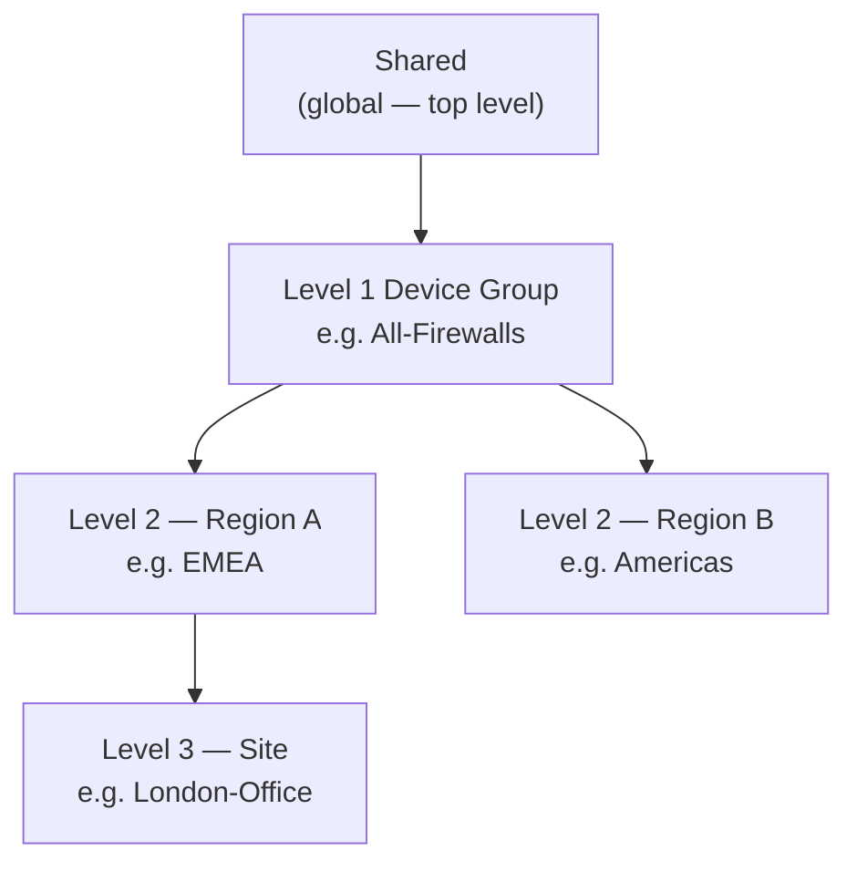

# Chapter 33 — Device Groups — Concepts, Components & Hierarchy

**Device Groups** are Panorama's mechanism for managing security policy and policy objects across a fleet of firewalls. While Templates govern network and device settings (Chapter 32), Device Groups govern **what traffic is allowed or denied and how it is inspected**.

---

## What Device Groups Control

| Scope | Examples |
|---|---|
| **Security Policies** | Allow/deny rules, NAT, QoS, decryption, DoS protection |
| **Policy Objects** | Address objects, address groups, application groups, URL categories, security profiles, services |
| **User mapping** | User-ID, group mapping (requires a master device per group) |

---

## Device Group Hierarchy

Device groups are arranged in a tree hierarchy of up to **four levels**. Lower-level groups inherit the settings (policies and objects) of all their ancestors.

| Level | Role | Example |
|---|---|---|
| **Shared** | Global policies and objects applied to every managed device | Corporate acceptable-use policy |
| **Level 1** | Organisation-wide grouping | All firewalls |
| **Level 2** | Region or function | EMEA, Americas; or Branch vs DC |
| **Level 3–4** | Site or device type | Individual office, specific firewall cluster |

**Inheritance rules:**
- A device group at level 3 inherits from its **parent**, **grandparent**, and **great-grandparent** (ancestors)
- Inherited settings flow **downward only** — a child cannot push changes to a parent
- Child groups can override inherited objects but cannot delete inherited policy rules

---

## Prisma Access Predefined Device Groups

Prisma Access automatically creates one device group per licensed component:

| Device Group | Component |
|---|---|
| `Mobile_User_Device_Group` | GlobalProtect mobile users |
| `Remote_Network_Device_Group` | Branch / remote network sites |
| `Service_Conn_Device_Group` | Service Connections (corporate DC) |
| `Explicit_Proxy_Device_Group` | Explicit Proxy (Cloud SWG) |

All predefined device groups are children of the **Shared** device group by default.

> 📷 [PaloAlto diagram — Prisma Access predefined device group structure](https://docs.paloaltonetworks.com/prisma-access/administration/prisma-access-setup/predefined-templates-onboard-a-service-connection-or-remote-network)

**Rules for predefined device groups:**
- Do **not** delete the predefined device groups
- Add your security policies inside the predefined device groups (or in Shared for policies that apply everywhere)
- The `Service_Conn_Device_Group` must have parent = `Shared` — this is validated by Prisma Access during setup (see Chapter 27)

---

## When to Add Custom Device Groups

Custom device groups are useful when:
- Different branch regions need different security policies (e.g. EMEA branches vs APAC branches)
- You want to create a regional sub-group under `Remote_Network_Device_Group`
- Different user populations need different mobile user policies

Custom device groups are nested **under** the predefined groups, not alongside them — this preserves the inheritance of the Prisma Access predefined policies.

---

## How This Maps in Strata Cloud Manager

Device Groups map onto Strata Cloud Manager's **Folders** concept — see Chapter 32 for the full explanation of how both Templates and Device Groups map onto Folders, and how Snippets differ from Template Stacks. This section covers only what's specific to Device Groups.

**Hierarchy and inheritance:** SCM Folders nest up to 4 levels below `All Firewalls` (confirmed in Chapter 32), and — like Device Group hierarchy — inheritance flows downward only. SCM surfaces this with a visual indicator: a grey dot marks a setting inherited from a higher folder, a blue dot marks one defined locally. A child folder can **Override** an inherited rule and later **Revert** it back to the inherited value — functionally the same downward-only, override-not-delete mechanic Device Groups use, just exposed through explicit Override/Revert controls rather than a blanket "cannot delete" restriction. *(This mechanic was pieced together from several indirect sources rather than one authoritative page — reasonably confident, not fully verified against a single primary source.)*

**Predefined groups:** the four predefined Device Groups above map onto the same predefined folder structure Chapter 32 already found for Prisma Access — including the Explicit Proxy nesting correction, which applies here too:

| Panorama Device Group | SCM Equivalent |
|---|---|
| `Mobile_User_Device_Group` | `Mobile Users Container` folder (shared with Explicit Proxy — see below) |
| `Remote_Network_Device_Group` | `Remote Networks` folder |
| `Service_Conn_Device_Group` | `Service Connections` folder |
| `Explicit_Proxy_Device_Group` | **Not a separate folder** — nested inside `Mobile Users Container` alongside GlobalProtect, not a sibling the way it is in Panorama (see Chapter 32) |

**Master Device / User-ID group mapping:** SCM handles this differently rather than mapping 1:1 — see the "Master Device" section below.

---

## Master Device

Each device group requires a **master device** for Panorama to gather **user group mappings** (User-ID). The master device:
- Is one of the managed firewalls assigned to that device group
- Collects and redistributes user-to-IP mappings
- Makes those user groups available when creating User-ID-based policy rules in the group

**Strata Cloud Manager:** there is no folder-level "one master device per Folder" equivalent. Master Devices are technically still supported in SCM/Prisma Access for the same narrow purpose (populating group-name dropdowns in policy rules), but SCM's recommended path is genuinely different: the **Cloud Identity Engine** handles user-group mapping instead, via **Identity Redistribution** (`Configuration > NGFW and Prisma Access > Identity Services > Identity Redistribution > Redistribution Profiles`), using a hub-and-spoke model scoped to an NGFW or NGFW Folder — not a single designated firewall per group. SCM does not translate "one Master Device per Device Group" into "one Master Device per Folder"; it replaces the whole mechanism with Cloud Identity Engine-based redistribution, with the legacy Master Device path still available as a fallback if Cloud Identity Engine isn't adopted.

---

## Key Takeaways

- Device Groups control security policy and objects — Templates control network/device settings
- Hierarchy: up to 4 levels; Shared is always at the top; inheritance flows downward only
- Prisma Access creates 4 predefined device groups at onboarding — do not delete them
- Nested custom device groups allow regional or functional policy segmentation below the predefined groups
- Each device group needs a master device for User-ID group mapping
- In Strata Cloud Manager, Device Groups map onto Folders (see Chapter 32); Master Device has no direct 1:1 folder equivalent — Cloud Identity Engine + Identity Redistribution is the SCM-native path instead

---

*Previous: [Chapter 32 — Templates & Template Stacks](./ch32-templates-and-template-stacks.md)* · *Next: [Chapter 34 — Device Group Policies & Objects](./ch34-device-group-policies-and-objects.md)*
