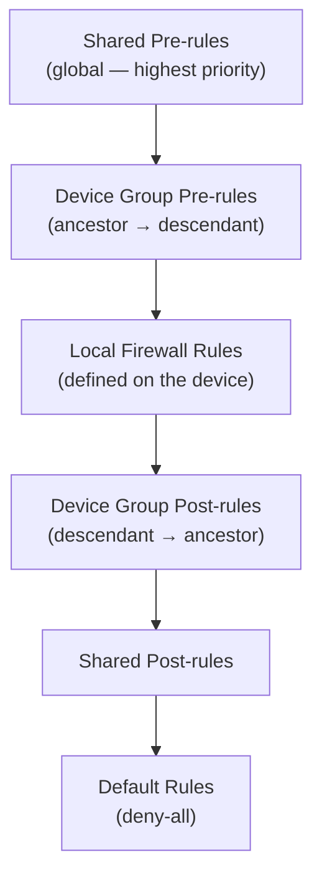
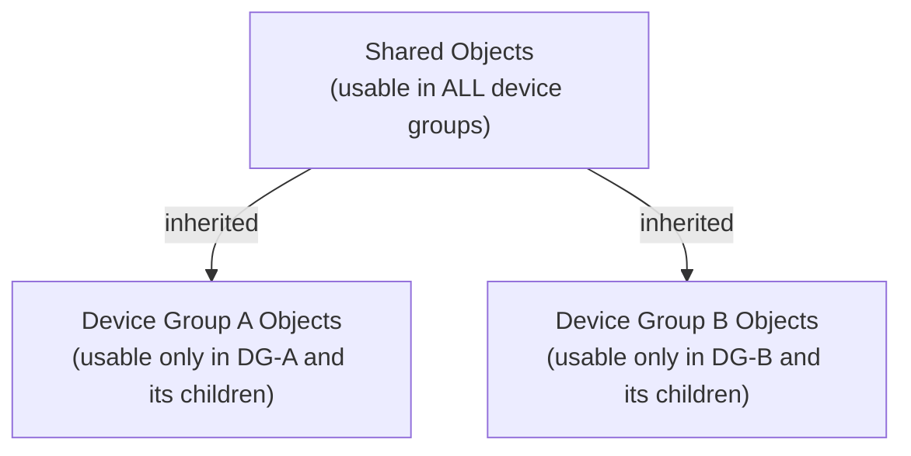

# Chapter 34 — Device Group Policies & Objects

Within each device group, Panorama manages two categories of configuration: **policies** (what traffic is permitted and how it is inspected) and **objects** (the named elements those policies reference). Both follow strict inheritance and precedence rules that determine which rules and objects a firewall actually enforces.

---

## Policy Rule Types

**Navigation (Strata Cloud Manager):**
`Configuration > NGFW and Prisma Access > Security Services > Security Policy`

The pre-rules/post-rules model carries over almost directly to SCM, just in folder terms: rules in the **shared configuration folder** apply globally, and — like Panorama's Shared pre-rules/post-rules — can be positioned to enforce ahead of or after rules in other configuration folders. SCM documentation defines these the same way: pre-rules are "global rules that take precedence over deployment-specific rules and are applied to traffic first," post-rules are "applied to traffic only after shared pre-rules and deployment-specific rules are applied." "Device Group" in Panorama's model corresponds to the target **Folder** for a rule (e.g. the Mobile Users Container, Remote Networks, or Service Connections folders confirmed in Chapters 32–33).

Every rulebase in Panorama contains three rule positions:

| Rule Type | Managed By | Behaviour |
|---|---|---|
| **Pre-rules** | Panorama (Shared or Device Group) | Evaluated first — cannot be overridden by local firewall rules |
| **Post-rules** | Panorama (Shared or Device Group) | Evaluated after device-group rules and before default rules |
| **Default rules** | Panorama or PAN-OS built-in | Catch-all at the bottom; typically deny-all |

Local rules defined directly on a managed firewall are inserted **between** pre-rules and post-rules.

---

## Rule Evaluation Order

A firewall evaluates rules from top to bottom across all layers in this fixed sequence:

**Key implications:**
- A Shared pre-rule cannot be bypassed by any device group or local rule
- A device group pre-rule from a parent group takes precedence over a child group's pre-rule
- Local firewall rules are sandwiched between Panorama pre-rules and post-rules — they cannot override Panorama policy

This model supports a **layered security policy**: corporate-wide rules at Shared, regional rules at device groups, and device-specific exceptions locally.

**Strata Cloud Manager terminology:** the same three-tier shape holds — shared configuration folder pre-rules → folder-specific rules → shared configuration folder post-rules — but the fetched SCM documentation only confirms that relative ordering; it does not spell out default-rule placement or a "local firewall rule" layer the way Panorama's diagram does. For cloud-managed Prisma Access specifically, there is no customer-administered on-box firewall the way there is for an NGFW appliance, so a literal "local rules inserted between pre-rules and post-rules" layer likely doesn't apply the same way — but this is a reasoned inference from how Prisma Access is architected, **not something the fetched docs state explicitly**. Treat the local-rules step in the diagram above as Panorama/NGFW-specific until confirmed otherwise for SCM.

---

## Policy Rulebases

Device group policies apply to all standard PAN-OS rulebases:

| Rulebase | Purpose |
|---|---|
| Security | Allow/deny application traffic |
| NAT | Network address translation |
| QoS | Traffic prioritisation |
| Policy-Based Forwarding (PBF) | Route traffic based on policy rather than routing table |
| Decryption | SSL/TLS inspection |
| Application Override | Bypass App-ID for specific traffic |
| DoS Protection | Rate-limit and drop volumetric attacks |
| Authentication | Enforce captive portal / authentication policy |

---

## Device Group Objects

**Objects** are the named building blocks referenced by policy rules:

| Object Type | Examples |
|---|---|
| Address objects | IP address, FQDN, subnet, address range |
| Address groups | Named group of address objects |
| Application groups | Named group of App-IDs |
| Services | Port and protocol definitions |
| URL categories | Custom URL category lists |
| Security profiles | AV, IPS/threat prevention, URL filtering, WildFire, DLP |
| Users / groups | User-ID mappings for identity-based policy |

---

## Object Scope and Inheritance

Objects are scoped to the level at which they are defined:

**Rules:**
- A Shared object can be referenced by any policy in any device group or local firewall
- A device group object can only be referenced by rules in **that group or its descendants**
- The same object name can exist at multiple levels — the most local definition takes precedence (see Chapter 35)
- An object can be reused in **any number of rules** that share the same scope

**Practical design guidance:**
- Define objects used everywhere (e.g. DNS servers, NTP servers) in **Shared**
- Define objects specific to a region or function in the relevant device group
- Avoid duplicating the same object at multiple levels — centralise in Shared and inherit

**Strata Cloud Manager visual indicators:** SCM has no direct Panorama equivalent for this, but surfaces object/rule scope visually in the UI with colour-coded dots — grey for a setting inherited from a higher folder, purple for a predefined (SCM/Palo Alto-provided) configuration, and blue for one defined locally in the current scope. It's a UI convenience for seeing at a glance where an object or rule actually comes from, rather than a new inheritance mechanic on top of what's described above.

Policy Analyzer, available for **both** Panorama-managed and SCM-managed deployments, can detect shadowed, redundant, and generalized rules that accumulate from this layered evaluation order — see the [Policy Analyzer documentation](https://docs.paloaltonetworks.com/strata-cloud-manager/aiops/security-posture/policy-analyzer-overview) for details; it's a related cleanup tool, not part of how evaluation order itself works.

---

## Key Takeaways

- Three rule positions: **pre-rules** (Panorama-controlled, highest priority), **local rules** (device-level), **post-rules** (Panorama-controlled, after local)
- Rule evaluation order: Shared pre → DG pre → local → DG post → Shared post → default rules
- Policies apply to all PAN-OS rulebases: Security, NAT, QoS, PBF, Decryption, DoS, Auth
- Objects defined in Shared are usable everywhere; device-group objects are scoped to that group and its descendants
- Centralise shared objects in Shared to avoid duplication and drift across device groups
- Strata Cloud Manager keeps the same pre-rules/post-rules shape (shared configuration folder vs. target Folder); the local-rules layer's applicability to cloud-managed Prisma Access is unconfirmed, not assumed to carry over
- SCM's grey/purple/blue indicators show inherited/predefined/local scope in the UI; Policy Analyzer (Panorama and SCM) detects shadowed/redundant/generalized rules from this layered model

---

*Previous: [Chapter 33 — Device Groups — Concepts, Components & Hierarchy](./ch33-device-groups-concepts-and-hierarchy.md)* · *Next: [Chapter 35 — Inheritance Precedence & Predefined Templates](./ch35-inheritance-and-predefined-templates.md)*
