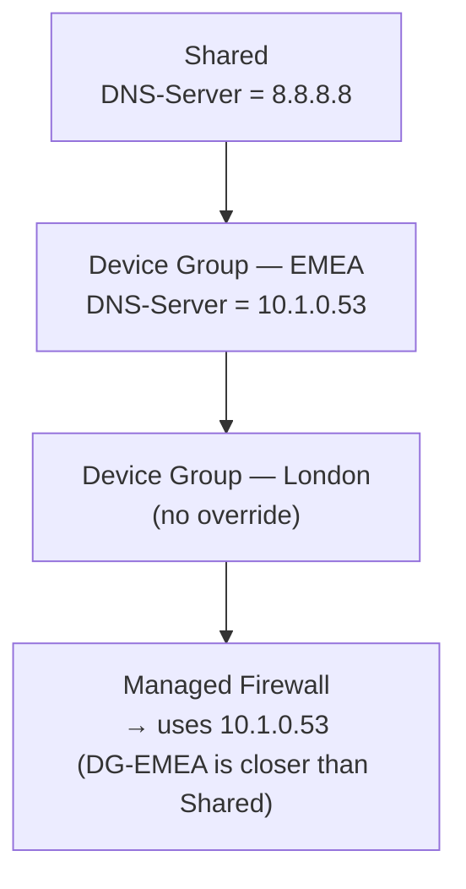

# Chapter 35 — Inheritance Precedence & Predefined Templates for Prisma Access

This chapter covers two related topics: how Panorama resolves conflicting objects across device group hierarchy levels, and the complete set of templates and device groups that Prisma Access creates automatically.

---

## Object Inheritance Precedence

When the same object name is defined at multiple levels of the device group hierarchy, Panorama applies a **most-local-wins** rule: the definition closest to the managed device takes precedence.

**Precedence order (highest to lowest):**

| Level | Precedence |
|---|---|
| Local firewall definition | Highest — overrides all inherited values |
| Child device group | Overrides parent and Shared |
| Parent device group | Overrides grandparent and Shared |
| Shared | Lowest — applies only when no lower-level definition exists |

**Important:** Precedence applies to **objects** (address objects, security profiles, etc.), not to pre-rules. Pre-rules from a parent device group always evaluate before a child device group's pre-rules regardless of inheritance — they are additive, not overridable.

> 📷 [PaloAlto diagram — Object precedence across device group hierarchy](https://docs.paloaltonetworks.com/panorama/11-0/panorama-admin/manage-firewalls/manage-device-groups)

---

## Prisma Access Predefined Templates & Device Groups

At Prisma Access onboarding, Panorama automatically creates one **template + template stack** pair and one **device group** per licensed component:

### Predefined Templates and Stacks

| Template | Template Stack | Contains |
|---|---|---|
| `Mobile_User_Template` | `Mobile_User_Template_Stack` | GP gateway/portal zone config, routing for MU-SPN |
| `Remote_Network_Template` | `Remote_Network_Template_Stack` | Predefined IKE/IPSec tunnels, IKE gateways, crypto profiles for branch IPSec |
| `Service_Conn_Template` | `Service_Conn_Template_Stack` | IKE/IPSec config for SC-CAN tunnels |
| `Explicit_Proxy_Template` | `Explicit_Proxy_Template_Stack` | Proxy listener zones and interface settings |

The `Remote_Network_Template` and `Service_Conn_Template` include **vendor-specific predefined IPSec configurations** for:

| Vendor / Device | Template Available |
|---|---|
| Aruba SD-WAN (Aruba Branch Gateways — distinct from Silver Peak/EdgeConnect below) | Yes |
| Aryaka SD-WAN | Yes |
| Citrix SD-WAN | Yes |
| Prisma SD-WAN (device) | Yes |
| Nuage Networks SD-WAN | Yes |
| Riverbed SteelConnect SD-WAN | Yes |
| Silver Peak SD-WAN (now HPE Aruba Networking EdgeConnect SD-WAN, post-acquisition rebrand) | Yes |
| Viptela SD-WAN | Yes |
| Generic (unlisted devices) | Yes |

Cisco devices are **not** in this predefined vendor list — no dedicated Cisco entry currently exists. Separately confirmed: in Strata Cloud Manager, Cisco SD-WAN variants (Catalyst, Meraki) are onboarded via a generic **"Other Devices"** Branch Device Type option rather than a dedicated Cisco entry; the equivalent on the Panorama side is most likely this table's **Generic** row, though that specific equivalence wasn't independently confirmed.

These predefined IPSec profiles eliminate the need to manually configure IKE Phase 1 and Phase 2 parameters for common third-party CPE types.

### Predefined Device Groups

| Device Group | Parent | Component |
|---|---|---|
| `Mobile_User_Device_Group` | Shared | GlobalProtect mobile users |
| `Remote_Network_Device_Group` | Shared | Branch / remote network sites |
| `Service_Conn_Device_Group` | Shared | Service Connections |
| `Explicit_Proxy_Device_Group` | Shared | Explicit Proxy (Cloud SWG) |

> 📷 [PaloAlto diagram — Prisma Access predefined templates and device groups](https://docs.paloaltonetworks.com/prisma-access/administration/prisma-access-setup/predefined-templates-onboard-a-service-connection-or-remote-network)

---

## Rules for Working with Predefined Templates and Device Groups

| Action | Allowed? | Notes |
|---|---|---|
| Modify predefined templates | No | Prisma Access manages these — manual edits may be overwritten |
| Delete predefined templates or stacks | No | Required for Prisma Access operation |
| Delete predefined device groups | No | Required for Prisma Access operation |
| Add a custom template to a predefined stack | Yes | Insert below the predefined template to avoid priority conflicts |
| Add security policies to predefined device groups | Yes | Recommended place for Prisma Access-specific security rules |
| Create child device groups under predefined ones | Yes | For regional or functional policy segmentation |
| Add a parent device group above predefined ones | Yes | Allows corporate-wide policies to propagate down to all Prisma Access components |

---

## How This Maps in Strata Cloud Manager

The predefined templates/device groups above map onto SCM's predefined Folder structure — see Chapters 32 and 33 for the full explanation (Folders, Snippets, the confirmed predefined folder names, and the Explicit Proxy-nests-inside-Mobile-Users-Container correction). The most-local-wins, override-not-delete precedence described above is the same mechanic Chapter 34 confirmed directly via SCM's grey/purple/blue inheritance indicators — not repeated here.

**Branch Device Type (the one new piece for this chapter):** SCM's Service Connection/Remote Network creation flow has a **Branch Device Type** field (first found during the ch29 SCM-parity session) offering built-in, vendor-specific recommended IKE/IPSec settings — serving exactly the same purpose as this chapter's vendor template table (avoiding manual IKE/IPSec parameter matching for known third-party devices), just delivered as a dropdown during setup rather than as separate predefined template objects.

**Vendor table correction (2026-07-09):** the vendor table above was found stale during this SCM-parity research and has since been corrected in a follow-up pass, independently re-verified against Palo Alto's "Supported IKE and IPSec Cryptographic Profiles for Common SD-WAN Devices" reference page — the source both Panorama's predefined templates and SCM's Branch Device Type draw from. Confirmed current list: **Aruba SD-WAN, Aryaka SD-WAN, Citrix SD-WAN, Prisma SD-WAN, Nuage Networks SD-WAN, Riverbed SteelConnect SD-WAN, Silver Peak SD-WAN, and Viptela SD-WAN** — eight vendors, no dedicated Cisco entry. The Silver Peak/Aruba naming question was resolved with sources: **Aruba SD-WAN** (Aruba Branch Gateways) and **Silver Peak SD-WAN** (now branded **HPE Aruba Networking EdgeConnect SD-WAN**, confirmed via Palo Alto's own retitled solution-guide page) are two genuinely distinct products under the same corporate parent, not one product listed twice — both rows are correct as separate entries.

---

## Key Takeaways

- Object precedence: most-local-wins — child device group overrides parent, parent overrides Shared; local firewall definition wins over all
- Pre-rules are additive, not overridable — a parent group's pre-rule always evaluates before a child's
- Prisma Access creates 4 template/stack pairs and 4 device groups at onboarding — do not modify or delete
- Vendor-specific predefined IPSec profiles (Aruba, Aryaka, Citrix, Prisma SD-WAN, Nuage Networks, Riverbed, Silver Peak/HPE Aruba EdgeConnect, Viptela) are included in the Remote Network and Service Connection templates — no dedicated Cisco entry exists
- Extend the predefined setup by adding custom templates to stacks (below the predefined) and custom child device groups beneath the predefined ones
- In Strata Cloud Manager, predefined templates/device groups map onto Folders (see Chapters 32–33) and the same precedence mechanic applies (confirmed in Chapter 34); Branch Device Type is SCM's equivalent of the vendor template table

---

*Previous: [Chapter 34 — Device Group Policies & Objects](./ch34-device-group-policies-and-objects.md)* · *Next: [Chapter 36 — Prisma Access Zones](./ch36-prisma-access-zones.md)*
