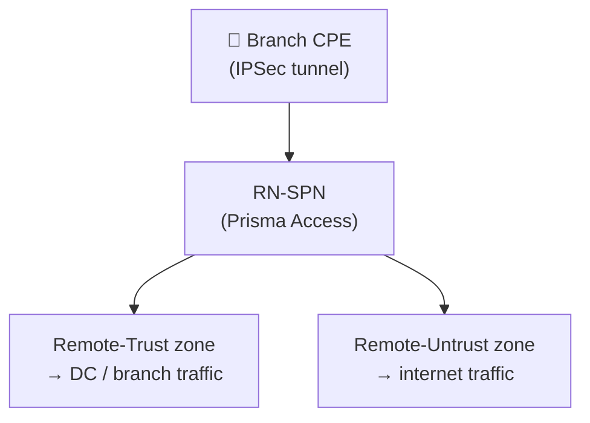

# Chapter 37 — Remote Network Templates, Device Groups & Zone Mapping

Before onboarding any branch site, three prerequisite steps must be completed: verifying the predefined template and device group are present, creating the security zones for branch traffic, and mapping those zones to the Prisma Access Trust/Untrust classification.

---

## Step 1 — Verify the Predefined Template and Device Group

**Navigation:**
`Panorama > Cloud Services > Configuration > Remote Networks`

Confirm that both the predefined objects created at onboarding are present and selected:

| Object | Expected Name |
|---|---|
| Template Stack | `Remote_Network_Template_Stack` |
| Device Group | `Remote_Network_Device_Group` |

If either is missing, re-check the Prisma Access onboarding in Chapter 27 — they are created automatically and should not need manual action.

**Strata Cloud Manager:** the equivalent predefined objects are the SCM Folder structure confirmed in Chapters 32, 33, and 35 — see those chapters for the confirmed folder names and how they map to Panorama's templates and device groups; not repeated here.

> 📷 [PaloAlto screenshot — Remote Network Templates & Device Groups validation](https://docs.paloaltonetworks.com/prisma-access/administration/prisma-access-remote-networks/onboard-a-remote-network)

---

## Step 2 — Create Branch Security Zones

Remote network traffic requires two custom zones in the template — one for trusted (internal DC/branch) traffic and one for untrusted (internet) traffic. The conventional names are:

| Zone Name | Maps To | Traffic |
|---|---|---|
| `Remote-Trust` | Prisma Access Trust | Branch-to-DC, branch-to-branch |
| `Remote-Untrust` | Prisma Access Untrust | Branch internet breakout |

**Navigation:**
`Panorama > Network > Zones` (with `Remote_Network_Template` selected in the template drop-down)

Create both zones:
1. Click **Add**
2. Enter zone name (`Remote-Trust`, then `Remote-Untrust`)
3. Leave zone type as **Layer 3**
4. Click **OK**

> ⚠️ Do **not** name zones `trust` or `untrust` — these are reserved Prisma Access zone names (see Chapter 36). Use `Remote-Trust` and `Remote-Untrust` or any custom non-conflicting names.

**Using an existing template:**
If you already have a template with zones defined, add that template to the `Remote_Network_Template_Stack` instead of creating zones in the predefined template.

> 📷 [PaloAlto screenshot — Creating zones in Remote_Network_Template](https://docs.paloaltonetworks.com/prisma-access/administration/prisma-access-remote-networks/onboard-a-remote-network)

**Strata Cloud Manager — open question, not confirmed:** Chapter 36 already confirmed the zone *model* itself (Trust, Untrust, reserved names) is platform-agnostic, so whatever mechanism SCM uses, the destination classification is the same. What's genuinely unconfirmed is the *mechanism*: the primary Remote Networks onboarding documentation describes detailed Panorama zone-creation steps (`Network > Zones`, selecting the template, adding zones), but the parallel SCM onboarding steps documented there (Site Name, Prisma Access Location, IPSec Termination Node) make no mention of zones at all — and no dedicated SCM zone-configuration page for Remote Networks was found despite a direct fetch and two targeted searches. This could mean zone assignment is inline elsewhere in the SCM workflow, that it's handled automatically/predefined, or simply that the documentation has a gap here — it is genuinely unclear which, and stating a specific mechanism with confidence would not be accurate. Treat this as an open item rather than assume the Panorama flow above carries over as-is.

---

## Step 3 — Map the Zones

**Navigation:**
`Panorama > Cloud Services > Configuration > Remote Networks > gear icon (Zone Mapping)`

Map each custom zone to the appropriate Prisma Access classification:

| Zone | Prisma Access Mapping |
|---|---|
| `Remote-Trust` | Trust |
| `Remote-Untrust` | Untrust |

All zones default to **Untrust** until mapped — security policies won't match correctly until zone mapping is complete.

> 📷 [PaloAlto screenshot — Zone mapping for Remote Networks](https://docs.paloaltonetworks.com/prisma-access/administration/prisma-access-remote-networks/onboard-a-remote-network)

**Strata Cloud Manager:** the reserved-names warning above applies identically — see Chapter 36 for the confirmed platform-agnostic zone model, not repeated here. Whether SCM has a distinct "zone mapping" step separate from zone creation, or classifies zones as Trust/Untrust inline at the point of creation, is tied to the same open question flagged in Step 2 above — not confirmed either way from available documentation.

---

## Commit & Push

After completing zones and zone mapping:

1. `Commit > Commit and Push`
2. Edit Selections → Select **Prisma Access** → **Remote Networks**
3. Click **OK** → **Commit and Push**

This push applies the zone configuration to the Prisma Access infrastructure. Bandwidth allocation and site onboarding (Chapters 38–41) follow after this push completes.

**Strata Cloud Manager:** Commit is replaced with **Push Config**, the same terminology already established in Chapter 28 — not re-explained here.

---

## Key Takeaways

- Verify `Remote_Network_Template_Stack` and `Remote_Network_Device_Group` exist before proceeding
- Create two zones in `Remote_Network_Template`: `Remote-Trust` and `Remote-Untrust` (or equivalent custom names)
- All zones default to Untrust — explicitly map `Remote-Trust` → Trust and `Remote-Untrust` → Untrust
- Push scope must include **Remote Networks**, not just Service Setup
- Scale: up to 25,000 remote network sites per tenant (Prisma Access 5.2+)
- Predefined objects (Step 1) and the zone model/reserved names (Step 3) map to SCM the same way confirmed in Chapters 32, 33, 35, and 36; SCM's actual zone-creation mechanism (Step 2) is an unconfirmed open question, not assumed to match Panorama's flow

---

*Previous: [Chapter 36 — Prisma Access Zones](../part6/ch36-prisma-access-zones.md)* · *Next: [Chapter 38 — Remote Network Bandwidth Allocation](./ch38-remote-network-bandwidth-allocation.md)*
