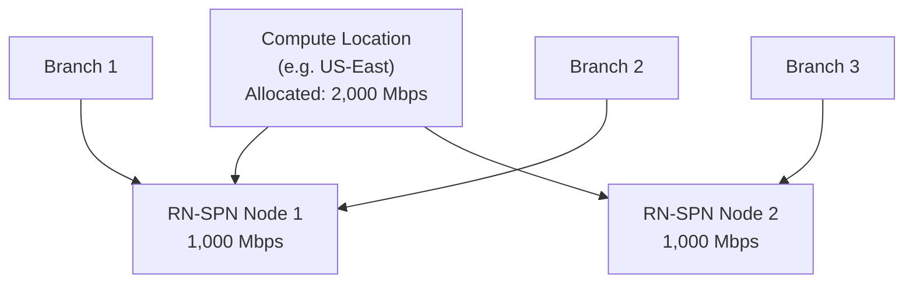

# Chapter 38 — Remote Network Bandwidth Allocation

Bandwidth allocation determines how much throughput is provisioned at each Prisma Access compute location for remote network traffic. It must be configured **before** onboarding branch sites — without it, Prisma Access cannot provision the RN-SPN node.

---

## Bandwidth Models

Two models are available depending on your Prisma Access version:

> ⚠️ **Current documentation is inconsistent about which model is the default for new deployments — verified directly, not assumed either way.** One current Palo Alto page states "New Prisma Access deployments starting with Prisma Access 6.0 allocate bandwidth per site and this procedure does not apply" (implying Site-Based is the default and Aggregate no longer applies to new deployments). A different current page states "Bandwidth for new Prisma Access remote network deployments are allocated at an aggregate level per compute location" and that "the aggregate bandwidth model is available for all new deployments" — the opposite framing. These two statements directly conflict, and this couldn't be resolved with confidence from available documentation — possibly reflecting terminology drift (an older "per Prisma Access location" sub-model within Aggregate vs. a newer "per compute location" sub-model) or pages updated on different schedules. **Confirm current default behavior directly in your own Prisma Access tenant before assuming either model applies by default.** See [Appendix D — Known Documentation Ambiguities](../appendix/appD-known-documentation-ambiguities.md) for this and other tracked ambiguities in one place.

| Model | How It Works | Available Since |
|---|---|---|
| **Aggregate** | Bandwidth allocated per **compute location** — shared across all branch sites in that location | Original PA model |
| **Site-based** | Bandwidth allocated per **individual branch site** — guaranteed rate per site | Prisma Access 6.0+ |

### Aggregate Model

- Total bandwidth is pooled at the compute location level
- All branches in the same compute location share the allocated pool
- A single RN-SPN node provides up to **1,000 Mbps**
- For allocations exceeding 1,000 Mbps, Prisma Access automatically provisions additional Service Endpoint Addresses (additional nodes)
- Rule of thumb: one additional compute instance per 500 Mbps beyond the first 1,000 Mbps

### Site-Based Model (PA 6.0+)

- Each branch is allocated a guaranteed rate (Committed Information Rate — CIR)
- Predefined options: **25 Mbps to 2,500 Mbps** per site
- Prevents a high-traffic branch from starving other branches in the same compute location
- Recommended for deployments with SLA requirements per branch

**Per-tunnel limit (both models):** up to **2 Gbps** from a single remote site to a single RN-SPN.

---

## Capacity Planning

| Requirement | Guidance |
|---|---|
| < 1,000 Mbps per location | Single node sufficient |
| > 1,000 Mbps per location | Additional nodes provisioned automatically |
| Minimum allocation | 50 Mbps per compute location |
| Per-tunnel maximum | 2 Gbps |
| Bandwidth reservation per 3 Gbps | 1 additional Service Endpoint IP/FQDN |

> For the related but distinct constraint of how many remote **sites** a single IPSec Termination Node can serve (500 sites/node, 1,000 Mbps/node, 200 nodes per compute location), see the IPSec Termination Node Limits table in [Chapter 9 — Remote Networks Planning](../part2/ch09-remote-networks-planning.md) rather than duplicating it here — this table covers bandwidth sizing, that one covers node capacity.

---

## Configuration Steps

**Navigation (Panorama):**
`Panorama > Cloud Services > Configuration > Remote Networks`

**Step 1** — Click the **gear icon** in the Bandwidth Allocation area.

**Step 2** — The bandwidth allocation screen shows each **Compute Location** with its Prisma Access locations. Enter the bandwidth allocation for each location you plan to onboard.

> 📷 [PaloAlto screenshot — Bandwidth Allocation configuration](https://docs.paloaltonetworks.com/prisma-access/administration/prisma-access-remote-networks/onboard-a-remote-network)

**Step 3** — Click **OK** to save.

**Navigation (Strata Cloud Manager):**
`Configuration > NGFW and Prisma Access > Configuration Scope > Prisma Access > Remote Networks > Bandwidth Management`

This is a **distinct settings screen**, confirmed separate from the per-site Remote Networks onboarding flow (ch37/ch39–41) — not something you configure inline while onboarding an individual site. Bandwidth must still be allocated to a location before any site in that location can be onboarded, same as the Panorama flow above.

---

## Commit & Push

After setting bandwidth:

1. `Commit > Commit and Push`
2. Edit Selections → Select **Prisma Access** → **Remote Networks**
3. Click **OK** → **Commit and Push**

Prisma Access provisions the required RN-SPN nodes based on the allocated bandwidth. The **Service Endpoint Address** (the public IP or FQDN configured as the VPN peer on the branch CPE) becomes available after this push under:

`Panorama > Cloud Services > Status > Network Details > Remote Networks`

**Strata Cloud Manager:** Commit is replaced with **Push Config**, the same terminology established in Chapter 28 — not re-explained here. For bandwidth consumption monitoring afterward, use `Insights > Prisma SASE > Branch Sites > Prisma Access` — confirmed as the current path (not nested under "Data Centers," despite that being the Service Connections monitoring path covered in Chapter 30). This is a **monitoring view, not where you configure the allocation** — see Chapter 30 for the general Insights concept, not repeated here. It shows Peak, Average, and Median bandwidth consumption trends, broken out by Ingress, Egress, Ingress vs. Egress, or Cumulative (Ingress + Egress), per site.

---

## Key Takeaways

- Aggregate model: bandwidth pooled per compute location; site-based model (PA 6.0+) guarantees per-site rates
- Single RN-SPN node handles up to 1,000 Mbps — additional nodes added automatically above that
- Per-tunnel maximum is 2 Gbps regardless of total location bandwidth
- Minimum allocation is 50 Mbps per compute location
- Service Endpoint Address (CPE peer IP) is only visible after the bandwidth push completes
- Current Palo Alto documentation is genuinely contradictory on which model (Aggregate or Site-Based) is the default for new deployments — confirm directly in your tenant rather than trusting either framing at face value
- In Strata Cloud Manager, bandwidth is configured via a distinct **Bandwidth Management** screen (not inline with per-site onboarding) and monitored via `Insights > Prisma SASE > Branch Sites > Prisma Access`
- IPSec Termination Node site-count limits (a related but distinct constraint from bandwidth sizing) are covered in Chapter 9, not duplicated here

---

*Previous: [Chapter 37 — Remote Network Templates, Device Groups & Zone Mapping](./ch37-remote-network-templates-and-zone-mapping.md)* · *Next: [Chapter 39 — Onboard Remote Network — Static Route](./ch39-onboard-remote-network-static-route.md)*
