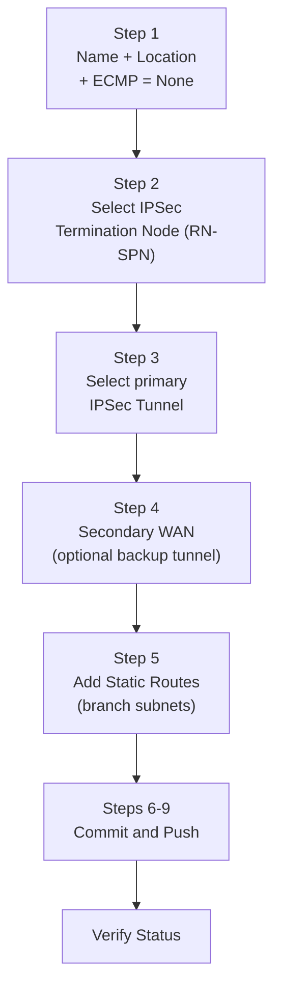

# Chapter 39 — Onboard Remote Network — Single IPSec Tunnel & Static Route

This is the simplest remote network onboarding configuration: one IPSec tunnel from the branch CPE to an RN-SPN, with branch subnets declared as static routes. No BGP peering is required.

---

## When to Use This Configuration

| Scenario | Use Single Tunnel + Static Routes |
|---|---|
| Branch has one WAN link | Yes |
| CPE does not support BGP | Yes |
| Branch subnets are stable and few | Yes |
| Need ECMP or multiple active tunnels | Use ch41 |
| Need dynamic route distribution | Use BGP (ch40) |

> If a subnet is covered by both a static route and BGP (e.g. after later adding BGP alongside existing static routes), **the static route takes precedence** — see Chapter 40 for the full explanation.

---

## Onboarding Steps

**Navigation (Panorama):**
`Panorama > Cloud Services > Configuration > Remote Networks > Onboarding > Add`

**Navigation (Strata Cloud Manager):**
`Configuration > NGFW and Prisma Access > Configuration Scope > Prisma Access > Remote Networks > Add Remote Network`

---

### Step 1 — Name, Location, and ECMP Setting

| Field | Value / Notes |
|---|---|
| **Name** | Descriptive branch name (e.g. `RN-To-US-Branch`) — becomes the source zone identifier in logs |
| **Location** | Prisma Access compute location nearest to the branch (e.g. `US-East`) |
| **ECMP Load Balancing** | Set to **None** for single-tunnel deployments |

> ⚠️ The remote network name becomes a zone name in traffic logs. Avoid names that conflict with `trust`, `untrust`, or `inter-fw`.

**Strata Cloud Manager:** the same wizard confirms these fields — **Site Name**, **Prisma Access Location**, and an **ECMP Load Balancing** toggle. For this chapter's single-tunnel scenario, leave ECMP Load Balancing disabled — see Chapter 41 for the ECMP-enabled case rather than explained here. (A separate "Region" field was not confirmed on the fetched documentation and isn't included here as a result — don't assume it exists without checking your own tenant's UI.)

---

### Step 2 — Select the IPSec Termination Node (RN-SPN)

- Select the specific **IPSec Termination Node** within the chosen compute location (e.g. `us-east-pecan`)
- This node's **Service Endpoint Address** is what the branch CPE configures as its VPN peer IP

> 📷 [PaloAlto screenshot — Remote network name, location, and termination node](https://docs.paloaltonetworks.com/prisma-access/administration/prisma-access-remote-networks/onboard-a-remote-network)

**Strata Cloud Manager:** **IPSec Termination Node** is confirmed as the same field name and selection step in the SCM wizard — not a separate screen.

---

### Step 3 — Select the IPSec Tunnel

- Select the **primary IPSec tunnel** from the predefined tunnel list (e.g. `CiscoASA-IPSec-Tunnel-Default`)
- If the required tunnel doesn't exist, create it first under `Network > IPSec Tunnels` in the `Remote_Network_Template`

**Strata Cloud Manager:** confirmed the tunnel/IKE setup uses the **same core fields** as Chapter 29's Service Connection SCM section — Branch Device Type, Branch Device IP Address (Static/Dynamic) with IKE ID if Dynamic, IKE Advanced Options, IPSec Advanced Options, Secret/Confirm Secret — see that chapter rather than repeating the full field list here.

---

### Step 4 — Secondary WAN (Optional Backup Tunnel)

Enable **Secondary WAN** if the branch CPE has a second WAN link:
- Select or create the **backup IPSec tunnel** (e.g. `CiscoASA-IPSec-Tunnel-Default-Backup`)
- The backup tunnel uses the same RN-SPN but a different CPE interface/IP
- Failover is automatic — Prisma Access switches to the backup if the primary tunnel goes down

**One genuine Remote-Network-specific difference from Chapter 29's Service Connection flow:** Prisma Access **requires a unique IPSec tunnel for each remote network's secondary WAN** — a secondary-WAN tunnel cannot be reused across multiple remote network sites. This constraint isn't called out the same way for Service Connections' secondary WAN.

---

### Step 5 — Add Static Routes

Click the **Static Route** tab, then click **Add**:

| Field | Example |
|---|---|
| Subnet | `10.10.10.0/24` |

Add one entry per branch subnet that Prisma Access needs to route to this site. These subnets are advertised to all connected mobile users and service connections.

> 📷 [PaloAlto screenshot — Static routes tab in remote network onboarding](https://docs.paloaltonetworks.com/prisma-access/administration/prisma-access-remote-networks/onboard-a-remote-network)

Click **OK** to save the remote network entry.

**Strata Cloud Manager:** static routes are entered directly in the same remote network add/edit screen, under a **Static Routes** tab — click **Add** and enter the subnet or IP address to secure at the branch. This maps directly onto Step 5 above; no separate screen or rewrite needed.

---

### Steps 6–9 — Commit and Push

1. `Commit > Commit and Push`
2. Edit Selections → Select **Prisma Access** → **Remote Networks**
3. Click **OK** → **Commit and Push**

> 📷 [PaloAlto screenshot — Commit and Push for Remote Networks](https://docs.paloaltonetworks.com/prisma-access/administration/prisma-access-remote-networks/onboard-a-remote-network)

**Strata Cloud Manager:** Commit is replaced with **Push Config**, per the terminology already established in Chapter 28 — not re-explained here.

---

## Verify Remote Network Status

**Navigation (Panorama):**
`Panorama > Cloud Services > Status > Remote Networks`

Confirm:
- **Tunnel Status = Connected** for the primary tunnel
- The remote network entry shows the correct Service Endpoint Address

If the tunnel shows **Disconnected**, check:
- Branch CPE peer IP matches the Service Endpoint Address
- Pre-shared key matches on both sides
- IKE/IPSec crypto profiles match (Phase 1 and Phase 2)

> 📷 [PaloAlto screenshot — Remote Network status verification](https://docs.paloaltonetworks.com/prisma-access/administration/prisma-access-remote-networks/onboard-a-remote-network)

**Strata Cloud Manager:** see Chapter 30's Config Status (In sync/Out of sync) and Insights explanation for how to verify push status and connectivity — not repeated here. The same troubleshooting checks above (peer IP, pre-shared key, crypto profile match) apply regardless of management platform.

---

## Managing at Scale (Strata Cloud Manager)

Worth knowing, not a deep dive: starting at Prisma Access 5.2, a tenant can onboard up to **25,000 remote networks and 50,000 IKE gateways**. To make managing a list at that scale practical, the SCM web interface added **pagination** (choose how many rows to display), **filtering**, and a **Group By Compute Location** option (collapses all sites under their compute location). This is purely an SCM UI detail — the Panorama-facing content in this manual doesn't cover list-scale UI features at all.

---

## Key Takeaways

- Single tunnel + static routes is the simplest onboarding path — no BGP required
- ECMP must be set to **None** for single-tunnel deployments
- Remote network name becomes the source zone identifier in logs — avoid reserved zone names
- Static routes declare which branch subnets Prisma Access should route to this site
- Service Endpoint Address (RN-SPN public IP) is the VPN peer address configured on the branch CPE
- SCM's tunnel/IKE fields match Chapter 29's Service Connection SCM section, except one RN-specific rule: a secondary WAN tunnel cannot be reused across sites
- Prisma Access 5.2+ supports up to 25,000 remote networks and 50,000 IKE gateways per tenant; SCM adds pagination, filtering, and Group By Compute Location to manage that scale

---

*Previous: [Chapter 38 — Remote Network Bandwidth Allocation](./ch38-remote-network-bandwidth-allocation.md)* · *Next: [Chapter 40 — Onboard Remote Network — BGP](./ch40-onboard-remote-network-bgp.md)*
