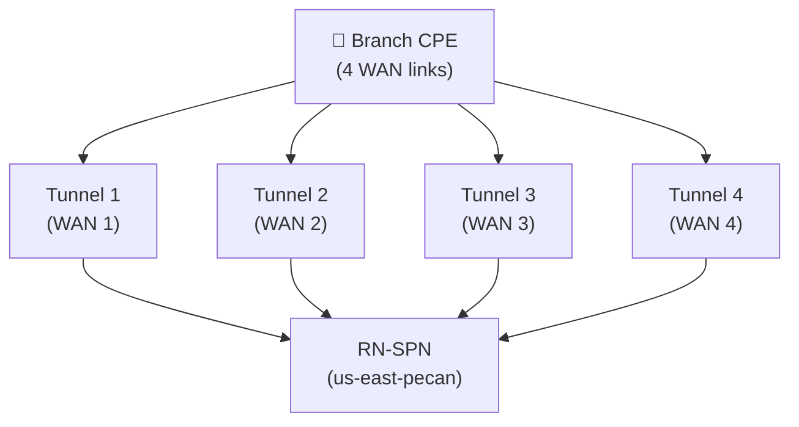

# Chapter 41 — Onboard Remote Network — Multiple IPSec Tunnels, ECMP & BGP

**ECMP (Equal-Cost Multipath)** allows a single branch site to distribute traffic across multiple IPSec tunnels simultaneously. This delivers both **increased bandwidth** and **resilience** — if one tunnel fails, the remaining tunnels absorb its traffic without a failover event.

---

## ECMP Requirements

| Requirement | Detail |
|---|---|
| **BGP mandatory** | ECMP only works with BGP — static routes and QoS-only configs cannot use ECMP |
| **QoS not supported** | Confirmed explicitly: "QoS and static routes are not supported" when ECMP Load Balancing is enabled — this is a functional restriction to know before choosing ECMP, not just the BGP requirement above |
| **Static routes not supported** | Same restriction as above — ECMP sites route entirely via BGP; static routes cannot be added alongside ECMP |
| **Maximum primary tunnels** | Up to **4 tunnels** per remote network site |
| **Same RN-SPN** | All ECMP tunnels for a site terminate on the **same** IPSec Termination Node |
| **Per-tunnel bandwidth** | Up to 2 Gbps per tunnel |
| **Scale constraint** | **Corrected 2026-07-09** — conditional, not a flat cap: see the "Tenant Scale Constraints for ECMP" section below for the full tiered figures and the condition they depend on |

---

## ECMP vs Single-Tunnel Comparison

| Feature | Single Tunnel | ECMP (Multi-Tunnel) |
|---|---|---|
| Bandwidth | Up to 2 Gbps | Up to 8 Gbps (4 × 2 Gbps) |
| Resilience | Failover via Secondary WAN | In-built — remaining tunnels absorb failed tunnel's load |
| BGP required | No (static routes possible) | Yes — mandatory |
| Config complexity | Low | Moderate — per-tunnel BGP settings |

---

## Onboarding Steps

**Navigation (Panorama):**
`Panorama > Cloud Services > Configuration > Remote Networks > Onboarding > Add`

**Navigation (Strata Cloud Manager):**
`Configuration > NGFW and Prisma Access > Configuration Scope > Prisma Access > Remote Networks > Add Remote Network` — same base path as Chapters 39 and 40.

### Steps 1–4 — Name, Location, ECMP Setting, Termination Node

| Field | Value |
|---|---|
| **Name** | Branch site name (e.g. `RN-To-US-Branch`) |
| **Location** | Compute location (e.g. `US-East`) |
| **ECMP Load Balancing** | **Enabled with Symmetric Return** |
| **IPSec Termination Node** | Select the RN-SPN (e.g. `us-east-pecan`) |

**Symmetric Return** ensures that return traffic for a session always exits through the same tunnel that received the ingress traffic — required for stateful firewalls at the branch.

> 📷 [PaloAlto screenshot — ECMP enabled with Symmetric Return](https://docs.paloaltonetworks.com/prisma-access/administration/prisma-access-remote-networks/remote-networks-high-performance)

**Strata Cloud Manager:** the base **Name (Site Name)**, **Location (Prisma Access Location)**, and **IPSec Termination Node** fields are the same as Chapter 39 — cross-referenced rather than re-explained. Chapter 39 already confirmed the **ECMP Load Balancing** toggle exists as the same field in SCM; this session's research did not independently re-verify whether the specific option labels ("None" vs. "Enabled with Symmetric Return") are worded identically in the SCM UI — noting this rather than asserting exact-wording parity that wasn't directly checked.

---

### Step 5 — Add IPSec Tunnels

Click **Add** to add each tunnel. Repeat for every tunnel in the ECMP group (up to 4):

| Tunnel | Example Name |
|---|---|
| Tunnel 1 | `CiscoASA-IPSec-Tunnel-1` |
| Tunnel 2 | `CiscoASA-IPSec-Tunnel-2` |
| Tunnel 3 | `CiscoASA-IPSec-Tunnel-3` |
| Tunnel 4 | `CiscoASA-IPSec-Tunnel-4` |

Each tunnel corresponds to a separate WAN link or CPE interface at the branch.

---

### Steps 6–8 — BGP Per Tunnel

For each tunnel added, configure BGP settings on its **BGP tab**:

| Field | Notes |
|---|---|
| **Enable** | Toggle on for each tunnel |
| **Peer AS** | Branch CPE AS (same AS for all tunnels at the same site) |
| **Peer IP Address** | Per-tunnel peer IP — each tunnel has a different CPE interface IP |
| **Local IP Address** | Optional |
| **Secret** | BGP MD5 passphrase |
| **Advertise Default Route** | Optional — sends `0.0.0.0/0` to branch |
| **Summarize Mobile User Routes** | Optional — reduces route advertisement volume |
| **Don't Export Routes** | Optional — prevents routes from propagating to HQ/DC |

Repeat steps 6–8 for each tunnel in the group.

> 📷 [PaloAlto screenshot — Per-tunnel BGP settings for ECMP](https://docs.paloaltonetworks.com/prisma-access/administration/prisma-access-remote-networks/remote-networks-high-performance)

**Strata Cloud Manager:** the per-tunnel BGP fields (Peer AS, Peer IP Address, Local IP Address, Secret, MRAI) are the same as what Chapter 40 already documented for single-tunnel BGP — cross-referenced rather than repeated here.

> ℹ️ **New technical detail, confirmed via live docs:** when you enable BGP, Prisma Access automatically sets the eBGP **TTL to 8** to accommodate extra hops between Prisma Access infrastructure and the CPE. This applies to BGP generally (not ECMP-specific), but wasn't previously mentioned in this manual — recorded here since it surfaced in this chapter's research; also relevant to Chapter 40's single-tunnel BGP.

---

### Step 9 — Click OK

After all tunnels and their BGP settings are configured, click **OK** to save the remote network entry.

The summary view shows all tunnels in the ECMP group with their BGP enable status:

| Tunnel | BGP Enabled |
|---|---|
| CiscoASA-IPSec-Tunnel-1 | Yes |
| CiscoASA-IPSec-Tunnel-2 | Yes |
| CiscoASA-IPSec-Tunnel-3 | Yes |
| CiscoASA-IPSec-Tunnel-4 | Yes |

---

## Commit & Push

1. `Commit > Commit and Push`
2. Edit Selections → **Prisma Access** → **Remote Networks** → **OK** → **Commit and Push**

> 📷 [PaloAlto screenshot — Commit and Push for ECMP remote network](https://docs.paloaltonetworks.com/prisma-access/administration/prisma-access-remote-networks/remote-networks-high-performance)

**Strata Cloud Manager:** Commit is replaced with **Push Config**, per the terminology already established in Chapter 28 — not re-explained here.

---

## A Related but Distinct Architecture: Remote Networks — High Performance

Palo Alto also offers a separate **Remote Networks — High Performance** architecture, not a bigger version of the ECMP steps in this chapter — it has its own bandwidth model (up to 3 Gbps aggregate per node, up to 120 branches per service IP with Prisma SD-WAN) and different constraints. For Strata Cloud Manager deployments specifically, this architecture doesn't require selecting an IPSec Termination Node at all, since Prisma Access auto-load-balances. This chapter doesn't cover its setup — see the [Remote Networks — High Performance documentation](https://docs.paloaltonetworks.com/prisma-access/administration/prisma-access-remote-networks/remote-networks-high-performance) if this architecture fits your scale requirements better than standard ECMP.

---

## Tenant Scale Constraints for ECMP

**Corrected 2026-07-09 — these figures are conditional, not a flat cap.** Confirmed via live docs (identical wording in both the Panorama and Strata Cloud Manager sections): the tiered limits below apply specifically **when a Local BGP IP Address is configured** for those remote networks (a maximum of 250 local IP addresses is supported per remote network overall, which cascades into these per-configuration ceilings). No comparable ceiling is documented for deployments that don't configure a Local BGP IP Address.

| Configuration | Max Remote Networks per Tenant (with a Local BGP IP Address configured) |
|---|---|
| Primary tunnel only | 250 |
| Primary + secondary tunnel | 250 |
| ECMP with 2 links | 125 |
| ECMP with 3 links | 83 |
| ECMP with 4 links | 62 |

Without ECMP or a configured Local BGP IP Address, the general single-tunnel scale limit is up to **25,000 remote networks per tenant** (see Chapter 39 for the tenant-wide onboarding scale figures) — the tiers above only bite once you're using a Local BGP IP Address, and get tighter the more ECMP links you add.

ECMP consumes significantly more RN-SPN resources than single-tunnel deployments — plan accordingly for large deployments, and confirm whether your design actually requires a Local BGP IP Address before assuming the tightest tier applies to you.

---

## Key Takeaways

- ECMP requires BGP — static routes and QoS are not supported with ECMP enabled, not just incompatible with each other
- Up to 4 primary tunnels per site; each carries up to 2 Gbps → 8 Gbps theoretical max per site
- All ECMP tunnels for a site must terminate on the **same** RN-SPN
- Enable **Symmetric Return** to ensure return traffic uses the same tunnel as ingress — required for stateful firewalls
- Configure BGP separately on each tunnel — each gets its own peer IP matching its CPE WAN interface
- Tenant scale limits (250/250/125/83/62 across primary-only through 4-link ECMP) apply specifically when a Local BGP IP Address is configured — corrected 2026-07-09 from a flat "62 sites" cap; no comparable ceiling applies without a Local BGP IP Address
- Prisma Access sets eBGP TTL to 8 automatically to accommodate extra hops between its infrastructure and the CPE
- "Remote Networks — High Performance" is a distinct architecture (different bandwidth model; SCM skips IPSec Termination Node selection entirely), not a bigger version of standard ECMP

---

*Previous: [Chapter 40 — Onboard Remote Network — BGP](./ch40-onboard-remote-network-bgp.md)* · *Next: [Chapter 42 — Mobile User Templates, Device Groups & Zone Mapping](../part8/ch42-mobile-user-templates-and-zone-mapping.md)*
