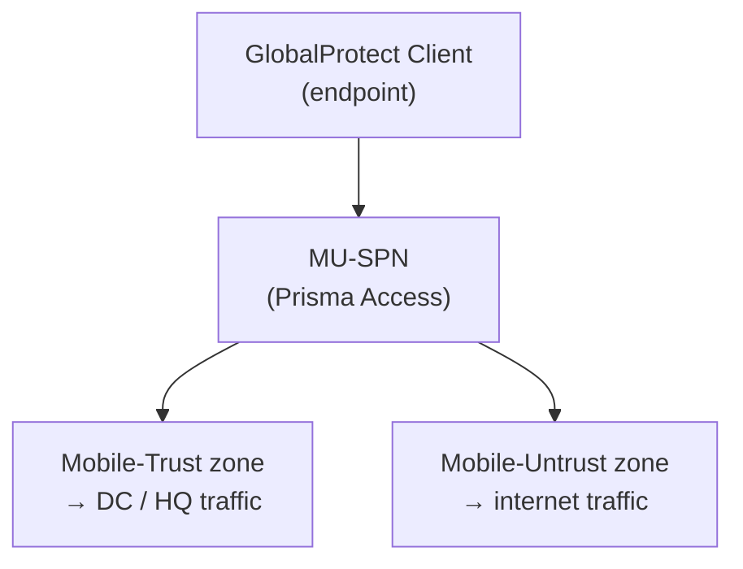

# Chapter 42 — Mobile User Templates, Device Groups & Zone Mapping

Before onboarding GlobalProtect mobile users, the predefined template and device group must be verified, security zones must be created for mobile user traffic, and those zones must be mapped to the Prisma Access Trust/Untrust classification.

---

## Step 1 — Verify the Predefined Template and Device Group

**Navigation:**
`Panorama > Cloud Services > Configuration > Mobile Users - GlobalProtect`

Confirm that both predefined objects created at Prisma Access onboarding are present:

| Object | Expected Name |
|---|---|
| Template Stack | `Mobile_User_Template_Stack` |
| Device Group | `Mobile_User_Device_Group` |

The parent device group for `Mobile_User_Device_Group` is `Shared`. If either object is missing, re-check the Prisma Access onboarding steps in Chapter 27 — they are created automatically and should not need manual action.

> 📷 [PaloAlto screenshot — Mobile User Templates & Device Groups validation](https://docs.paloaltonetworks.com/prisma-access/administration/prisma-access-mobile-users/mobile-users-globalprotect)

**Strata Cloud Manager:** confirmed directly against the live docs' heading structure — the SCM-specific section for Mobile Users setup uses **neither** "template stack" nor "device group" terminology anywhere. The equivalent predefined structure is the SCM Folder model confirmed in Chapters 32, 33, and 35 (the `Mobile Users Container` folder specifically) — see those chapters rather than repeating the mapping here.

---

## Step 2 — Create Mobile User Security Zones

Mobile user traffic requires two custom zones in the template — one for trusted (internal/DC) traffic routed via Prisma Access, and one for untrusted (internet) traffic.

| Zone Name | Maps To | Traffic |
|---|---|---|
| `Mobile-Trust` | Prisma Access Trust | Mobile user to DC, mobile user to branch |
| `Mobile-Untrust` | Prisma Access Untrust | Mobile user internet breakout |

**Navigation:**
`Panorama > Network > Zones` (with `Mobile_User_Template` selected in the template drop-down)

Create both zones:
1. Click **Add**
2. Enter zone name (`Mobile-Trust`, then `Mobile-Untrust`)
3. Leave zone type as **Layer 3**
4. Click **OK**

> ⚠️ Do **not** name zones `trust` or `untrust` — these are reserved Prisma Access zone names (see Chapter 36). Use `Mobile-Trust` and `Mobile-Untrust` or any custom non-conflicting names.

> 📷 [PaloAlto screenshot — Creating zones in Mobile_User_Template](https://docs.paloaltonetworks.com/prisma-access/administration/prisma-access-mobile-users/mobile-users-globalprotect)

**Strata Cloud Manager — confirmed genuinely different, not just a different navigation path:** the SCM-specific Mobile Users setup documentation contains **no mention of zones, zone creation, or Trust/Untrust classification at all** — a confirmed absence, checked directly against the live docs, not an unconfirmed gap. Mobile Users under SCM does not require the manual zone-creation step described above for Panorama. See Chapter 36 for the underlying zone model (still platform-agnostic) — the difference here is in the workflow, not the zone concept itself.

---

## Step 3 — Map the Zones

**Navigation (Panorama):**
`Panorama > Cloud Services > Configuration > Mobile Users - GlobalProtect > gear icon (Zone Mapping)`

Map each custom zone to the appropriate Prisma Access classification:

| Zone | Prisma Access Mapping |
|---|---|
| `Mobile-Trust` | Trust |
| `Mobile-Untrust` | Untrust |

All zones default to **Untrust** until explicitly mapped — security policies will not match correctly until zone mapping is complete.

> 📷 [PaloAlto screenshot — Zone mapping for Mobile Users](https://docs.paloaltonetworks.com/prisma-access/administration/prisma-access-mobile-users/mobile-users-globalprotect)

**Strata Cloud Manager:** no separate zone-mapping step exists in the documented SCM flow, consistent with Step 2's finding above. Instead, SCM ships Mobile Users onboarding with **default best-practice security policy rules already in place** — the documented SCM step is to review and update those default rules to fit your organization, not to create and map zones manually. See Chapter 36 for the reserved-names warning if you do end up creating custom zones or policy later — that constraint is still platform-agnostic.

---

## Commit & Push

After completing zones and zone mapping:

1. `Commit > Commit and Push`
2. Edit Selections → Select **Prisma Access** → **Mobile Users**
3. Click **OK** → **Commit and Push**

This push applies the zone configuration to the Prisma Access Mobile User infrastructure. LDAP authentication and portal onboarding (Chapters 43–44) follow after this push completes.

**Strata Cloud Manager:** Commit is replaced with **Push Config**, per the terminology already established in Chapter 28 — not re-explained here.

---

## Key Takeaways

- Verify `Mobile_User_Template_Stack` and `Mobile_User_Device_Group` exist before proceeding
- Create two zones in `Mobile_User_Template`: `Mobile-Trust` and `Mobile-Untrust` (or equivalent custom names)
- All zones default to Untrust — explicitly map `Mobile-Trust` → Trust and `Mobile-Untrust` → Untrust
- Push scope must include **Mobile Users**, not just Service Setup
- The Panorama structure mirrors the Remote Networks zone setup (ch37) — same pattern, different predefined template
- Strata Cloud Manager confirmed genuinely different, not just a different navigation path: no manual zone-creation or zone-mapping step exists in SCM's documented Mobile Users flow — SCM ships default best-practice security policy rules instead, which you review/update rather than build zones from scratch
- Confirmed via direct fetch that SCM Mobile Users terminology never uses "template stack" or "device group" — the earlier concern that these terms leaked into SCM guidance was a misreading of the source page, not a real documentation issue

---

*Previous: [Chapter 41 — Onboard Remote Network — ECMP & BGP](../part7/ch41-onboard-remote-network-ecmp-bgp.md)* · *Next: [Chapter 43 — LDAP Server & Authentication Profile](./ch43-ldap-and-authentication-profile.md)*
