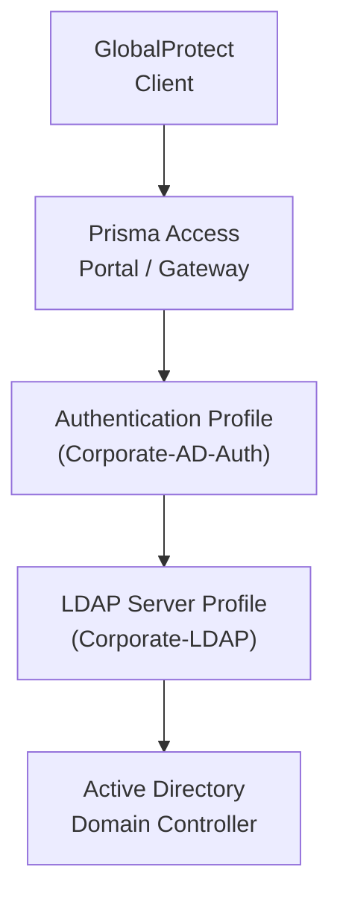

# Chapter 43 — LDAP Server & Authentication Profile

GlobalProtect requires an authentication profile to validate user credentials at the portal and gateway. This chapter covers creating an **LDAP server profile** (the connection to Active Directory) and an **authentication profile** (the policy that references that profile).

---

## Prerequisites

- Active Directory LDAP server reachable from Panorama (or via Service Connection)
- Service account credentials with read access to the directory
- LDAP port open: TCP 389 (LDAP) or TCP 636 (LDAPS)

---

## Step 1 — Create the LDAP Server Profile

**Navigation:**
`Panorama > Device > Server Profiles > LDAP > Add`

| Field | Example / Notes |
|---|---|
| **Name** | `Corporate-LDAP` |
| **Type** | `LDAP` |
| **LDAP Server** (hostname/IP) | IP or FQDN of the domain controller |
| **Port** | `389` (LDAP) or `636` (LDAPS) |
| **SSL** | Enable for port 636; leave off for port 389 |
| **Base DN** | `dc=corp,dc=example,dc=com` |
| **Bind DN** | `cn=svc-ldap,cn=users,dc=corp,dc=example,dc=com` |
| **Password** | Service account password |
| **Verify Server Certificate** | Recommended for LDAPS |

Click **OK** to save.

> 📷 [PaloAlto screenshot — LDAP Server Profile configuration](https://docs.paloaltonetworks.com/prisma-access/administration/prisma-access-mobile-users/mobile-users-globalprotect/set-up-globalprotect-mobile-users)

**Strata Cloud Manager:** confirmed direct LDAP server profile configuration remains fully valid and current for SCM — this is not something Cloud Identity Engine has replaced.

`Configuration > NGFW and Prisma Access > Configuration Scope > Access Agent > Identity Services > Authentication > Server Profiles > LDAP > Add LDAP Server Profiles`

Fields match the Panorama table above closely: **Name**, **Type** (select `active-directory`), **Base DN**, **Bind DN**, **Bind Password / Confirm Bind Password**, **LDAP Server** (name and IP — up to four servers per profile), **Require SSL/TLS Secure Connection** (enabled by default), **Verify Server Certificate**.

> ⚠️ **Note the configuration scope name:** this specific SCM feature is scoped under **Access Agent**, not the **Prisma Access** scope used elsewhere in this manual's SCM navigation (ch29–ch42) — confirmed exactly as documented, not a typo.

---

## Step 2 — Verify LDAP Connectivity

After saving the server profile, test reachability:

- From Panorama > Device > Server Profiles > LDAP, select the profile and verify no commit errors
- Confirm the LDAP server is reachable from the Panorama management IP
- If Panorama and the LDAP server are on different segments, ensure a route exists (typically via Service Connection)

---

## Step 3 — Create the Authentication Profile

**Navigation:**
`Panorama > Device > Authentication Profiles > Add`

### Authentication tab

| Field | Value / Notes |
|---|---|
| **Name** | `Corporate-AD-Auth` |
| **Type** | `LDAP` |
| **Server Profile** | Select the profile created in Step 1 (e.g. `Corporate-LDAP`) |
| **Login Attribute** | `sAMAccountName` (default for Active Directory) |
| **User Domain** | `corp` (NetBIOS domain name — used for username normalization) |
| **Username Modifier** | Leave blank unless UPN format is required |

> The **User Domain** field prepends the domain to the username in logs (e.g. `corp\jsmith`). Set it to match your AD NetBIOS domain name.

### Advanced tab

| Field | Value / Notes |
|---|---|
| **Allow List** | Add the AD groups (or `all` for unrestricted) allowed to authenticate via GlobalProtect |

> ⚠️ If the **Allow List** is empty, no users will be permitted to authenticate. Always add at least one group or select `all`.

Click **OK** to save.

> 📷 [PaloAlto screenshot — Authentication Profile configuration](https://docs.paloaltonetworks.com/prisma-access/administration/prisma-access-mobile-users/mobile-users-globalprotect/set-up-globalprotect-mobile-users)

**Strata Cloud Manager:**

`Configuration > NGFW and Prisma Access > Configuration Scope > Access Agent > Identity Services > Authentication > Authentication Profiles`

Confirmed the authentication profile references the LDAP server profile **directly** — select the LDAP Server Profile created in Step 1 above, with no Cloud Identity Engine step in between.

**A separate, parallel option worth knowing about, not a replacement for this chapter's approach:** Palo Alto also offers **Cloud Identity Engine (CIE)** as a centralized authentication broker, primarily documented for SAML-based identity providers (Okta, Azure AD/Entra ID). CIE is a genuinely different, broader identity architecture — the same one Chapter 33 found replaces Panorama's Master Device concept with Identity Redistribution for group mapping — but for this chapter's specific scenario (on-premises AD via direct LDAP), CIE is not required and direct LDAP configuration is the confirmed current path. If your organization already authenticates via SAML/Okta/Azure AD rather than on-prem AD, CIE may be more relevant — that's outside this chapter's scope.

---

## Commit & Push

After creating both profiles:

1. `Commit > Commit and Push`
2. Edit Selections → Select **Prisma Access** → **Mobile Users**
3. Click **OK** → **Commit and Push**

The authentication profile becomes available for selection in the GlobalProtect portal onboarding (Chapter 44).

**Strata Cloud Manager:** Commit is replaced with **Push Config**, per the terminology already established in Chapter 28 — not re-explained here.

---

## Key Takeaways

- LDAP server profile defines the connection to Active Directory: server, port, Base DN, Bind DN
- Authentication profile references the LDAP profile and specifies the login attribute and user domain
- The Allow List on the Advanced tab controls which AD groups can authenticate — must not be empty
- Use `sAMAccountName` as the login attribute for standard AD deployments; use `userPrincipalName` for UPN/email login
- LDAP profiles are created under Panorama > Device (not under a specific device group) — they apply globally across the management plane
- Direct LDAP-profile configuration is confirmed fully valid and current for Strata Cloud Manager — not superseded by Cloud Identity Engine for this on-prem AD scenario
- SCM's LDAP feature is scoped under **Access Agent**, not the **Prisma Access** configuration scope used elsewhere in this manual — confirmed, not a typo
- Cloud Identity Engine is a separate, parallel authentication broker (mainly for SAML/Okta/Azure AD) — relevant to Chapter 33's Identity Redistribution finding, but not required for this chapter's direct-LDAP approach

---

*Previous: [Chapter 42 — Mobile User Templates, Device Groups & Zone Mapping](./ch42-mobile-user-templates-and-zone-mapping.md)* · *Next: [Chapter 44 — Onboard Mobile Users — GlobalProtect](./ch44-onboard-mobile-users-globalprotect.md)*
