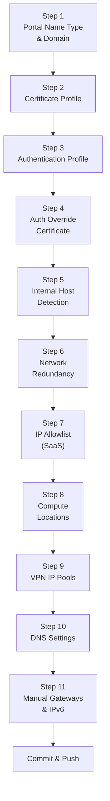

# Chapter 44 — Onboard Mobile Users — GlobalProtect

This chapter configures the GlobalProtect portal in Prisma Access — the entry point for all mobile user connections. The portal distributes gateway lists, authentication settings, and client configurations to the GlobalProtect app.

---

## Navigation

**Panorama:**
`Panorama > Cloud Services > Configuration > Mobile Users - GlobalProtect > Onboarding > Configure`

**Strata Cloud Manager:**
`Configuration > NGFW and Prisma Access > Configuration Scope > Prisma Access > Mobile Users` (to enable GlobalProtect), and `Configuration > NGFW and Prisma Access > Configuration Scope > Prisma Access > GlobalProtect > Infrastructure` (for portal/DNS/IP pool infrastructure settings).

**Structural note, confirmed via direct fetch, not assumed:** SCM's actual documented onboarding flow is a **consolidated 7-step process** (enable GlobalProtect → basic infrastructure settings → advanced settings → choose Prisma Access locations → set up authentication → review default security policy rules → verify provisioning) — it does **not** break down into the same 11 granular steps this chapter walks through for Panorama. Several of this chapter's individually-numbered Panorama steps (Auth Override Certificate, Internal Host Detection, DNS Settings, Manual Gateways) are consolidated inside SCM's broader "infrastructure settings" and "advanced settings" steps rather than surfaced as separate items — the SCM notes below are added only where a specific difference was confirmed, not manufactured to force a fake 1:1 parallel.

---

## Onboarding Steps Overview

---

### Step 1 — Portal Name Type and Domain

Select how the GlobalProtect portal FQDN is constructed:

| Portal Name Type | Description | Example Result |
|---|---|---|
| **Subdomain** | You choose a subdomain; Prisma Access appends `.gpcloudservice.com` | `portal.gpcloudservice.com` |
| **Custom FQDN** | You provide a fully qualified domain name (requires DNS CNAME to Prisma Access IP) | `portal.corp.example.com` |

| Field | Example |
|---|---|
| **Portal Name** | `portal` (subdomain) or `portal.corp.example.com` (FQDN) |
| **Domain** (subdomain type only) | `gpcloudservice.com` (auto-filled) |

> ⚠️ The portal FQDN is what GlobalProtect clients are configured to connect to. Choose a name that is stable and meaningful — it cannot be changed after onboarding without re-configuring all endpoints.

> 📷 [PaloAlto screenshot — Portal Name Type selection](https://docs.paloaltonetworks.com/prisma-access/administration/prisma-access-mobile-users/mobile-users-globalprotect/set-up-globalprotect-mobile-users)

**Strata Cloud Manager — confirmed genuine terminology difference, not a synonym:** SCM labels the same choice **"Default Domain"** and **"Custom Domain"** — not "Subdomain"/"Custom FQDN" as in Panorama, and not "Use Default Domain" as initially suspected (checked and corrected before writing this). The underlying mechanism is the same: Default Domain appends `.gpcloudservice.com` to a hostname you provide, same as this chapter's Subdomain option.

---

### Step 2 — Certificate Profile

Select the **Certificate Profile** used to validate the portal's SSL/TLS certificate:

| Field | Value |
|---|---|
| **Portal Certificate Profile** | Pre-configured cert profile (e.g. `Portal-Cert-Profile`) |

The certificate profile defines the CA certificates trusted for the portal's server certificate. This must be configured in the `Mobile_User_Template` before onboarding.

**Strata Cloud Manager — confirmed structural difference, not just a naming change:** the SCM section does **not** use a separate reusable "Certificate Profile" object the way Panorama does here. For a Custom Domain portal, SCM instead asks for a **Certificate** directly (format: PKCS12 or PEM) as part of the domain setup — a simpler, inline field rather than a standalone profile you configure ahead of time in a template. This certificate requirement was confirmed only in the context of the Custom Domain option; whether Default Domain skips it entirely wasn't explicitly confirmed and is left unstated here rather than assumed.

---

### Step 3 — Authentication Profile

Select the authentication profile created in Chapter 43:

| Field | Value |
|---|---|
| **Authentication Profile** | `Corporate-AD-Auth` (or your LDAP/SAML profile) |

This profile controls how users log in to the portal — credentials are validated against the server profile referenced in the authentication profile.

**Strata Cloud Manager:** see Chapter 43 for the confirmed SCM navigation and field details (`Identity Services > Authentication > Authentication Profiles`, scoped under **Access Agent**) — not repeated here.

---

### Step 4 — Authentication Override Certificate

Select the **Auth Override Certificate** to enable cookie-based re-authentication:

| Field | Value |
|---|---|
| **Auth Override Certificate** | `Auth-over-cert` |

The auth override certificate allows Prisma Access to issue an encrypted cookie after initial authentication. Subsequent connections use this cookie to re-authenticate transparently — avoiding repeated credential prompts when the GlobalProtect app reconnects.

> 📷 [PaloAlto screenshot — Auth Override Certificate and Authentication Profile](https://docs.paloaltonetworks.com/prisma-access/administration/prisma-access-mobile-users/mobile-users-globalprotect/set-up-globalprotect-mobile-users)

---

### Step 5 — Internal Host Detection

Configure the IP and hostname used to detect whether the endpoint is inside the corporate network:

| Field | Example |
|---|---|
| **Internal Host Detection IP** | `10.10.10.10` (internal DNS server IP) |
| **Internal Host Detection Hostname** | `dns.corp.example.com` |

When GlobalProtect resolves the specified hostname and gets the specified IP, it determines the endpoint is **on the internal network** and can connect directly (or skip the tunnel per split tunnel policy). When the hostname cannot be resolved to that IP, the endpoint is **external** and tunnels through Prisma Access.

> 📷 [PaloAlto screenshot — Internal Host Detection configuration](https://docs.paloaltonetworks.com/prisma-access/administration/prisma-access-mobile-users/mobile-users-globalprotect/set-up-globalprotect-mobile-users)

---

### Step 6 — Network Redundancy

Enable **Network Redundancy** to allow the GlobalProtect client to connect to a secondary MU-SPN if the primary is unreachable:

| Option | Effect |
|---|---|
| **Enabled** | Client tries alternate gateways in the same compute location if primary is down |
| **Disabled** | Client connects to a single designated gateway only |

Network Redundancy is recommended for all production deployments.

> ⚠️ **Strata Cloud Manager — confirmed behavioral difference, not just a navigation difference:** exact quote from the live docs — "In Strata Cloud Manager, Network Redundancy is enabled by default between portals or gateways and service connections, ensuring redundant connectivity for mobile users to accessible services and applications." This is **not** presented as an admin-configurable Enabled/Disabled toggle the way it is for Panorama above — in SCM it's on by default, without a separate step to enable it.

---

### Step 7 — IP Allowlist (SaaS Access)

The **IP Allowlist** provides the MU-SPN public IPs to trusted SaaS applications for source IP whitelisting:

- Enabling this causes Prisma Access to publish the MU-SPN egress IP ranges
- SaaS vendors (e.g. Salesforce, Box) can whitelist these IPs to restrict access to corporate Prisma Access connections
- Leave disabled if SaaS IP whitelisting is not required

> ℹ️ **Not independently confirmed for Strata Cloud Manager.** Unlike Steps 4, 5, 10, and 11, this step isn't named in the "Structural note" above as one of the items consolidated into SCM's infrastructure/advanced settings — its SCM equivalent (if any) wasn't checked during this pass. Don't assume it's absent or present without verifying directly in your tenant.

---

### Step 8 — Select Compute Locations

Select the **compute locations** (Prisma Access regions) where mobile users will be served:

- Each selected location gets a portal/gateway pair provisioned
- Prisma Access automatically connects users to the nearest selected location
- Fallback locations: **Hong Kong**, **Netherlands Central**, and **US Northwest** are used if other locations are unavailable

> 📷 [PaloAlto screenshot — Compute location selection for mobile users](https://docs.paloaltonetworks.com/prisma-access/administration/prisma-access-mobile-users/mobile-users-globalprotect/set-up-globalprotect-mobile-users)

Select at least two locations for redundancy. The provisioning process starts after the first Commit & Push that includes these location selections.

> ℹ️ **Fallback locations spot-checked, not assumed still current:** Hong Kong, Netherlands Central, and US Northwest are confirmed as current fallback locations — but only in the **Panorama** section of the source docs. The SCM section does not mention fallback locations at all in what was fetched. Don't assume this specific list applies identically to SCM without checking your own tenant.

---

### Step 9 — VPN IP Pools

Define the IP address ranges Prisma Access assigns to GlobalProtect clients when they connect:

| Field | Example |
|---|---|
| **IP Pool** | `10.20.0.0/16` |

Click **Add** for each pool subnet. Requirements:
- **Minimum size: /23** per location (512 IP addresses — Prisma Access allocates from the pool in /24 blocks as demand grows)
- **Recommended sizing: 2× the expected concurrent device count** to accommodate growth and BYOD
- Must not overlap with corporate subnets, service connection subnets, infrastructure subnets, or `169.254.0.0/16` / `100.64.0.0/10`
- IPv6 pools are supported if IPv6 is enabled

> 📷 [PaloAlto screenshot — VPN IP pool configuration](https://docs.paloaltonetworks.com/prisma-access/administration/prisma-access-mobile-users/mobile-users-globalprotect/set-up-globalprotect-mobile-users)

**Spot-checked, confirmed still current:** the /23 minimum pool size and the `169.254.0.0/16` / `100.64.0.0/10` overlap exclusions are confirmed identical in both the Panorama and Strata Cloud Manager sections of the source docs — no drift found here despite this being worth checking after everything else that's shifted since May 2026.

---

### Step 10 — DNS Settings

Configure DNS resolution for mobile users on the **Network Services** tab:

| Field | Notes |
|---|---|
| **DNS Servers** | Primary and secondary DNS server IPs — typically internal DNS for split DNS |
| **DNS Search Domain** | Domains appended to short-name queries (e.g. `corp.example.com`) |
| **Internal DNS Suffixes** | Domains resolved via internal DNS (e.g. `*.corp.example.com`) — used for split DNS |

**Split DNS** sends queries for listed internal domains to the corporate DNS server, and all other queries to a public resolver. This is the recommended configuration for hybrid deployments where mobile users access both internal and internet resources.

> 📷 [PaloAlto screenshot — DNS settings for mobile users](https://docs.paloaltonetworks.com/prisma-access/administration/prisma-access-mobile-users/mobile-users-globalprotect/set-up-globalprotect-mobile-users)

---

### Step 11 — Manual Gateways and IPv6

**Manual Gateways** (optional): Override the automatic gateway selection and designate specific gateways. Used when a custom on-premises gateway should be included in the GP gateway list alongside Prisma Access gateways.

**IPv6**: Enable IPv6 support for VPN IP pools and gateway addresses if your environment requires dual-stack connectivity.

---

## Commit & Push

1. `Commit > Commit and Push`
2. Edit Selections → Select **Prisma Access** → **Mobile Users**
3. Click **OK** → **Commit and Push**

After this push, Prisma Access provisions the portal and gateway at each selected compute location. The portal FQDN becomes resolvable and GlobalProtect clients can begin connecting.

**Strata Cloud Manager:** Commit is replaced with **Push Config**, per the terminology already established in Chapter 28 — not re-explained here. SCM's final step (per the confirmed 7-step flow above) is verifying the mobile user location is active after initial provisioning.

---

## Key Takeaways

- Portal Name Type determines the FQDN format — subdomain (`name.gpcloudservice.com`) or custom FQDN (requires CNAME)
- Auth Override Certificate enables cookie-based re-auth — avoids repeated credential prompts after initial login
- Internal Host Detection determines on-net vs off-net status for each endpoint
- VPN IP pools must not overlap with any existing subnet — size for peak concurrent users across all locations
- Split DNS via Internal DNS Suffixes routes internal domain queries to corporate DNS and external queries to public DNS
- Prisma Access uses Hong Kong, Netherlands Central, and US Northwest as fallback locations — confirmed for Panorama; not confirmed for SCM
- The zone-mapping passage referencing `Mobile_User_Template_Stack` is confirmed (via heading-outline verification, same method as ch42) to fall under Panorama, not SCM — no contradiction with ch42's finding
- Strata Cloud Manager's onboarding flow is a consolidated 7-step process, not a 1:1 match to this chapter's 11 Panorama steps — Network Redundancy is on by default (a real behavioral difference), Portal FQDN uses "Default Domain"/"Custom Domain" labels, and Certificate Profile has no separate reusable-object equivalent

---

*Previous: [Chapter 43 — LDAP Server & Authentication Profile](./ch43-ldap-and-authentication-profile.md)* · *Next: [Chapter 45 — Verify Mobile Users — GlobalProtect](./ch45-verify-mobile-users-globalprotect.md)*
