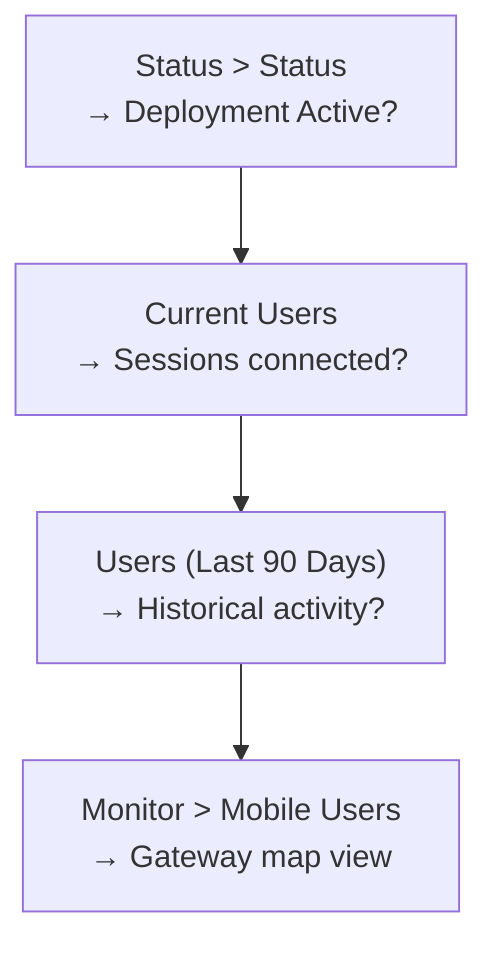

# Chapter 45 — Verify Mobile Users — GlobalProtect

After the initial Commit & Push from Chapter 44, Prisma Access provisions the portal and gateways (allow up to 15 minutes). This chapter covers the three verification views available in Panorama.

---

## Verification Views

### View 1 — Deployment Status

**Navigation:**
`Panorama > Cloud Services > Status > Status`

Confirm:
- **Mobile Users** section shows **Active** status for each deployed compute location
- Portal FQDN is listed and resolvable (test with `nslookup <portal-fqdn>`)
- Each selected compute location shows a gateway in **Active** state

If a location shows **Provisioning**, wait and refresh — initial provisioning can take up to 15 minutes after the first push.

**Strata Cloud Manager — confirmed genuinely different framing, not just a different navigation path:** `Insights > Prisma SASE > Prisma Access Locations`. This is a **location-health dashboard**, not the same Active/Provisioning check as Panorama's view above. Per-location status is one of **Up** (all cloud firewalls at that location are up), **Down** (all are down), or **Need Attention** (some up, some down) — plus a separate **Strata Logging Service Connectivity** indicator (Connected / Disconnected / Partially Connected), GlobalProtect connected user counts, and connected sites/data centers. Use this to gauge overall location health rather than a simple "is this deployment Active yet" check.

---

### View 2 — Current Connected Users

**Navigation:**
`Panorama > Cloud Services > Status > Status > Current Users`

Click the **Current Users** count to see a live list of connected GlobalProtect sessions:

| Column | Description |
|---|---|
| **Username** | Authenticated user identity |
| **IP Address** | VPN IP assigned from the pool |
| **Gateway** | Compute location gateway in use |
| **Connect Time** | Session start time |
| **Client Version** | GlobalProtect app version |

Use this view to confirm that test users can successfully connect, authenticate, and receive a VPN IP address from the correct pool.

**Strata Cloud Manager — confirmed as the same single view used for View 3 below, not a separate destination:** `Insights > Activity Insights > Users`. This view covers both "current connected" and "historical" use cases via a **"Turn Current Connected ON"** toggle (ON = connected users only; OFF = all users) rather than Panorama's two separate navigation destinations. The columns shown are meaningfully different from Panorama's simple table above — instead of Username/IP Address/Gateway/Connect Time/Client Version, SCM shows **User Name, Connection Method, Last Device Location, Threats, Applications, Data Usage**, and several experience-score columns (User Experience Score, Endpoint/Wi-Fi/Local Network/PA/Internet Experience Score), plus Last Firewall/PA Location and Last Activity Time — an experience-and-security-oriented view, not a like-for-like session detail table.

---

### View 3 — Historical Users (Last 90 Days)

**Navigation:**
`Panorama > Cloud Services > Status > Status > Users (Last 90 Days)`

Click the number next to **Users (Last 90 Days)** to display a historical timeline of user connections. Use this view to:
- Confirm that users connected on specific dates after rollout
- Identify connection patterns and peak usage periods
- Verify that users in different regions are connecting to the correct compute locations

**Strata Cloud Manager — confirmed the fixed 90-day framing does NOT carry over, checked rather than assumed:** the same `Insights > Activity Insights > Users` view from View 2 above, with the "Turn Current Connected" toggle set to **OFF**. The docs describe a generic **"selected time range"** with no fixed 90-day window mentioned anywhere — treat the time range as configurable rather than assuming a hardcoded 90-day equivalent exists in SCM.

---

### View 4 — Geographic Gateway Map

**Navigation:**
`Panorama > Monitor > Mobile Users`

The Monitor view displays a world map showing:
- All active Prisma Access portals and gateways in the selected compute locations
- Current connection counts per region
- Active status per gateway

Click any region on the map to drill down into that region's gateway details, including connected user count and gateway health.

**Strata Cloud Manager — confirmed genuinely different orientation, not just a different map style:** `Insights > SASE Health > Current Mobile Users - Map View`. This map is oriented around **user experience scoring**, not gateway active-status the way Panorama's view is: circled numbers show connected GlobalProtect user counts per location, individual dots represent single mobile users color-coded **green** (good experience) or **red** (degraded experience), and a trend line chart shows average experience scores over the selected time range. Click a degraded-experience count to drill into details. Use this when the question is "how good is the user experience at this location," not "is the gateway itself up" — for that, see View 1's location-health status above.

---

## Common Issues

| Symptom | Likely Cause | Resolution |
|---|---|---|
| Portal FQDN not resolving | Push not complete or provisioning in progress | Wait 15 min, check Status > Status |
| User can reach portal but auth fails | Auth profile misconfiguration or LDAP unreachable | Verify LDAP server profile (ch43), check allow list. **Strata Cloud Manager:** confirmed diagnostic tool for this exact scenario — `Insights > Prisma SASE > Network Services > GlobalProtect Authentication` shows authentication **Success**, **Total Failures**, and **Timeout Failures** counts, filterable by location and time range. Not currently covered elsewhere in this chapter. |
| VPN IP not assigned | IP pool exhausted or pool overlap | Check pool size and overlap |
| Users connecting to wrong region | Internal Host Detection misconfigured | Verify detection IP/hostname (ch44, Step 5) |
| No users showing in Last 90 Days | No users have connected yet | Connect a test user and re-check |

---

## Key Takeaways

- Deployment becomes Active approximately 15 minutes after the first Mobile Users Commit & Push
- Current Users view shows live session details: username, VPN IP, gateway, client version
- Last 90 Days view provides historical connectivity data for up to 3 months
- Monitor > Mobile Users provides the geographic gateway health map
- For users connecting to the wrong location: verify Internal Host Detection and confirm the app is using the correct portal FQDN
- Strata Cloud Manager's four verification views were confirmed to diverge meaningfully from Panorama's, not just in navigation: Prisma Access Locations is a health dashboard (Up/Down/Need Attention), Activity Insights: Users unifies current+historical into one view with a toggle (no fixed 90-day window), and SASE Health's map is experience-score-oriented rather than gateway-status-oriented
- SCM's GlobalProtect Authentication Insights (`Insights > Prisma SASE > Network Services > GlobalProtect Authentication`) shows success/failure/timeout counts by location — a genuinely new diagnostic for the auth-fails scenario, not previously in this chapter

---

*Previous: [Chapter 44 — Onboard Mobile Users — GlobalProtect](./ch44-onboard-mobile-users-globalprotect.md)* · *Next: [Chapter 46 — GlobalProtect Split Tunneling](./ch46-globalprotect-split-tunneling.md)*
