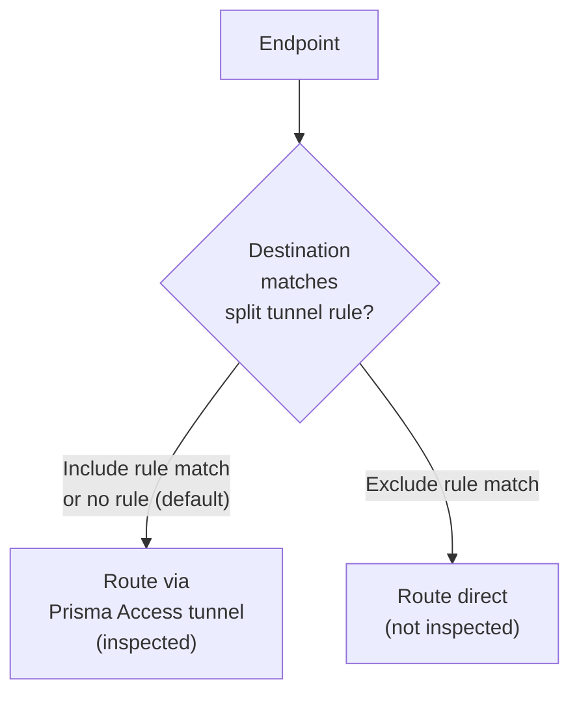

# Chapter 46 — GlobalProtect Split Tunneling

Split tunneling controls which traffic is routed through the Prisma Access VPN tunnel and which goes directly to the internet from the endpoint. This reduces bandwidth consumption and latency for trusted non-corporate traffic (e.g. video conferencing, SaaS apps).

> ⚠️ **Security note:** Split-tunneled traffic is **not** inspected by the Prisma Access next-generation firewall and does not receive threat protection. Include only traffic you explicitly trust to bypass inspection.

---

## Configuration Location

**Navigation (Panorama):**
`Panorama > Network > GlobalProtect > Gateways > [select gateway] > Agent > Client Settings > [select config] > Split Tunnel`

**Navigation (Strata Cloud Manager):**
`Configuration > NGFW and Prisma Access > Configuration Scope > Prisma Access > GlobalProtect > GlobalProtect App > Tunnel Settings`

**Confirmed structural difference, not just a shorter path:** SCM consolidates split tunnel configuration into a **single screen**, rather than Panorama's Gateway > Agent > Client Settings drill-down. The screen is organized differently too — **Local Network Access** (resources reachable without the tunnel), **Exclude Traffic** (by application, domain, or route/IP), and **Customize Include Traffic** (to override Exclude Traffic criteria) — rather than Panorama's separate Access Route and Domain/Application tabs. The underlying concepts (Include, Exclude, Access Route, Domain, Application) are the same; only the screen layout and labeling differ.

> ℹ️ **200-entry limit not confirmed for SCM:** the fetched SCM documentation didn't restate the 200-entries-per-list figure Panorama documents (below) — don't assume it's unchanged without checking your own tenant.

Privileged Remote Access and Secure Agentless Access features reuse this same Tunnel Settings screen for their own domain exclusions (default domains `*.panwpra.com` and `*.panwsaa.com`, added under Exclude Traffic > domain) — worth knowing if you encounter these entries while troubleshooting, though this chapter doesn't cover PRA/SAA in depth.

---

## Split Tunneling Methods

Two independent methods are available. They can be used together.

### Method 1 — Access Route (IP/Subnet-Based)

Controls traffic routing by destination IP address or subnet.

**Access Route tab:**

| Action | Behaviour |
|---|---|
| **Include** | Route these destination subnets **through** the VPN tunnel |
| **Exclude** | Route these destination subnets **directly** (bypass tunnel) |

| Field | Example |
|---|---|
| Subnet (include) | `10.0.0.0/8` (all RFC 1918 traffic via tunnel) |
| Subnet (exclude) | `8.8.8.8/32`, `1.1.1.1/32` (DNS bypass) |

**Use case:** Route all corporate RFC 1918 traffic through the tunnel; let everything else go direct.

> ⚠️ Access route exclusions do **not** apply to Android endpoints on Chromebooks — all traffic is tunnelled for those endpoints.

---

### Method 2 — Domain and Application-Based

Controls traffic routing by domain name or application process name — more granular than IP-based routing.

**Domain and Application tab:**

| Field | Limit | Example |
|---|---|---|
| **Include Domains** | Up to 200 entries | `corp.example.com` |
| **Exclude Domains** | Up to 200 entries | `zoom.us`, `teams.microsoft.com` |
| **Include Applications** | Up to 200 entries (by process name) | `outlook.exe` (Windows) |
| **Exclude Applications** | Up to 200 entries (by process name) | `zoom.exe`, `teams.exe` |

Domain-based split tunneling resolves the domain at connection time and routes matching traffic accordingly. This is more flexible than IP-based routing for SaaS apps with dynamic IP addresses.

---

## Default Behaviour

Without any split tunnel configuration, GlobalProtect routes **all traffic** through the tunnel (full tunnel mode). Split tunnel rules create exceptions to this default.

| Configuration | Traffic Behaviour |
|---|---|
| No split tunnel (default) | All traffic → VPN tunnel |
| Include rules only | Only listed traffic → VPN; rest → direct |
| Exclude rules only | All traffic → VPN, except listed → direct |
| Include + Exclude | Include rules take precedence |

> ℹ️ **Investigated, not flipped — evidence didn't support a correction.** A community troubleshooting article claims the opposite ("application exclude takes precedence over application include, followed by domain exclude taking precedence over domain include"). This claim couldn't be independently confirmed: the article itself was inaccessible for direct verification (403), and multiple direct fetches of first-party Palo Alto documentation pages explicitly stated they don't document include/exclude precedence. What *was* found, from Strata Cloud Manager's own Tunnel Settings documentation, is a framing that supports this table's existing claim — SCM explicitly labels the Include list "Customize Include Traffic (**to override exclude criteria**)." Given that first-party phrasing points the same direction as the existing table and the only contrary source couldn't be verified directly, this row is left unchanged rather than "corrected" on an unconfirmed basis. If you rely on this behavior for a security-sensitive configuration, verify directly against your own tenant rather than either source.
>
> One thing that **is** confirmed regardless of precedence direction: for access-route-based split tunneling specifically, avoid listing the same route as both Include and Exclude — Palo Alto's docs call this a misconfiguration outright, and recommend excluded routes be more specific than included ones to avoid excluding more traffic than intended.

---

## Commit & Push

After configuring split tunnel rules:

1. `Commit > Commit and Push`
2. Edit Selections → Select **Prisma Access** → **Mobile Users**
3. Click **OK** → **Commit and Push**

**Strata Cloud Manager:** Commit is replaced with **Push Config**, per the terminology already established in Chapter 28 — not re-explained here.

---

## Key Takeaways

- Two methods: access route (IP/subnet) and domain/application — both can be used simultaneously
- **Exclude** rules bypass the tunnel; **Include** rules force traffic through the tunnel
- Domain/application method supports up to 200 entries per include/exclude list (not independently confirmed for SCM)
- Split-tunnelled traffic is **not inspected** by the next-generation firewall — exclude only trusted destinations
- Access route exclusions do not work for Android apps on Chromebook endpoints
- Default (no split tunnel) = full tunnel — all endpoint traffic passes through Prisma Access
- A possible Include/Exclude precedence error was investigated but not confirmed — SCM's own docs ("Customize Include Traffic to override exclude criteria") support this chapter's existing claim over a single, unverifiable community source
- Strata Cloud Manager consolidates split tunnel into one Tunnel Settings screen (Local Network Access / Exclude Traffic / Customize Include Traffic), reused by Privileged Remote Access and Secure Agentless Access for their own domain exclusions

---

*Previous: [Chapter 45 — Verify Mobile Users — GlobalProtect](./ch45-verify-mobile-users-globalprotect.md)* · *Next: [Chapter 47 — GlobalProtect App Settings](./ch47-globalprotect-app-settings.md)*
