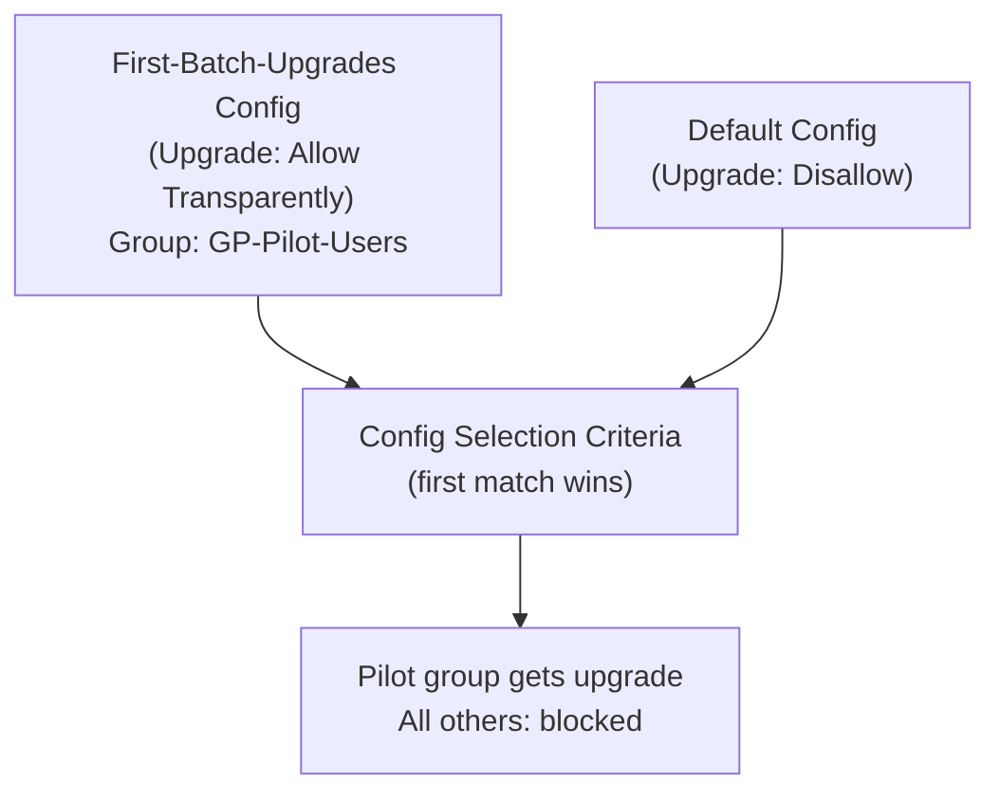

# Chapter 48 — GlobalProtect App Upgrades — Staged Rollout

GlobalProtect app upgrades in Prisma Access are managed in two steps: **activating** the target version tenant-wide, and optionally configuring a **staged rollout** that restricts the upgrade to a pilot group before deploying broadly.

---

## Part 1 — Activate a New App Version

Only one GlobalProtect app version is active at any time. Users who download the app from the portal receive the currently active version.

### Step 1 — Navigate to App Activation

**Navigation (Panorama):**
`Panorama > Cloud Services > Configuration > Service Setup > Service Operations > GlobalProtect App Activation`

**Navigation (Strata Cloud Manager) — ambiguity resolved via direct fetch, not guessed:** `Configuration > NGFW and Prisma Access > Configuration Scope > Prisma Access > Mobile Users > GlobalProtect Setup > GlobalProtect App tab > Global App Settings > General tab`. This is the confirmed correct path — no separate "Service Setup" equivalent for GlobalProtect app version activation was found for SCM. Version settings are **per-tenant**, not split between a global default and per-portal override; the source docs explicitly note this for multitenant deployments.

The screen shows all available app versions with their activation status:

| Version | Status |
|---|---|
| `6.1.0` | Available |
| `6.0.1` | Available |
| `6.0.0` | Activated (current) |

### Step 2 — Select and Activate the New Version

1. Select the target version (e.g. `6.1.0`)
2. Click **OK** to confirm activation
3. A success message confirms the version is now set as the active version

> After activation, the new version is shown as **Activated** on the Service Setup page.

> 📷 [PaloAlto screenshot — GlobalProtect App Activation in Service Setup](https://docs.paloaltonetworks.com/prisma-access/administration/prisma-access-mobile-users/mobile-users-globalprotect/globalprotect-app-upgrades/select-the-active-globalprotect-app-version-for-prisma-access)

### Step 3 — Commit & Push

After activating the new version:

1. `Commit > Commit and Push`
2. Edit Selections → Select **Prisma Access** → **Service Setup**
3. Click **OK** → **Commit and Push**

> ⚠️ Note the push scope for version activation is **Service Setup**, not Mobile Users.

**Strata Cloud Manager:** Commit is replaced with **Push Config**, per the terminology already established in Chapter 28 — not re-explained here.

---

## Part 2 — Staged Rollout via Portal Agent Configs

A staged rollout deploys the new version to a pilot group first, while other users remain on the current version. This is achieved by creating a separate agent config with upgrade allowed, and restricting it to a specific user group.

### Overview

The portal evaluates agent configs **top-to-bottom** — the first config whose selection criteria match the user is applied. Move the pilot config above the Default config to ensure it is evaluated first.

---

### Step 1 — Clone the Default Config

**Navigation (Panorama):**
`Panorama > Network > GlobalProtect > Portals > [portal] > Agent tab`

1. Select the **Default** config
2. Click **Clone** (or right-click → Clone)
3. Name the clone `First-Batch-Upgrades` (or any descriptive name)

**Strata Cloud Manager — no dedicated staged-rollout guide exists, confirmed via direct fetch:** only a Panorama-specific "Stagger GlobalProtect App Updates" page is documented — there is no paired SCM/cloud-management version, despite that being the pattern for most other GlobalProtect docs in this manual (Tunnel Settings, for example, has separate Panorama and Cloud Management pages). SCM's general "Allow Users to Upgrade the GlobalProtect App" documentation does mention an **Add App Settings** action (creating additional named app-setting configurations under `Mobile Users > GlobalProtect Setup > GlobalProtect App tab`), which suggests the same underlying "multiple configs, restrict by criteria" mechanism this chapter's Panorama steps use is likely achievable in SCM — but since no formal staged-rollout walkthrough is documented for it, the specific steps below are **not verified for SCM** and are presented as Panorama-only.

---

### Step 2 — Configure the New Config — Selection Criteria

Open the cloned config and go to the **Config Selection Criteria** tab:

| Field | Value |
|---|---|
| **User Group** | Add the pilot AD group (e.g. `GP-Pilot-Users`) |

Only members of this group will receive this config — all others continue to receive the Default config.

---

### Step 3 — Configure the New Config — App Upgrade Setting

On the **App tab** of the cloned config:

| Field | Value |
|---|---|
| **Upgrade App** | `Allow Transparently` (or `Allow with Prompt`) |

**Complete upgrade options, confirmed via direct fetch — this chapter previously only mentioned 3 of 5 real options:**

| Behavior | Panorama label | Strata Cloud Manager label |
|---|---|---|
| Prompt the user; upgrade when convenient (default) | `Allow with Prompt` | `Allow with Prompt` |
| User manually checks for and initiates the upgrade | `Allow Manually` | `Allow Manually` |
| Auto-upgrade as soon as a new version is available | `Allow Transparently` | `Allow Transparently` |
| Auto-upgrade, but only once the endpoint is on the corporate network | `Allow when the user is in the corporate network` | **`Internal`** — confirmed genuine terminology difference, not a synonym to normalize away |
| No upgrade allowed | `Disallow` | `Disallow` |

> ⚠️ **Confirmed platform-agnostic prerequisite, previously missing from this chapter entirely:** if **Allow Transparently** or **Internal**/**Allow when the user is in the corporate network** is selected, you must also create a **Custom URL category** for `pan-gp-client.s3.dualstack.us-west-2.amazonaws.com` and allow traffic to it in security policy — otherwise the app cannot actually download the update file. Optionally scope the rule to only `*.pkg` and `*.msi` downloads for tighter control. This applies to **both** Panorama and Strata Cloud Manager — it's not platform-specific.

---

### Step 4 — Move the Pilot Config Above Default

Back on the Agent tab list:

1. Select `First-Batch-Upgrades`
2. Click **Move Up** until it appears **above** the Default config

Config order matters — the portal applies the first matching config.

---

### Step 5 — Set Default Config to Disallow Upgrade

Open the **Default** config and on the **App tab**:

| Field | Value |
|---|---|
| **Upgrade App** | `Disallow` |

This prevents all users not matched by the pilot config from receiving the upgrade.

---

### Step 6 — Commit & Push

1. `Commit > Commit and Push`
2. Edit Selections → Select **Prisma Access** → **Mobile Users**
3. Click **OK** → **Commit and Push**

After this push, only members of `GP-Pilot-Users` receive the upgrade. Once the pilot is validated, update the Default config to allow upgrades and re-push to roll out to all users.

**Strata Cloud Manager:** Commit is replaced with **Push Config**, per the terminology already established in Chapter 28. (This assumes an equivalent config-cloning mechanism exists in SCM — see the caveat under Step 1 above; not independently verified as a formal staged-rollout process.)

---

## Key Takeaways

- Only one GlobalProtect app version is active at a time — activating a new version replaces the current one for all new downloads
- Version activation commit scope is **Service Setup**; staged rollout commit scope is **Mobile Users** — these are separate pushes
- Staged rollout uses portal agent config ordering: pilot config with group restriction above Default config
- Config selection criteria use **first-match** logic — pilot group config must be above Default to take effect
- After pilot validation, remove the restriction (or update Default to Allow) and re-push to complete the rollout
- FedRAMP environments must remain on FIPS-certified version 5.1.4 — do not change unless explicitly required
- Five upgrade options exist, not three: Allow with Prompt, Allow Manually, Allow Transparently, corporate-network-only (SCM: **Internal**; Panorama: "Allow when the user is in the corporate network"), and Disallow
- Allow Transparently and Internal both require a Custom URL category for `pan-gp-client.s3.dualstack.us-west-2.amazonaws.com` allowed in security policy — otherwise the app can't download the update, regardless of management platform
- SCM's GlobalProtect app version activation path was confirmed via direct fetch: Mobile Users > GlobalProtect Setup > Global App Settings — no separate Service Setup equivalent exists for SCM
- No dedicated SCM staged-rollout guide is documented — only Panorama's "Stagger GlobalProtect App Updates" page exists; SCM likely supports an equivalent via multiple named App Settings configs, but this isn't formally documented as a staged-rollout process

---

*Previous: [Chapter 47 — GlobalProtect App Settings](./ch47-globalprotect-app-settings.md)* · *Next: [Chapter 49 — How Explicit Proxy Works](../part9/ch49-how-explicit-proxy-works.md)*
