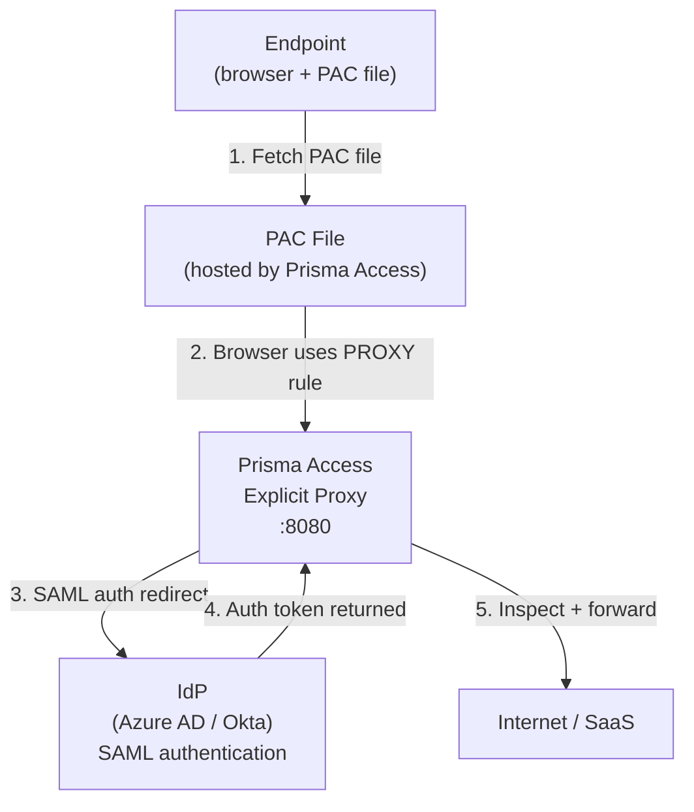

# Chapter 49 — How Explicit Proxy Works

**Explicit Proxy** (also called Cloud Secure Web Gateway) is an agentless method for securing mobile user internet and SaaS traffic. Instead of installing a VPN client, the endpoint's browser is pointed at a PAC file that automatically forwards web traffic to the Prisma Access proxy.

---

## Explicit Proxy vs GlobalProtect

| Feature | Explicit Proxy | GlobalProtect (ch44) |
|---|---|---|
| Client software | None — browser only | GlobalProtect app required |
| Traffic coverage | HTTP/HTTPS only (ports 80/443) | All TCP/UDP traffic |
| Private app access | Not supported | Supported |
| Authentication | SAML, Kerberos *(corrected 2026-07-09 — was "SAML only")* | LDAP, SAML, Kerberos |
| Proxy port | 8080 (SAML), 8081 (Kerberos) | N/A (tunnel) |
| Deployment model | Cloud-only | Cloud + on-premises gateways |

Explicit Proxy is best suited for **managed and unmanaged devices** that need web/SaaS security without a full VPN client.

---

## Traffic Flow

1. On connection, the browser fetches the PAC file hosted by Prisma Access
2. The PAC file returns `PROXY <fqdn>.proxy.prismaaccess.com:8080` for web traffic
3. The browser forwards HTTP/HTTPS traffic to the Explicit Proxy on port 8080
4. Prisma Access redirects to the SAML IdP for authentication (first connection)
5. After successful authentication, traffic is inspected by NGFW security policies and forwarded to the internet

> This diagram shows the **SAML** authentication path specifically. If Kerberos is configured instead (see Key Constraints below), the endpoint authenticates against your Kerberos infrastructure via port 8081 rather than redirecting to a SAML IdP on port 8080 — the rest of the flow (inspect + forward) is the same.

---

## Key Constraints

| Constraint | Detail |
|---|---|
| **Port** | **Corrected 2026-07-09** — port **8080** for SAML authentication, port **8081** for Kerberos authentication (was stated as "only port 8080") |
| **Protocols** | HTTP and HTTPS only — no FTP, no private app protocols |
| **Authentication** | **Corrected 2026-07-09** — **SAML and Kerberos** are both current, GA options (was stated as "SAML only — no LDAP, no Kerberos"); LDAP and local authentication are still not supported |
| **HTTP/2** | Not supported natively — downgraded to **HTTP/1.1** |
| **TLS** | Maximum version **TLS 1.3** |
| **On-premises** | Not available — cloud-only service |
| **Private apps** | Not accessible via Explicit Proxy — use GlobalProtect or ZTNA Connector |

> ℹ️ **Kerberos authentication — confirmed current, brief pointer only:** Kerberos is a fully supported alternative to SAML for Explicit Proxy, available on both Panorama and Strata Cloud Manager. Endpoints with access to your Kerberos infrastructure use it; endpoints without that access fall back to SAML — both can be configured in the same deployment. Requires a Kerberos Keytab and Kerberos Realm, and usernames must be in `userPrincipalName` (UPN) format — `sAMAccountName` is not supported. Full setup is out of scope for this chapter; see the [Kerberos Authentication for Explicit Proxy Deployments documentation](https://docs.paloaltonetworks.com/prisma-access/administration/prisma-access-mobile-users/mobile-users-explicit-proxy/kerberos-authentication-for-explicit-proxy-deployments) if you need it.

---

## SSL Decryption Requirement

Explicit Proxy **requires** an SSL decryption policy for all traffic. Without SSL decryption:
- HTTPS traffic cannot be inspected
- User identity is unknown for encrypted sessions (users appear as unidentified in logs)

This is a mandatory prerequisite — configure a decryption policy rule in the `Explicit_Proxy_Device_Group` before onboarding.

---

## Proxy URL Location

After onboarding and commit/push, the Explicit Proxy URL is available at:

`Panorama > Cloud Services > Status > Network Details > Mobile Users — Explicit Proxy`

This URL is used in the PAC file's `PROXY` statement and in proxy chaining configurations.

---

## Related Capabilities

Brief pointers only — not covered in depth in this chapter:

- **Trusted Source Address** — confirmed current. Lets you allowlist source IP addresses that bypass authentication entirely, useful for headless or agentless devices that can't complete a SAML or Kerberos login. Supports up to 100,000 entered addresses (which can include subnets), expanding to up to 1,000,000 individual IPs once subnets are expanded. Relevant since the rest of this chapter assumes authentication is always required — it isn't, for allowlisted sources.
- **SOCKS5 proxy support** — **could not be confirmed** despite extensive searching. A feature by this name surfaced repeatedly in aggregated search results, but no direct fetch of an actual Palo Alto docs page could locate a verbatim description, port number, or availability caveat. Not included here as fact — if you need this capability, verify directly with Palo Alto Networks rather than relying on this note.

---

## Key Takeaways

- Explicit Proxy secures HTTP/HTTPS browser traffic only — no VPN client required
- Traffic reaches Prisma Access via PAC file directing browsers to port 8080 (SAML) or 8081 (Kerberos)
- **Corrected 2026-07-09** — SAML is **not** the only supported authentication method; Kerberos is a current, GA alternative on both Panorama and SCM, and both can be used in the same deployment
- SSL decryption is mandatory — without it, HTTPS traffic cannot be inspected
- Private apps, FTP, and non-web protocols are not supported
- The Explicit Proxy URL is only visible after onboarding and commit/push
- Trusted Source Address lets allowlisted IPs skip authentication entirely — confirmed current; SOCKS5 proxy support could not be confirmed and is not stated as fact

---

*Previous: [Chapter 48 — GlobalProtect App Upgrades — Staged Rollout](../part8/ch48-globalprotect-app-upgrades.md)* · *Next: [Chapter 50 — Explicit Proxy Configuration Guidelines](./ch50-explicit-proxy-configuration-guidelines.md)*
