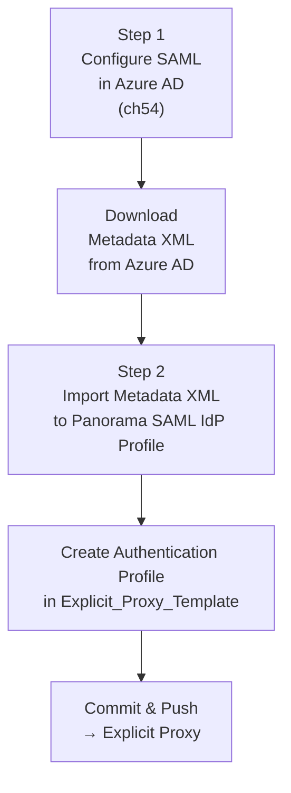

# Chapter 53 — Configure Azure AD SAML Profile & Authentication Profile

Explicit Proxy requires **SAML authentication** for typical browser-based mobile users — this chapter outlines the two-step process: configuring a SAML Enterprise Application in Azure AD, then importing Azure AD's metadata into Panorama to create a SAML IdP profile and authentication profile. (Kerberos is a separate, currently-supported alternative for servers, IoT, and headless devices rather than typical browser users — see Chapter 49; SAML remains the right choice for the scenario this chapter covers.)

Chapter 54 covers the Azure AD configuration steps in detail.

> ⚠️ **This chapter documents the direct SAML IdP import approach — confirmed still valid, but not the currently-recommended path for Azure AD specifically.** Palo Alto's own documentation has a page titled *"Configure Mobile Users using Cloud Identity Engine (**Recommended**)"* for Azure AD SAML setups (covering both GlobalProtect and Explicit Proxy). That path is a **genuinely different workflow**, not just an alternate connection method for the same two steps: SP metadata is sourced **from Cloud Identity Engine** rather than from Prisma Access, and the authentication profile is created **inside CIE**, then referenced from Prisma Access — rather than importing Azure's metadata directly into a Panorama/SCM SAML IdP Profile the way this chapter does. Palo Alto also documents a sibling "Configure Mobile Users without Cloud Identity Engine" path, confirming this chapter's direct approach remains valid and supported — just not the one currently labeled "Recommended." This echoes the same direct-vs-CIE pattern Chapter 43 found for LDAP, and relates to Chapter 33's Identity Redistribution finding — CIE is Palo Alto's broader push toward a centralized identity broker across multiple authentication contexts, not something specific to this one chapter. Full CIE setup is out of scope here — see the CIE Azure AD configuration documentation if you want the recommended path instead.

---

## Overview — Two-Step Process

---

## Step 1 — Configure SAML in Azure AD

Full step-by-step in Chapter 54. The key outputs from the Azure AD configuration are:

| Output | Value |
|---|---|
| **Entity ID** (configured in Azure AD) | `https://global.acs.prismaaccess.com/saml/metadata` |
| **ACS URL** (Reply URL in Azure AD) | `https://global.acs.prismaaccess.com/saml/acs` |
| **Name ID** | `user.userprincipalname` |
| **Username claim** | `username` attribute = `user.userprincipalname` |
| **Metadata XML file** | Downloaded from Azure AD for import into Panorama |

---

## Step 2 — Import Metadata XML into Panorama

**Navigation (Panorama):**
`Panorama > Device > Server Profiles > SAML Identity Provider > Import`

**Navigation (Strata Cloud Manager) — confirmed via direct fetch:**
`Configuration > NGFW and Prisma Access > Configuration Scope > Prisma Access > Mobile Users > Explicit Proxy Setup > User Authentication > SAML IdP Profile > Add SAML IdP Profile > Import` — the same shared UI pattern used for GlobalProtect's SAML setup ("Select GlobalProtect Setup or Explicit Proxy Setup").

| Field | Value |
|---|---|
| **Profile Name** | Descriptive name (e.g. `AzureAD-ExplicitProxy`) |
| **Import File** | The metadata XML file downloaded from Azure AD |

After import, Panorama auto-populates:
- **Identity Provider ID** (Entity ID from Azure AD)
- **Identity Provider SSO URL** (Azure AD SAML sign-on endpoint)
- **Identity Provider SLO URL** (Azure AD sign-out endpoint)
- **IdP certificate** (from the metadata XML)

> 📷 [PaloAlto screenshot — SAML Identity Provider profile after metadata import](https://docs.paloaltonetworks.com/prisma-access/administration/prisma-access-mobile-users/mobile-users-explicit-proxy/set-up-explicit-proxy)

---

## Step 3 — Create Authentication Profile

The authentication profile must be created within the **`Explicit_Proxy_Template`** context — not in the global Device context.

**Navigation (Panorama):**
`Panorama > Device > Authentication Profiles > Add`
(with `Explicit_Proxy_Template` selected in the template drop-down)

**Navigation (Strata Cloud Manager) — confirmed, and confirmed to differ from Chapter 43's LDAP path, not assumed identical:**
`Configuration > NGFW and Prisma Access > Configuration Scope > Prisma Access > Identity Services > Authentication > Authentication Profiles`

This uses the same **Identity Services > Authentication > Authentication Profiles** structure Chapter 43 established for GlobalProtect's LDAP authentication profile — but scoped under **Prisma Access**, not **Access Agent** as Chapter 43's LDAP path was. Don't assume the two are interchangeable — the underlying screen structure is shared, but the configuration scope differs.

| Field | Value |
|---|---|
| **Name** | `AzureAD-SAML-Auth` |
| **Type** | `SAML` |
| **IdP Server Profile** | Select the profile imported in Step 2 |
| **Username Attribute** | `username` (matches the claim configured in Azure AD) |
| **Allow List** | Add groups or set to `all` |

> ⚠️ If the authentication profile is created in the wrong template context, it will not be available during Explicit Proxy onboarding. Verify the template selector before saving.

> 📷 [PaloAlto screenshot — Authentication profile in Explicit_Proxy_Template](https://docs.paloaltonetworks.com/prisma-access/administration/prisma-access-mobile-users/mobile-users-explicit-proxy/set-up-explicit-proxy)

---

## Commit & Push

After creating the SAML IdP profile and authentication profile:

1. `Commit > Commit and Push`
2. Edit Selections → Select **Prisma Access** → **Explicit Proxy**
3. Click **OK** → **Commit and Push**

**Strata Cloud Manager:** Commit is replaced with **Push Config**, per the terminology already established in Chapter 28 — not re-explained here.

---

## Key Takeaways

- SAML configuration is a two-step process: Azure AD setup (ch54) → Panorama import
- Entity ID must be `https://global.acs.prismaaccess.com/saml/metadata` — this is fixed, not configurable
- ACS URL must be `https://global.acs.prismaaccess.com/saml/acs` — also fixed
- Metadata XML import auto-populates the Panorama SAML IdP profile fields
- Authentication profile must be created inside `Explicit_Proxy_Template` — not globally
- Push scope must target **Explicit Proxy**, not Mobile Users or Service Setup
- This chapter's direct SAML import approach is confirmed still valid, but Palo Alto's docs explicitly recommend **Cloud Identity Engine** instead for Azure AD SAML — a genuinely different workflow (SP metadata sourced from CIE, auth profile created in CIE), not just an alternate connection method — see the CIE Azure AD docs if that path fits better
- Kerberos (Chapter 49) is a separate, currently-supported authentication option for Explicit Proxy — used for servers/IoT/headless devices, not the typical browser scenario this chapter covers
- SCM's Authentication Profile path uses the same Identity Services structure as Chapter 43's LDAP path, but scoped under **Prisma Access** rather than **Access Agent** — confirmed different, not assumed identical

---

*Previous: [Chapter 52 — PAC File Guidelines — Detailed & Sample](./ch52-pac-file-guidelines-and-sample.md)* · *Next: [Chapter 54 — Configure SAML in Azure AD for Prisma Access Explicit Proxy](./ch54-configure-saml-in-azure-ad.md)*
