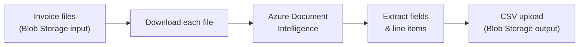

# Invoice Processor

Upload invoice files to cloud storage, run one command, get a structured spreadsheet back. No templates to maintain, no per-vendor configuration — the AI reads the invoices the same way a person would.

---

!!! info "At a Glance"
    **Python · Azure Document Intelligence · Azure Blob Storage**

    Single-file script &nbsp;·&nbsp; ~150 lines &nbsp;·&nbsp; No database &nbsp;·&nbsp; Output: timestamped CSV with line-item detail

---

## The Problem

Manual invoice processing sounds simple until you're doing it at any volume. Download the PDF, open the spreadsheet, read each field, type it in, move to the next file. Repeat for every invoice, every vendor, every month.

At low volume it's annoying. At high volume — dozens of invoices from different vendors, different layouts, different formats — it becomes a real operational cost. Because it's manual, it's also error-prone: transposition mistakes, missed line items, vendor name inconsistencies that break every pivot table you build downstream.

The deeper structural problem is variability. Every vendor sends a different invoice layout. Template-based extraction tools need to be configured for each one, and when a vendor changes their format, the template breaks.

## The Solution

Invoice Processor removes the manual step. Upload your invoice files to Azure Blob Storage, run one command, and a consolidated CSV lands in your output folder.

The extraction is handled by Azure Document Intelligence — Microsoft's AI service for reading document structure. It uses a pre-built model trained on millions of real-world invoices. It reads the invoice the way a person would: identifying vendor name, date, line items, quantities, unit prices, and totals — regardless of the specific layout. No templates, no training data required on your side.

The result is a single timestamped CSV file with all extracted data across the entire batch.

## How It Works



1. **Read** — the script scans the input container and finds all invoice files (PDF, JPG, PNG, TIFF, BMP)
2. **Analyze** — each file is sent to Azure Document Intelligence, which runs the prebuilt invoice model and returns structured data
3. **Extract** — vendor name, invoice date, invoice total, and each line item (description, quantity, unit price, amount) are pulled from the response
4. **Consolidate** — all rows from all invoices are combined into a single dataset
5. **Store** — the CSV is uploaded to the output container with a UTC timestamp in the filename

Failed files are tracked and reported at the end without stopping the rest of the batch.

## Setup

### Prerequisites

- Azure subscription (free tier is sufficient for low volume)
- Azure CLI installed and logged in (`az login`)
- Python 3.9 or later

### Provision Azure resources

The repository includes `setup.sh` — a bash script that creates everything required in one go: a resource group, a Document Intelligence account, a storage account, and the two blob containers. It also writes the `.env` credentials file automatically. [View setup.sh →](../code/invoice-processing.md#setupsh)

Run it with:

```bash
bash setup.sh
```

### Install dependencies

```bash
pip install -r requirements.txt
```

Three packages: `azure-ai-documentintelligence`, `azure-storage-blob`, `python-dotenv`.

### Environment configuration

The setup script writes a `.env` file automatically. If you're connecting to existing Azure resources instead, create it manually:

```
AZURE_DI_ENDPOINT=https://your-resource.cognitiveservices.azure.com/
AZURE_DI_KEY=your-key-here
AZURE_STORAGE_CONNECTION_STRING=DefaultEndpointsProtocol=https;...
AZURE_STORAGE_INPUT_CONTAINER=input
AZURE_STORAGE_OUTPUT_CONTAINER=output
```

## Running It

Upload invoice files to your input container, then run:

```bash
python invoice_processor.py
```

Console output as it runs:

```
Processing: january-invoices/acme-corp-001.pdf
  -> 4 row(s) extracted
Processing: january-invoices/northwind-supplies.pdf
  -> 1 row(s) extracted
Processing: january-invoices/contoso-services.pdf
  -> 7 row(s) extracted

Results written to 'output/invoices-20260423-143022.csv'
```

The output file appears in the output container, named with a UTC timestamp so successive runs never overwrite each other.

## The Code

A single Python file, ~150 lines. Reads from blob storage, calls Azure Document Intelligence, writes the CSV.

[View invoice_processor.py →](../code/invoice-processing.md#invoice_processorpy)

## What You Get

The output CSV has eight columns, one row per invoice line item:

| Column | Description |
|---|---|
| `source` | Original filename from blob storage |
| `vendor` | Vendor name as extracted from the invoice |
| `invoice_date` | Invoice date (YYYY-MM-DD) |
| `line_description` | Line item description |
| `quantity` | Line item quantity |
| `unit_price` | Line item unit price |
| `line_amount` | Line item total amount |
| `invoice_total` | Invoice-level total (repeated on each line) |

Example rows from a batch of three invoices:

| source | vendor | invoice_date | line_description | quantity | unit_price | line_amount | invoice_total |
|---|---|---|---|---|---|---|---|
| acme-corp-001.pdf | Acme Corp | 2026-01-15 | Server Hosting | 1 | 450.00 | 450.00 | 1250.00 |
| acme-corp-001.pdf | Acme Corp | 2026-01-15 | Support Plan | 2 | 400.00 | 800.00 | 1250.00 |
| northwind-supplies.pdf | Northwind Supplies | 2026-01-18 | Office Supplies | | | | 87.50 |

Invoices with no line items produce a single row with just the invoice-level fields.

## Going Further

The script is a foundation. A few natural extensions:

**Automate the run** — deploy it as an Azure Function with a timer trigger. Set it to run nightly and it processes every invoice uploaded that day without manual intervention.

**Connect to a dashboard** — the CSV loads directly into Power BI. With the storage account as a data source, a spend-by-vendor report takes about fifteen minutes to build.

**Add an approval step** — use Power Automate to send a notification when the CSV is ready, letting a reviewer check the totals before they move downstream.

**Train a custom model** — if your invoices are always from the same vendors in consistent formats, a custom Document Intelligence model can improve extraction accuracy. You train it on a labelled sample in the Azure portal, then swap the model ID in the script.

## Scope and Limitations

This is a focused extraction tool, not a full accounts-payable system. It does not:

- Detect or flag duplicate invoices
- Integrate directly with ERP or accounting software
- Validate extracted totals against line-item sums
- Retry on transient Azure API failures
- Process invoices in parallel (runs sequentially)

Each of these is a buildable addition — the script provides the extraction layer and leaves the rest open.
