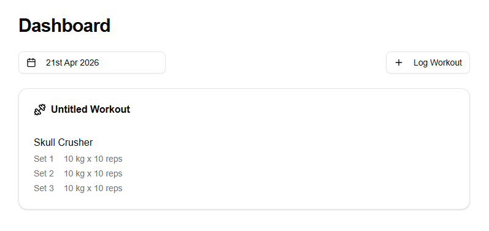

# Lifting Diary — Scaffold Speed with Claude Code

A production-quality full-stack workout tracker, built entirely with Claude Code — from database schema to deployed Vercel app — in approximately 22 prompt sessions. The project is as much about the tooling as the app: it shows where AI-assisted development accelerates experienced developers, and where it still requires architectural knowledge to function at all.

---

!!! info "At a Glance"
    **Next.js 16 · React 19 · TypeScript · Clerk · Neon + Drizzle ORM · shadcn/ui · Vercel**

    27 commits &nbsp;·&nbsp; 21 days (28 Jan – 18 Feb 2026) &nbsp;·&nbsp; ~22 prompt sessions &nbsp;·&nbsp; 6 architectural constraint docs &nbsp;·&nbsp; Full handover document also generated by Claude

    **[Live deployment →](https://lifting-diary-course-eta.vercel.app)**

---

---

## What Was Built

Lifting Diary is a personal workout tracker — authenticated, full-stack, with a relational database, a typed ORM, server-side rendering, and deployment on Vercel. The application spans authentication, a date-based dashboard, an exercise catalog, set logging, and full CRUD for workouts and exercises.

[The Application →](lifting-diary-claude/the-application.md)

---

## How Claude Code Was Used

Claude Code operated in three modes throughout the build: default for exploration, plan for design decisions, and edit for implementation. A custom slash command handled branch workflow. The context window was deliberately cleared at branch boundaries to prevent stale assumptions carrying into new features.

[Building with Claude Code →](lifting-diary-claude/building-with-claude-code.md)

---

## Architecture as the Input

The most important work wasn't code — it was the `/docs` folder: six Markdown files written before the features they governed. Each file was a constraint for Claude, establishing what was allowed and what was not. Without these constraints, Claude would make inconsistent choices across sessions. With them, every generated file followed the same patterns.

[Architecture as the Input →](lifting-diary-claude/architecture-as-input.md)

---

## Prompt Log

An annotated walkthrough of all 12 build phases — from initial environment setup to the AI-generated handover document — with the prompts that drove each phase and commentary on why each approach was chosen.

[Prompt Log →](lifting-diary-claude/prompt-log.md)
