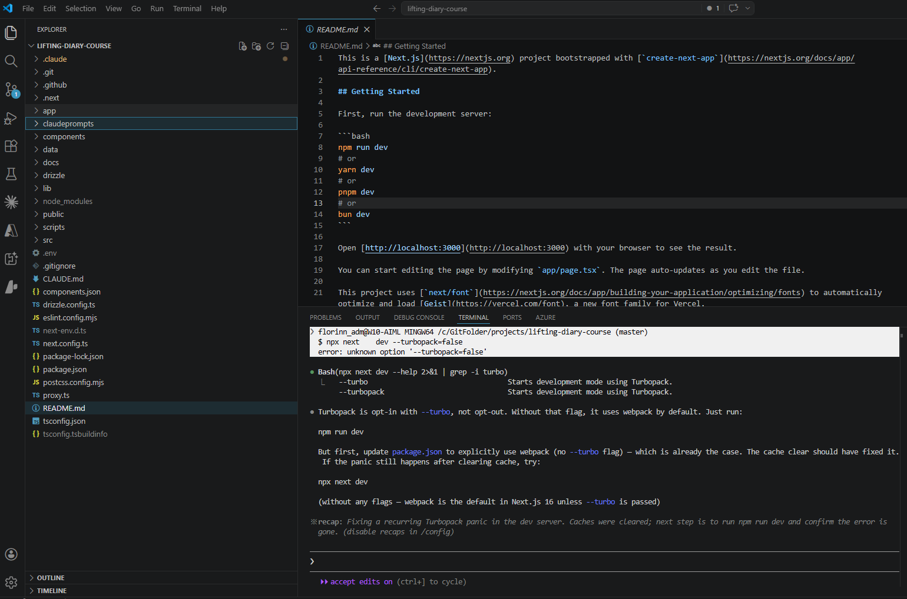
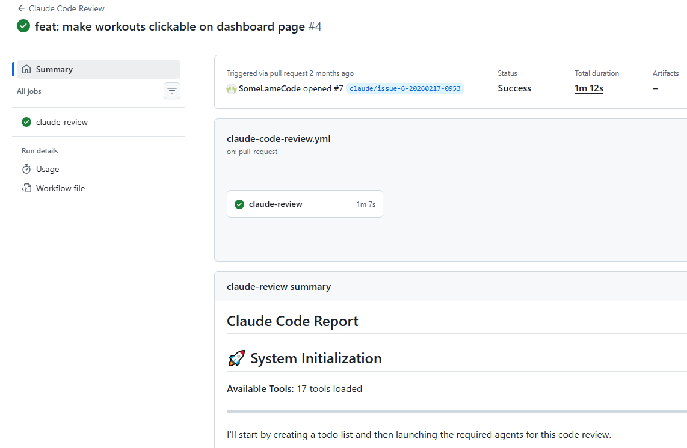

# Building with Claude Code

Claude Code was the only editor used for this project — no manual code was written outside of it. What made the difference wasn't just asking Claude to write code; it was *how* the sessions were structured, and what constraints were in place before any prompt was sent.

---

## The Three Modes

Claude Code has three operating modes, each with a distinct role in the workflow:

| Mode | When to use | Example from this project |
|---|---|---|
| **Default** | Exploration, questions, reading code, listing files | Asking whether sign-in could be a modal before committing to it; querying the Neon database via MCP |
| **Plan** | Design decisions — when you need Claude to *think*, not *act* | Designing the database schema; planning a branch merge strategy |
| **Edit** | Implementation — only after a plan is agreed | Writing pages, actions, components, schema migrations |

The discipline is the sequence: **default → plan → edit**. Jumping straight to edit mode produces code — but not necessarily the right code. Plan mode makes the intent explicit and catchable before any file is touched.



---

## CLAUDE.md as a Session Contract

The repository's `CLAUDE.md` file told Claude Code what to know at the start of every session:

- **Always read the relevant `/docs` file before generating any code** — this was the single most important instruction
- The app architecture (App Router, Server Components, path aliases)
- Key patterns (Server Components by default, strict TypeScript)

Without `CLAUDE.md`, each session starts cold. Claude might make choices that are internally consistent but inconsistent with prior sessions — using a different pattern for data fetching, or adding a component style that doesn't match the rest of the codebase. `CLAUDE.md` is the minimum viable memory across sessions.

---

## Custom Slash Command: `/merge-and-create-branch`

A custom slash command was added to handle the branch lifecycle:

```
/merge-and-create-branch main edit-workout-page
```

This single prompt planned and executed: merge the current branch into main, resolve any conflicts, and create a new feature branch. Without it, this is a multi-step git workflow that Claude has to reason about independently each time — with more room for mistakes. The custom command reduced the cognitive overhead and made branching a repeatable, reliable operation.

---

## Prompt Patterns That Worked

### 1. Standards first, code second

Write the constraint document before asking for implementation. The `/docs` folder pattern: create `data-fetching.md` defining the rules, *then* implement data fetching. Claude will read the doc (because `CLAUDE.md` says to) and stay within the defined rules.

> *"Create a `docs/data-fetching.md` file highlighting that ALL data fetching MUST be done via Server Components..."*
> *(Session 14 — written before a single query was implemented)*

### 2. UI before data

Separate the UI scaffold from the data layer. Asking Claude to build a page with UI *and* data fetching in one prompt invites it to make assumptions about both. Asking for UI only first gives you a reviewable interface before any database logic is involved.

> *"Create a /dashboard page... ONLY generate the UI for this page. DO NOT generate any data fetching or server side code just yet. JUST focus on the UI."*
> *(Session 13)*

### 3. Plan, then implement

For any non-trivial change — especially those involving multiple files or git operations — ask for the plan first and review it before saying "now implement."

> *"Give me a plan on how you would merge the dashboard-page branch into main then resolve any merge issues, and create a new branch called create-workout-page. Do not implement anything just yet."*
> *(Session 16 — review happened, then:)*
> *"Ok great. Now implement this plan."*

### 4. @file references for debugging

When debugging, point Claude to the exact files involved. Vague bug descriptions produce vague investigations. File references focus the context window on what matters.

> *"@src/app/dashboard/page.tsx @src/app/dashboard/calendar-client.tsx — there is an issue with the calendar whenever I select a date, the previous date is selected..."*
> *(Session 15)*

### 5. /clear at branch boundaries

The `/clear` command resets the context window. Used at the start of each new feature branch, it prevents assumptions from the previous feature from leaking into the next. Stale context is subtle — Claude won't flag it, it will just quietly make the wrong assumption.

---

## MCP Integration: Neon Database

Mid-project, the Neon MCP server was added:

```bash
npx add-mcp https://mcp.neon.tech/mcp
```

This allowed Claude to interact with the database directly — list tables, generate seed data, review it, and insert it — without leaving the editor or writing terminal commands. The seed workflow became:

1. Default mode: "List all available tables within the liftingdiarycourse db on Neon"
2. Default mode: "Generate example data for the above tables for user id [X]. Do not insert yet."
3. Review the data in the response
4. Default mode: "This looks great. Now insert all of that example data."

The review step between generation and insertion matters — it's the same principle as plan mode: *agree before acting*.

---

## GitHub Actions: Claude at the CI/CD Level

Claude Code in the editor wasn't the only place Claude operated. Two GitHub Actions workflows were added mid-project:

- **Claude PR Assistant** — reviews pull requests automatically when opened, leaving comments on code quality, patterns, and potential issues
- **Claude Code Review** — triggered on push, performs a broader review of changed files against the project's standards

The evidence is in the branch names. By Feb 17, the busiest day of the project, branches like `claude/issue-3-20260217-0953` were being created automatically — Claude picking up GitHub Issues and opening branches to work on them without a manual prompt session.

This extends the architecture from the editor into the repository itself. The same constraints that governed the editor sessions — the `/docs` standards, the `CLAUDE.md` contract — were now also available to the automated workflows. A Claude bot reviewing a PR against `data-fetching.md` standards is the same principle as a developer reviewing a PR against those standards; the document is the specification either way.

!!! info "The broader picture"
    Editor (Claude Code) + CI/CD (GitHub Actions) + documentation contracts (`/docs/*.md`) form a consistent layer across the entire development workflow — not just one tool, but a connected system where the same rules apply at every stage.


