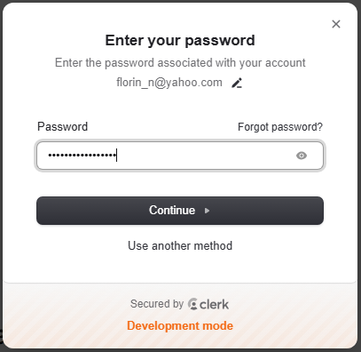
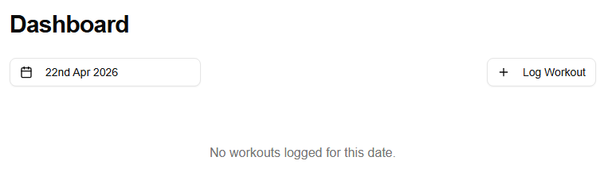
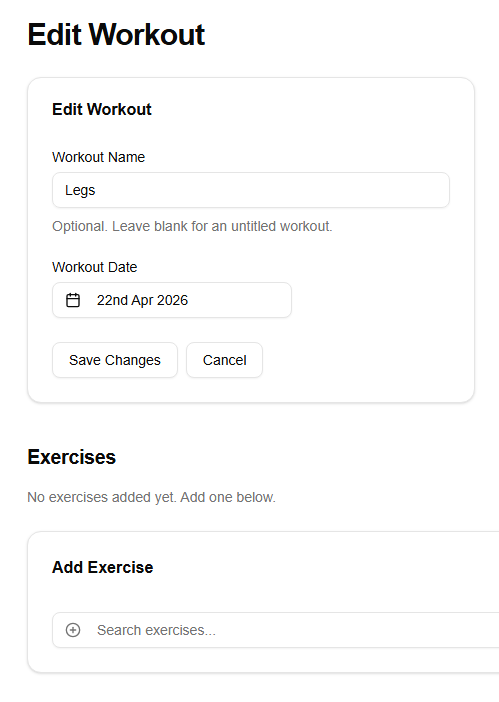
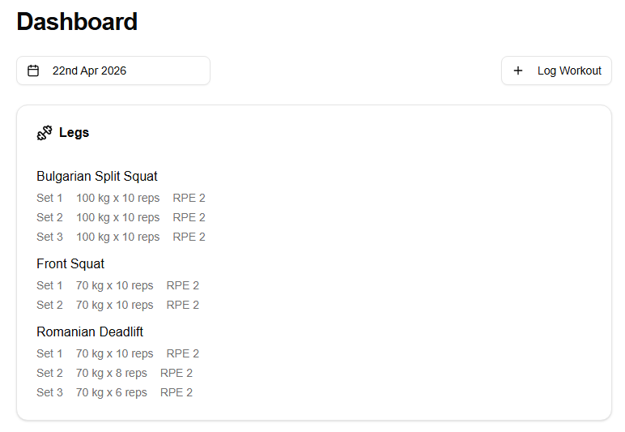

# The Application

Lifting Diary is a personal workout tracker for weightlifters. Users sign in, browse their workout history by date, log new sessions, add exercises from a catalog of 63 movements, and record sets with reps, weight, and an optional RPE score. The data model is fully relational — workouts contain exercises, exercises contain sets — with cascade deletes throughout.

---

## Core User Flows

| Flow | Description |
|---|---|
| Sign up / Sign in | Handled via Clerk — email, social login, or magic link |
| Dashboard | Browse logged workouts by date using a calendar date picker |
| Log a workout | Create a session entry with an optional name and date |
| Add exercises | Search and select exercises from the pre-seeded catalog |
| Log sets | Record reps, weight, weight unit (kg/lbs), and optional RPE per set |
| Edit / delete | Remove exercises or sets from any logged workout |

---

## Tech Stack

| Concern | Technology |
|---|---|
| **Framework** | Next.js 16 (App Router), React 19, TypeScript |
| **Styling** | Tailwind CSS v4 |
| **UI components** | shadcn/ui (exclusively — no custom components) |
| **Authentication** | Clerk |
| **Database** | Neon PostgreSQL (serverless) |
| **ORM** | Drizzle ORM |
| **Validation** | Zod |
| **Date handling** | date-fns |
| **Deployment** | Vercel |

---

## Architecture

The application follows a **server-first** paradigm. Data fetching happens exclusively in Server Components; data mutations happen exclusively through Server Actions. Client Components are used only where browser interactivity is required — state, event handlers, or form submissions.

```
Browser
  └─ Client Component (UI state, event handlers, form submission)
       ├─ Server Action  (validate via Zod → auth check → DB write → revalidatePath)
       └─ Server Component (auth check → DB read via data helper → render as props)
            └─ Drizzle ORM
                 └─ Neon PostgreSQL (serverless)
```

Route protection is enforced at two levels: middleware blocks unauthenticated access before any page component runs, and each protected Server Component contains a secondary auth guard as a defence-in-depth measure.

---

## Database Schema

Four tables, all owned by a authenticated user:

| Table | Purpose | Key relations |
|---|---|---|
| `workouts` | A workout session — date, name, start/end timestamps | Owned by `userId` (Clerk) |
| `exercises` | An exercise within a workout (e.g., "Bench Press") | FK → `workouts` (cascade delete) |
| `sets` | A single set — reps, weight, unit, RPE, completion status | FK → `exercises` (cascade delete) |
| `exerciseCatalog` | Reference data — 63 pre-seeded common exercises | Read-only reference |

Cascade deletes are configured throughout: deleting a workout removes its exercises; deleting an exercise removes its sets.

---

## Route Map

| Route | Access | Description |
|---|---|---|
| `/` | Public | Landing page — redirects to `/dashboard` if signed in |
| `/dashboard` | Protected | Main view — browse workouts by date |
| `/dashboard/workout/new` | Protected | Create a new workout |
| `/dashboard/workout/[workoutId]` | Protected | View and edit a specific workout |

---

## The App in Action

**Sign in with Clerk:**



**Dashboard — no workout logged yet for the selected date:**



**Selecting an exercise from the catalog:**




**A completed workout with sets logged:**


