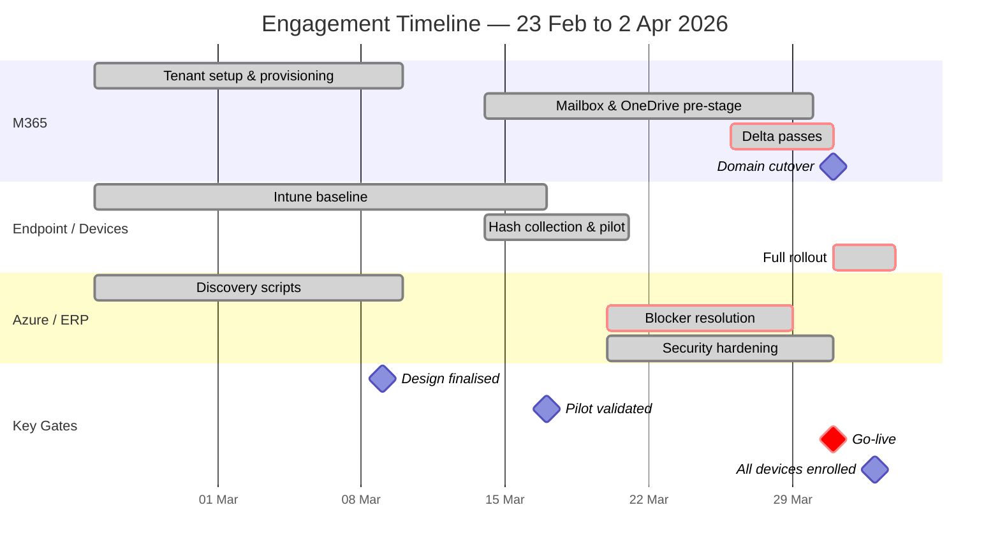
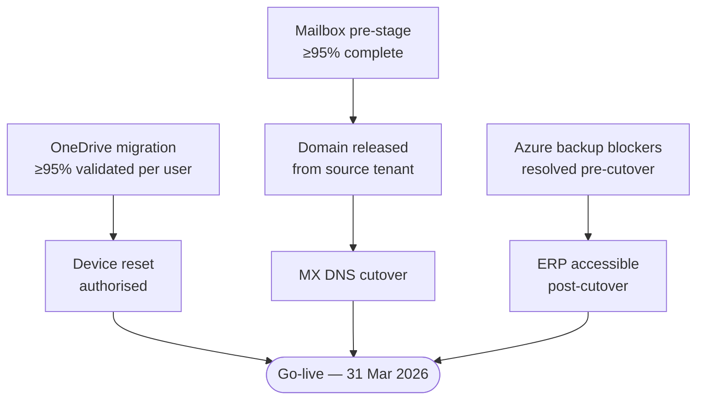
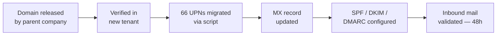
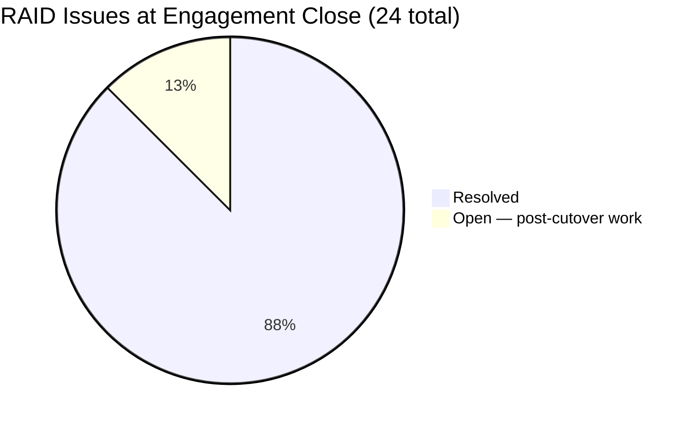

# M365 Tenant Separation — Five Weeks, Three Workstreams, One Cutover

*On 31 March 2026, the client's email domain was released from the parent company's tenant. By end of business, 63 users had new email addresses, MX was cut, and inbound mail was flowing. Five weeks earlier, none of it existed.*

A legal business separation forced ~60–70 users off a shared Microsoft 365 tenant onto a fully independent cloud estate — with a fixed go-live date, no pilot run, and three parallel workstreams running simultaneously. This is how it was done.

!!! info "Engagement at a Glance"
    **5 weeks &nbsp;·&nbsp; 63 users &nbsp;·&nbsp; 65 devices &nbsp;·&nbsp; 3 workstreams**

    65 PowerShell scripts &nbsp;·&nbsp; 36 documented decisions &nbsp;·&nbsp; 34 delivery documents &nbsp;·&nbsp; Go-live met on the fixed date

---

## Table of Contents

1. [Executive Summary](#1-executive-summary)
2. [Business Context — The Forced Cutover](#2-business-context-the-forced-cutover)
3. [Scope and Timeline](#3-scope-and-timeline)
4. [Solution Architecture](#4-solution-architecture)
5. [Why Nothing Was Forgotten](#5-why-nothing-was-forgotten)
6. [How Nothing Was Clicked Twice](#6-how-nothing-was-clicked-twice)
7. [Outcomes and Observations](#7-outcomes-and-observations)

---

## 1. Executive Summary

A subsidiary of a large industrial group was being legally separated from its parent company. Around 60–70 users shared the parent company's Microsoft 365 tenant — same email domain, same managed devices, same cloud services. The legal separation required a clean break: an independent M365 tenant, their own email domain, their own managed devices, and their own Azure infrastructure for the ERP platform.

The delivery partner was engaged under a Statement of Work signed on 23 February 2026. Go-live was fixed at 31 March 2026 — five weeks and one day later.

The engagement covered three parallel workstreams:

- **Microsoft 365** — greenfield Entra ID tenant, Exchange Online mailbox migration, OneDrive data migration, SharePoint site migration, domain transfer and DNS cutover
- **Endpoint Management** — 65 Windows devices reset via Windows Autopilot and enrolled in the new tenant from scratch
- **Azure / ERP** — V2V infrastructure migration for the ERP platform, Azure Files, backup and DR remediation, security hardening

Go-live was achieved on 31 March 2026. All 63 in-scope users were live on the new tenant with the client's email addresses on that date. All mailboxes, OneDrive libraries, and SharePoint sites were migrated. All devices were enrolled. The domain was cut over. No P1 issues remained open at go-live.

Sixty-five PowerShell scripts were authored across the three workstreams. The console was used to verify what scripts had already done — not to perform the work. Governance was maintained live throughout every session using Claude Code, producing 36 documented decisions, a 115-task WBS, a 24-issue RAID register, and 34 delivery documents spanning the full design-to-handover lifecycle.

---

## 2. Business Context — The Forced Cutover

When a parent company and a subsidiary undergo a legal separation, the IT estate rarely separates cleanly. Users, mailboxes, file shares, and devices are entangled in ways that take months to unpick under normal conditions.

The client had no normal conditions.

The business separation was legally driven and the timing was not negotiable. The go-live date of 31 March 2026 was fixed from the moment the Statement of Work was signed on 23 February. That left five weeks — not to plan and negotiate, but to execute.

There was no pilot tenant. There was no parallel-run period where users operated on both tenants and traffic was gradually shifted. There was no room for an incremental approach. On 31 March, the parent company's obligation to host the client's users on its M365 environment ended. Every user had to be on the new tenant, on that day, with email flowing, data accessible, and devices enrolled.

The consequences of that constraint shaped every decision made during the engagement:

- **Every choice had to be right first time.** A design flaw discovered after go-live could not be quietly fixed — users would already be live on the new environment.
- **The critical path was outside the delivery team's control.** The client's email domain was held in the parent company's tenant. It could only be released once, and the timing of that release depended entirely on the parent company's IT team. The migration was designed to proceed at full pace while the domain was still in the parent company's hands — so that when it was finally released, cutover could be executed the same day.
- **Data loss risk was real and irreversible.** The chosen device migration method — Windows Autopilot full reset — permanently destroys local device data. For 65 devices across 63 users, that meant OneDrive migration had to be individually validated, per user, before any device was wiped. No batch approvals. No exceptions.
- **MFA had to work on day one without enrolled devices.** Users were signing in to a new tenant for the first time on the same day their device was being reset. Microsoft Authenticator — the default MFA method — requires an enrolled device to approve sign-ins. A user mid-reset would be locked out. SMS-based MFA was chosen specifically because it works on any phone number, regardless of device state.

The domain was eventually released from the parent company's tenant on the morning of 31 March — go-live day itself. User principal names were updated, MX DNS was cut, and inbound mail flow was validated, all within the same working day.

!!! warning "Critical path"
    The client's email domain was released by the parent company on the morning of 31 March — go-live day itself. UPNs were migrated, MX was cut, and inbound mail was validated before end of business the same day. The migration had been designed to absorb this exact scenario: two weeks of pre-stage passes meant there was almost nothing left to move when the domain finally became available.

The forced cutover was not a failure of planning. It was the client's operating reality. The engagement was designed around it.

---

## 3. Scope and Timeline

The engagement covered three workstreams running in parallel from day one. Each had its own design, runbook, test plan, and delivery lifecycle — but the cutover date was shared, and the workstreams were tightly interdependent. A device could not be reset until its OneDrive migration was validated. The domain could not be cut until the mailbox migration was ready. Azure infrastructure had to be stable before users could connect to the ERP system on the new tenant.

### Workstreams

| Workstream | Scope |
|---|---|
| **Microsoft 365** | Greenfield Entra ID tenant (cloud-only); ~66 user accounts; Exchange Online mailbox migration (user + shared); OneDrive data migration; ~90 distribution groups; 11 SharePoint Team sites (add-on); domain transfer and DNS cutover |
| **Endpoint Management** | 65 Windows devices reset via Windows Autopilot full OOBE; Intune baseline (27+ profiles); hardware hash collection via Intune-deployed script; pilot wave before full rollout |
| **Azure / ERP** | ERP server V2V migration (application and SQL VMs); Azure Files with Kerberos authentication via Intune; backup and DR remediation; security hardening; 8 discovery scripts as as-built baseline |

**Explicitly out of scope:** Known Folder Move, Conditional Access enforcement, Microsoft Purview, Teams content migration, Teams Telephony, local device data preservation, on-premises AD.

### Milestone Timeline



Every milestone was met on its target date. The delta pass window was compressed by one week when the client confirmed domain release timing on 25 March — six days before go-live — but this had been designed as a contingency from the start. Pre-stage passes had already run while the domain was still in the parent company's hands, so the compressed window was absorbed without rework.

### Workstream Dependencies

The three workstreams were not just parallel — they were locked together at go-live. Each had a hard gate that blocked progress in another:



---

## 4. Solution Architecture

The solution was not a single migration — it was three distinct technical workstreams that had to land on the same day. Each workstream had its own tools, its own failure modes, and its own hard dependencies on the others. What follows is a workstream-by-workstream account of what was built and the decisions that shaped it.

### Microsoft 365 — Tenant, Mail, and Data

The new M365 tenant was a greenfield deployment: cloud-only Entra ID, no on-premises Active Directory, no AD Connect. Sixty-six user accounts were created and licensed with M365 Business Premium via group-based licensing. MFA was configured as SMS primary with voice fallback — not the Authenticator app — because users' devices were being wiped during the same transition window, and SMS is the only MFA method that works regardless of device state.

**Mailbox migration** used BitTitan MigrationWiz with a two-pass model: a pre-stage pass running continuously from mid-March to build up ~95% completion, followed by a final delta pass on cutover day to capture changes made in the last 24 hours. The BitTitan endpoints authenticated via Entra app registration and OAuth — the current Microsoft standard since `ApplicationImpersonation`, the previous standard approach, was deprecated in February 2025 and can no longer be assigned in new tenants.

An early blocker: every BitTitan migration folder was failing with `ErrorMessageSizeExceeded`. The fix required raising EWS send and receive size limits to 150 MB on both tenants and applying EWS throttling relief on the destination side. Two scripts handled this; the console was not touched.

**Shared mailboxes** required a separate pipeline. BitTitan migrates content but not permissions. A pre-cutover script collected 1,214 Full Access, Send As, and Send on Behalf entries from the source tenant into a CSV; a second script re-applied all of them to the destination immediately after the full migration pass. Two Send-on-Behalf entries could not be resolved automatically and were applied manually — the only mailbox permission work that required direct console interaction.

!!! info "1,214 permissions, two scripts"
    A pre-cutover script collected every Full Access, Send As, and Send on Behalf entry from the source tenant — 1,214 rows — into a CSV. A second script re-applied all of them to the destination immediately after the full migration pass. Two entries required manual resolution. The other 1,212 were applied without opening the Exchange admin centre once.

**Distribution groups** (~90) were recreated entirely by script from a CSV inventory of the source tenant. BitTitan does not handle distribution groups.

**OneDrive** migration followed the same two-pass model as mailboxes. Before any device could be reset, the user's OneDrive migration had to be individually validated at ≥95% completion and explicitly signed off. No batch approvals. This was a hard gate, not a recommended step — because Autopilot full reset is irreversible, and any data not in OneDrive at the moment of reset is permanently gone.

**SharePoint** was an add-on workstream agreed separately after the SOW was signed. Eleven Team sites were in scope. The initial approach — creating the sites as standard SharePoint site collections and connecting them to M365 Groups via the "groupify" process — failed twice due to PowerShell module authentication bugs in the destination tenant. The solution was to delete the sites, purge them from the recycle bin (which immediately releases the URL), and recreate them directly as M365 Group-connected Teams sites using `New-Team`. Because the site URLs were identical after recreation, the BitTitan migration connector paths were unchanged.

**Domain cutover** on 31 March involved six steps executed in sequence, all within a single working day:



### Azure / ERP Infrastructure

The Azure workstream covered the infrastructure platform that the client's ERP system runs on. The tenant and subscriptions were already provisioned in a CAF enterprise-scale landing zone; the engagement took over from that baseline.

Eight PowerShell discovery scripts were authored to inventory the environment across every relevant dimension — networking, compute, storage, backup, monitoring, security, and RBAC. These scripts ran once and their output became the foundation for the Azure as-built documentation. Every infrastructure fact in the as-built came from script output, not manual portal investigation.

Two go-live blockers were identified during discovery and resolved before 31 March:

- **ERP-SQL backup** had never completed. The Recovery Services vault showed the SQL VM in an `IRPending` state, meaning no SQL backup existed. The seed backup was manually initiated and completed before go-live.
- **File share backup** for the 6 TiB ERP data share was similarly stuck in `IRPending`. Same resolution.

Azure Files access from enrolled devices required Kerberos authentication via Intune — a configuration profile deployed to all devices that enables the Azure AD Kerberos ticket-granting ticket required for SMB authentication to Azure file shares. This in turn required AADKERB to be configured on the storage account, which was identified as missing during discovery and resolved before go-live.

Security hardening removed two pre-existing issues: an unresolvable external principal (ForeignGroup) with Owner rights across six subscriptions, and a guest Gmail account with Owner rights on all management groups. Defender for Cloud was upgraded to Servers Plan 2 on both ERP VMs.

VM rightsizing was identified during discovery and deferred as a post-go-live task; the client is aware and can action it independently.

### Endpoint Management — Autopilot at Scale

The device workstream had the most irreversible consequence of any workstream: a device reset via Windows Autopilot destroys all local data permanently. There is no undo.

**Method selection** was explicit and documented. A 55-dimension comparison was produced between Autopilot full reset and manual disjoin/rejoin. Manual disjoin preserves local data and leaves the parent company's configuration and cached credentials on the device — an unacceptable state for a clean business separation. Legal, technical, and business requirements drove the data handling approach: all relevant local content was required to be uploaded to OneDrive on the source side — and filtered as necessary — before any device was reset. Autopilot was selected because it guarantees a clean device state with no legacy artefacts, delivering a fully Intune-managed device from day one.

**The Intune baseline** was built before the first device was reset. Twenty-seven-plus configuration and security profiles covered the full device lifecycle: Autopilot profile, Enrollment Status Page (which blocks the desktop until M365 Apps are installed), BitLocker disk encryption, Windows LAPS, Credential Guard, Defender antivirus/ASR/EDR, Windows Update rings, VPN, Azure Files Kerberos TGT, OneDrive SSO, and device restrictions.

Two specific configuration findings from implementation:

!!! tip "BitLocker silent encryption: two settings required"
    `Allow Warning For Other Disk Encryption = Block` suppresses the user-visible encryption prompt. `Allow Standard User Encryption = Allow` lets the encryption process complete without an elevation prompt on cloud-only Entra-joined devices. Neither setting alone is sufficient — both must be configured together, or silent encryption will not complete.

!!! tip "Autopilot hash collection: SYSTEM context required"
    The MDM WMI bridge class that returns the Autopilot hardware hash gives empty results under any user context — including local administrator. The collection script must run under the SYSTEM account, deployed as an Intune device script. This is a hard technical requirement, not a preference. Any user-context approach will silently return nothing.

**The rollout** ran in two phases. A pilot of 5–10 devices on 17 March validated the end-to-end OOBE process — Autopilot profile, Enrollment Status Page, M365 Apps installation, OneDrive sync, VPN connectivity, Azure Files access — before committing the remaining devices. No design gaps were found during the pilot. The full rollout completed on 2 April.

Eighteen of the 65 devices were enrolled by the client's own team during the rollout window, without delivery team oversight, and were enrolled incorrectly — they joined Entra ID but did not complete the Autopilot process, leaving them outside the corporate device compliance baseline. These 18 devices were identified after the fact during the as-built documentation session and are tracked as an open item requiring a Phase 2 remediation pass.

!!! note "18 devices: what did not go as designed"
    The project design specified per-user OneDrive validation and explicit sign-off before each device reset. During the client-managed portion of the rollout, these controls were treated as recommended steps rather than enforced gates. No data loss was reported. But the 18 devices that completed Entra join without Autopilot — leaving them outside the corporate compliance baseline — are a direct consequence of execution without delivery team oversight. The lesson is not about trust; it is about matching the scope of oversight to the risk profile of the task being delegated.

---

## 5. Why Nothing Was Forgotten

A five-week engagement with three parallel workstreams, 63 users, 65 devices, and a fixed go-live date creates a documentation problem: by the time you would normally write things down, the engagement is over. The decisions, issues, and rationale that matter most are the ones made under pressure, mid-execution — the ones that are easiest to lose.

This engagement used Claude Code as a live governance engine throughout every working session. Governance files were not assembled at the end; they were updated as each session closed. The result is a project record that reflects what actually happened — not a reconstruction from memory or a post-hoc normalisation.

### The Four-Layer Model

| Layer | What it captured |
|---|---|
| **What was decided** | Every non-obvious choice with alternatives considered and explicit rationale |
| **What was done** | 115-task breakdown; checkbox per task; progress counter updated each session |
| **What was at risk** | RAID register — risks, assumptions, issues, dependencies; rows opened, updated, and closed inline |
| **What happened** | Session-by-session narrative; management and delivery logs maintained separately |

### Decision Log

Thirty-six decisions were recorded across the engagement — from the first design choices on 2 March to the final post-go-live decision on 20 April. Every entry includes the alternatives that were considered and the reasoning behind the choice made.

This is not a formality. During a compressed engagement with many moving parts, decisions get revisited. The decision log prevented that. When a question came up in a later session that had already been settled — which auth method to use, why the SharePoint sites were recreated rather than groupified, why custom passwords could not be set — the answer was already written down, with the reasoning, so it did not need to be re-derived.

Several entries document real-world technical failures that changed the approach:

- **Three consecutive decisions** document a progressive discovery that the Microsoft Graph SDK's `DeviceCodeCredential` implementation does not reliably renew tokens. Each decision captured the exact failure mode, what was tried, what worked, and what the new standard would be going forward. By the time the third issue was found, the auth rules were fully documented and all subsequent scripts were written correctly from the start.
- **One decision** documents the SharePoint groupify failure — two approaches tried, both failed due to module authentication bugs, solution found (delete and recreate). The decision log entry is a reference for anyone who later asks why the sites were built the way they were.
- **One decision** records the choice to remove all proprietary script names from customer-facing as-built documents before handover, replacing them with generic descriptions. Proprietary tooling stays proprietary.

### RAID Register

Twenty-four issues were tracked from identification to resolution. Two of them — backup `IRPending` states on the ERP-SQL VM and the 6 TiB file share — were classified as go-live blockers on 20 March and resolved before 31 March. Eight risks were tracked; all were either closed or formally mitigated at go-live.

Issue closure rate at engagement close: **88%** (21 of 24 resolved). The three open items at close were all post-go-live optimisation work — VM rightsizing, a DMARC policy progression, and the 18-device Autopilot re-enrolment — none blocking core functionality.



### Document Lifecycle

Thirty-four delivery documents were produced across the three workstreams following a consistent lifecycle:

```
design → test plan → test cases → runbook → [config] → validation → acceptance → as-built → SOP
```

The full lifecycle was completed across all three workstreams. Azure began with a full infrastructure build — a hub-spoke landing zone provisioned via Bicep, completed before the M365 and device workstreams began — followed by discovery scripts to baseline the environment, an as-built record, and an operational SOP.

All documents follow a consistent naming convention encoding workstream, document type, subject, and version — visible in every filename without opening the file. Thirty-plus superseded versions were retained in an archive folder rather than deleted, providing a full audit trail of how each document evolved.

### What Claude Code Made Possible

Traditional project governance relies on humans remembering to update documents between tasks. Under time pressure, that discipline degrades — the RAID register falls behind, the decision log gets filled in retrospectively, the WBS counter stays stale.

Claude Code updated the governance files as part of the work itself. At the close of every session, RAID rows were opened or closed, WBS tasks were ticked, decision log entries were written, and the session diary was appended. The WBS counter was verified by grep, not by memory. When the counter was found to be stale during the final documentation session, it was corrected immediately.

The governance record for this engagement is continuous, timestamped, and accurate — because it was maintained by the same tool that was doing the technical work, in the same sessions, with no gap between execution and documentation.

---

## 6. How Nothing Was Clicked Twice

Sixty-five PowerShell scripts were authored across the three workstreams. The principle was consistent throughout: if a task could be expressed as a data operation, it was scripted. The portal — Entra admin centre, Exchange admin centre, Intune, the Azure portal — was used to verify what scripts had already done, not to perform the work.

### Script Distribution

| Workstream | Scripts | Character |
|---|---|---|
| M365 | 32 | Mix of source-tenant inventory and destination provisioning and configuration |
| Endpoint Management | 18 active + 5 archived | Provisioning and configuration; includes Intune-deployed device scripts |
| Azure | 10 | All read-only discovery; run once, output became the as-built baseline |

### What Was Automated

The table below covers the bulk operations that would have been prohibitively slow or error-prone if done through the portal:

| Operation | Scale | Method |
|---|---|---|
| User account creation | 66 accounts | Custom provisioning script — batch REST calls from CSV |
| MFA configuration (SMS + Voice + Registration Campaign) | 66 users | Custom MFA configuration script |
| Shared mailbox permission re-application | **1,214 entries** | Custom permissions pipeline — export CSV then bulk apply |
| Distribution group recreation with full membership | **~90 groups** | Custom group recreation script from CSV inventory |
| OneDrive site provisioning | 66 sites | Custom provisioning script using delegated auth |
| OneDrive site unlock on source tenant | 66 sites | Custom site unlock script |
| Autopilot hardware hash collection | 65 devices | Custom hash collection script — deployed via Intune, runs under SYSTEM |
| Autopilot hash import | 65 hashes | Custom hash import script |
| User UPN migration at cutover | 66 UPNs | Custom UPN migration script |
| Source tenant user cleanup (GAL hide + SMTP forward) | 59 users | Custom source tenant cleanup script using on-premises AD PowerShell |
| EWS size limit increases | Both tenants | Custom mailbox configuration scripts |
| SharePoint site creation | 11 M365 Group + Teams sites | Custom site creation script |
| Azure infrastructure discovery | 8 domains | Suite of 8 custom discovery scripts |

### What Genuinely Required the Portal

Not everything was scriptable. The portal was the right tool for:

- **Intune profile creation** — 27+ profiles configured through the Intune GUI; JSON exported afterwards via a custom bulk export script for documentation
- **BitTitan project and endpoint setup** — SaaS GUI with no API for project creation
- **DNS changes** — MX, SPF, DKIM, DMARC applied at the registrar web portal
- **Azure Recovery Services seed backup initiation** — no scriptable path to force-start an `IRPending` backup; portal-triggered only

Everything else was script-first.

### Authentication Standards

All 65 scripts share a common authentication approach: the operator signs in with their own current admin credentials at runtime. No service accounts. No hardcoded usernames. No stored secrets in script files.

Two sign-in methods were used depending on the script's behaviour:

- **Device code flow** — for read-only scripts that don't call Graph in a loop. Prints a short URL and code to the terminal; operator opens the URL in any browser and signs in. Clean, auditable, no browser window opens automatically.
- **Browser-based interactive auth** — for write scripts and for any script that calls Graph API cmdlets in a loop. A Microsoft Graph SDK bug causes `DeviceCodeCredential` token renewal to fail silently on the first in-loop API call. Browser auth handles token renewal correctly in all cases.

!!! tip "Graph SDK: DeviceCodeCredential fails silently in loops"
    If your script calls any Graph cmdlet inside a loop — including `Get-MgUser` — do not use device code flow. The `DeviceCodeCredential` implementation in the current SDK version fails to renew its token on the first in-loop call and silently returns nothing rather than throwing an error. Use `Connect-MgGraph` without `-UseDeviceAuthentication` (browser-based interactive auth) for any script with Graph calls inside a loop. This applies even to read-only cmdlets.

One further constraint: every script that targets a specific tenant passes the tenant identifier explicitly. Without it, the Graph module reuses cached credentials from whatever tenant was last authenticated — a silent and hard-to-diagnose source of cross-tenant operations.

Two edge cases required different approaches entirely:

- **Password resets** — a Conditional Access policy in the new tenant blocks the standard password reset API endpoint for all callers, including Global Admin. The workaround was the Auth Methods API (`resetPassword`), which is not blocked by the policy and returns a system-generated temporary password. Implemented as a pure REST script with no module dependency.
- **Hardware hash collection** — the MDM WMI bridge class that provides Autopilot hardware hashes returns empty results under any user account, including local administrator. The Intune-deployed collection script runs under the SYSTEM account. This is a hard technical requirement, not a preference.

### A Note on Encoding

All 65 scripts contain only ASCII characters. No em-dashes, no curly quotes, no Unicode.

The reason is specific: Windows PowerShell 5.1 reads `.ps1` files without a UTF-8 BOM using the system ANSI code page (CP1252). The UTF-8 byte sequence for an em-dash is `E2 80 94`. Byte `0x94` in CP1252 maps to a right curly quotation mark — which PowerShell's parser treats as a string terminator. The result is cascading parse errors with no clear indication that the actual cause is a single invisible character in a comment or string literal. The ASCII-only rule prevents this class of failure entirely.

---

## 7. Outcomes and Observations

### What Was Delivered

At go-live on 31 March 2026, the fixed-date constraint was met:

- **63 users live** on the new tenant with the client's email addresses
- **All mailboxes migrated** — user and shared — accessible in the new Exchange Online environment
- **MX DNS cut** — inbound mail routing validated within 48 hours
- **66 OneDrive libraries migrated** — per-user validation completed before each device reset
- **11 SharePoint Team sites migrated** — file counts spot-checked per site post-cutover
- **~90 distribution groups recreated** with full membership
- **1,214 shared mailbox permissions re-applied** by script post-cutover
- **65 devices enrolled** in the new Intune and Entra ID environment (47 fully via Autopilot; 18 requiring Phase 2 remediation)
- **No P1 issues open** at go-live

The domain — the single critical-path dependency outside the delivery team's control — was released by the parent company on the morning of 31 March. UPNs were migrated and MX was cut the same day.

### What Remained Open

The engagement closed with several items deferred as post-go-live work, none blocking core functionality:

| Item | Status | Notes |
|---|---|---|
| 18 devices — Autopilot re-enrolment | Open | Client-managed rollout without oversight; devices outside the corporate compliance baseline; Phase 2 planned under delivery team ownership |
| VM rightsizing (ERP-PROD, ERP-SQL) | Open | Both VMs deployed below designed specification; ERP runs on undersized hardware |
| DMARC `p=quarantine` progression | Open | Policy still at `p=none` as at 20 April; targeted transition was 14 April |
| Azure acceptance and validation documents | WIP | Infrastructure workstream documentation not fully closed at engagement end |
| Test VM decommission | Open | Two stray test VMs in Azure not yet removed |

### Observations

**The pre-stage model absorbed the domain dependency.** The biggest risk in the engagement was the domain release timing — an event entirely outside the delivery team's control, which ultimately happened on go-live day itself with zero margin for error. The two-pass migration model (pre-stage pass running for weeks before cutover, delta pass on cutover day) was designed specifically so that migration work could proceed at full pace while the domain was still in the parent company's hands. By the time the domain was released, there was almost nothing left to migrate — the delta pass on go-live day was a formality, not a race. The design absorbed the risk.

**The Graph SDK issues would have recurred without documentation.** Three separate Microsoft Graph SDK authentication failures were encountered across the engagement — each discovered during execution, root-caused, resolved, and immediately written into both the decision log and the project's scripting standards. Because the fix was documented and the standard was updated, subsequent scripts were written correctly from the start. Without that discipline, the same failure mode would have been rediscovered independently every time a new script was written — and under time pressure, the second and third encounters are when shortcuts get taken.

**Automation at this scale requires consistent standards, not just scripts.** Applying 1,214 mailbox permissions, recreating 90 distribution groups, migrating 66 UPNs at cutover — none of these are hard to script in isolation. What makes them reliable at scale is that every script in the repository follows the same authentication pattern, the same encoding rule, and the same tenant-scoping convention. A single auth bug in a permission-application script that runs 1,214 times produces 1,214 errors. The scripting standards were not boilerplate — they were engineering decisions that determined whether the scripts were trustworthy at scale.

**Live governance produces a different kind of record than retrospective documentation.** The decision log for this engagement was updated in the same session that the decision was made — within hours of the event, while the context was still complete. The 36 entries read as working notes, not as polished summaries. They include the failures (the groupify approach that was tried twice before being abandoned), the edge cases (the one script that needed an exception to the auth rule), and the judgment calls (the SharePoint site with the wrong URL slug that was left as-is the day before go-live because the fix risk outweighed the cosmetic problem). That level of specificity is only possible when governance happens during the work, not after it.

**The gap between design intent and execution reality is worth naming.** The project design specified a hard gate: per-user written acknowledgement of data loss before device reset, and per-user OneDrive validation before any wipe. The as-built documentation records that both controls were treated as recommended steps rather than enforced gates during the client-managed portion of the rollout. No data loss was reported. But the audit trail is weaker than the design intended — and the 18-device issue, which also arose from a client-managed rollout without oversight, is a direct consequence of the same pattern. The lesson is not that clients cannot be trusted with execution; it is that the scope of delivery team oversight needs to match the risk profile of the task being delegated.

---

Five weeks, three workstreams, one fixed date that was never going to move. What made it work was not any single decision — it was the combination of a design that had already absorbed the critical-path risk, automation that removed human error from the bulk operations, and governance that captured every failure and fix in the session it happened, not the week after.

By the time the domain was released on the morning of 31 March, there was almost nothing left to do. That was the point.
