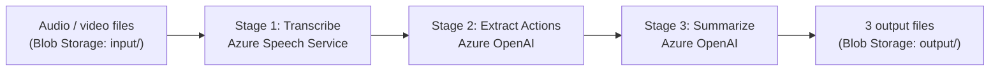

# Meeting Audio Notes Pipeline

Drop a meeting recording into cloud storage, run one command, get back a structured notes file — with a summary, the key decisions made, and a table of action items ready to share.

---

!!! info "At a Glance"
    **Python · Azure Speech Service · Azure Blob Storage · Azure OpenAI (GPT-4o)**

    3 Python modules &nbsp;·&nbsp; ~340 lines &nbsp;·&nbsp; 3 Azure services &nbsp;·&nbsp; Input: MP3, MP4, WAV, M4A, MOV, AVI, MKV &nbsp;·&nbsp; Output: TXT + JSON + MD per recording

---

## The Problem

The most useful output of a meeting is what was decided and what needs to happen next. In practice that information lives in someone's hastily typed notes, a recording nobody has time to replay, or both.

Manual note-taking is inconsistent. The person who writes the notes shapes what gets captured — and what gets missed. Replaying recordings is time-consuming. Neither scales when a team is running multiple meetings a day.

## The Solution

The pipeline processes recordings automatically. Upload the audio or video file to Blob Storage, run the script, and three output files appear in the output container:

| File | Contents |
|---|---|
| `<name>-transcript.txt` | Full verbatim transcript |
| `<name>-actions.json` | Structured action items (owner, task, deadline) |
| `<name>-notes.md` | Formatted Markdown: summary, decisions, action items table |

It handles common recording formats without requiring any per-meeting configuration.

## How It Works



The main script (`run.py`) iterates over every media file in the input container, runs each through the three stages in sequence, assembles the outputs, and uploads them. A temp file is used for local processing and cleaned up after each recording regardless of success or failure.

## Stage 1 — Transcription

The transcription stage is the most technically involved part of the pipeline. Azure Speech Service offers two modes, and the pipeline uses both depending on the file.

**Why two modes?** The Azure Speech SDK can handle WAV files directly using real-time recognition. But for compressed audio formats — MP3, MP4, M4A, MOV, AVI, MKV — the SDK requires GStreamer to decode the audio before it can process it. GStreamer isn't available in the Azure cloud environment. The batch transcription API sidesteps this: it accepts a URL, processes the file server-side, and returns the transcript. No local decoding required.

The routing logic is straightforward:

```python
if ext in {".mp3", ".mp4", ".mov", ".avi", ".mkv", ".m4a"}:
    return _batch_transcribe(blob_name, local_path)

duration = _get_duration(local_path)
if duration < 60:
    return _realtime_transcribe(local_path)
else:
    return _batch_transcribe(blob_name, local_path)
```

All compressed formats go to batch. WAV files under 60 seconds use real-time; longer ones fall back to batch. The 60-second threshold is a reliability boundary — real-time mode has an internal timeout, and batch is more dependable for longer recordings.

**Real-time mode** works through event callbacks. The SDK fires `recognized` events as it processes audio chunks. The pipeline registers a handler that appends each result to a list, and a `threading.Event` is used to signal when recognition is complete. The collected strings are joined and returned.

**Batch mode** generates a 2-hour SAS URL for the file (so the Speech API can fetch it securely without exposing the storage key), POSTs a transcription job to the Speech API v3.1 endpoint, then polls every 5 seconds until the job status is `Succeeded`. The transcript is extracted from the `recognizedPhrases[].nBest[0].display` field and the job is deleted.

## Stage 2 — Action Item Extraction

This stage reuses the [Transcript Action Extractor](../articles/code/transcript-action-extractor.md) — a separate module built to pull structured action items from meeting text using Azure OpenAI. It returns a list of objects, each with `owner`, `task`, and `deadline` (nullable).

The module lives in a sibling directory and is imported at runtime:

```python
sys.path.insert(0, str(Path(__file__).resolve().parent.parent / "transcript-action-extractor"))
from transcript_action_extractor import extract_action_items
```

If no action items are found, the extractor returns an empty list — the pipeline handles that gracefully in the output template.

## Stage 3 — Summarization

The summarization stage sends the transcript to Azure OpenAI (GPT-4o) and asks for a one-paragraph meeting summary and a list of key decisions. Structured JSON output is enforced via `response_format`:

```python
response = client.chat.completions.create(
    model=DEPLOYMENT,
    response_format={"type": "json_object"},
    messages=[
        {"role": "system", "content": "Return ONLY valid JSON with keys 'summary' (string) and 'decisions' (array of strings). No other text."},
        {"role": "user", "content": transcript},
    ],
)
return json.loads(response.choices[0].message.content)
```

The system prompt forbids anything other than JSON in the response, so `json.loads()` is always safe. Empty transcripts return `{"summary": "", "decisions": []}` without calling the API.

## Putting It Together

The main loop in `run.py` keeps each stage separate and handles cleanup regardless of what happens mid-processing:

```python
for blob in blobs:
    suffix = Path(blob.name).suffix
    with tempfile.NamedTemporaryFile(suffix=suffix, delete=False) as tmp:
        tmp_path = tmp.name
    try:
        container_client.download_blob(blob.name).readinto(open(tmp_path, "wb"))
        transcript = transcribe(blob.name, tmp_path)
        actions = extract_action_items(transcript)
        result = summarize(transcript)
        notes_md = build_notes(blob.name, transcript, actions, result)
        upload_outputs(blob.name, transcript, actions, notes_md)
    finally:
        Path(tmp_path).unlink(missing_ok=True)
```

Each recording produces three blobs in the output container. For a short call recording, the notes file looks like this:

```
# Meeting Notes — call-1

## Summary
Ava from Contoso followed up on a prior meeting to confirm that her team can
meet the discussed price expectations and invited further communication to
discuss next steps via phone or email.

## Decisions
- Contoso confirmed they can meet the price expectations.

## Action Items
| Owner | Task       | Deadline |
|-------|------------|----------|
| —     | No action items found | — |
```

## Infrastructure

The repository includes `setup.sh` — an idempotent Bash script that provisions everything needed in one run. Running it a second time on an existing environment is safe.

| Resource | Name | Region | Purpose |
|---|---|---|---|
| Resource Group | `rg-fn-audio-pipeline` | — | Container for all resources |
| Azure AI Speech | `speech-fn-audio-pipeline` | eastus | Transcription (real-time + batch) |
| Storage Account | `stfnaudiopl` | eastus | Blob storage for input and output |
| Blob Container | `input` | — | Source audio / video files |
| Blob Container | `output` | — | Transcripts, action JSON, notes |
| Azure OpenAI | `aoai-fn-audio-pipeline` | australiaeast | GPT-4o for actions and summarization |
| Model Deployment | `pipeline` | — | gpt-4o (2024-11-20), 10K TPM |

After provisioning, `setup.sh` writes all 7 required credentials to a `.env` file. The pipeline reads this file before importing any modules — ensuring the pipeline credentials take precedence if any were already loaded by the action extractor module.

## Going Further

The architecture is already close to something that could run entirely on its own. A few natural directions if you wanted to take it further:

- **Fully automated trigger** — wrap the pipeline in an Azure Function with a Blob Storage trigger, so any recording dropped into the input container is processed without any manual step. Connect it to a webhook from Zoom or Microsoft Teams and the loop closes completely: meeting ends, recording uploads, notes appear.
- **Deliver to where people actually work** — rather than retrieving output from Blob Storage, post the notes directly: a Teams channel message, an email, a SharePoint page via the Graph API, or a Confluence page via REST. The notes reach the right people without anyone having to fetch them.
- **Push action items to a CRM or task tracker** — `actions.json` is already structured with owner, task, and deadline. That maps cleanly onto tasks in HubSpot or Salesforce, work items in Jira or Azure DevOps, or cards in Microsoft Planner — arriving where the work happens, without manual entry.
- **Speaker diarization** — Azure Speech's batch API supports labelling who said what. Enabling it would make action item extraction meaningfully more accurate, since the model could attribute tasks to named speakers rather than inferring from context.
- **Multi-language support** — closer to a configuration choice than a feature; the locale is a single parameter in the transcription call.

## Scope and Limitations

This is a focused pipeline, not a meeting intelligence platform. It does not:

- Support languages other than English (`en-US` is hard-coded)
- Separate speakers — the transcript is a single undifferentiated text block
- Stream results in real-time as the meeting happens
- Provide a UI or dashboard
- Retry on transient Azure API failures

Each of these is a buildable extension. Speaker diarization in particular is supported by the Azure Speech batch API and would require only minor changes to the polling and extraction logic.

## Repository

The full source — including `setup.sh`, `run.py`, `transcribe.py`, `summarize.py`, and `requirements.txt` — is in the GitHub repository. The action extractor module is a dependency imported from a sibling project.

| File | Purpose |
|---|---|
| `run.py` | Main entry point — orchestrates all three stages and manages blob I/O |
| `transcribe.py` | Stage 1 — dual-mode speech transcription (real-time + batch) |
| `summarize.py` | Stage 3 — structured meeting summary and decisions via Azure OpenAI |
| `setup.sh` | Idempotent Azure resource provisioning and `.env` generation |
| `requirements.txt` | Six Python dependencies |
| `.env.example` | Template for the seven required environment variables |

[← Back to Projects](../projects/index.md)
