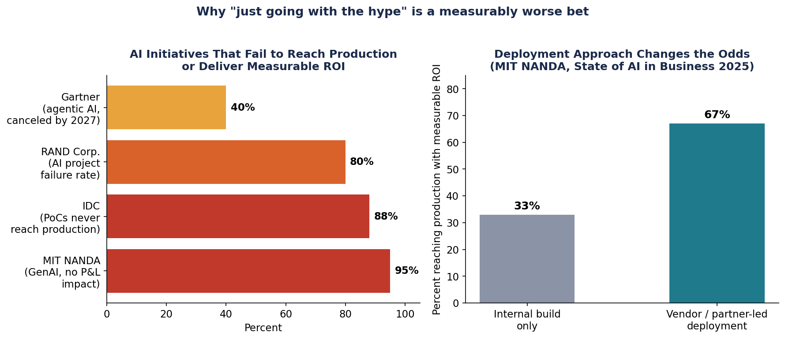
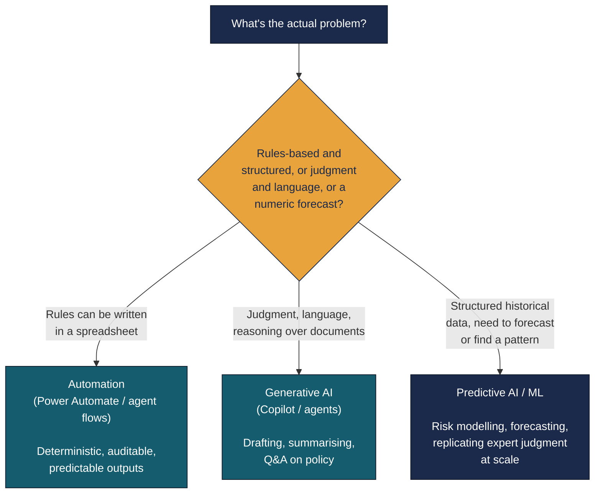
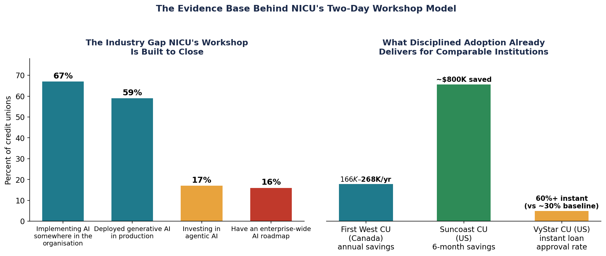
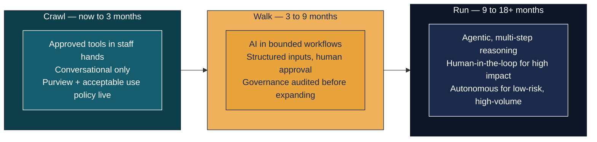

# NICU AI Strategy Workshop — Two Days, Three Unresolved Questions, One Governed Answer

*For months, the CEO of a regional Australian credit union had been asking the CTO the same question in leadership meetings: "What is our philosophy when it comes to AI?" Nobody had a written answer. Meanwhile, three staff were already building their own AI agents at home on personal laptops, and the CEO's own AI use case had already forced a policy exception nobody had planned for.*

Northern Inland Credit Union (NICU) didn't ask Experteq for a Copilot demo. It asked for help answering three questions its leadership team had been circling for months without landing on a written position: when should the organisation automate a process versus reach for generative AI, what is NICU's actual philosophy on AI, and what does it do about staff who are already using AI tools nobody approved. This is the story of the two-day workshop built to answer exactly those questions — and what the room walked out with.

!!! info "Engagement at a Glance"
    **2 days &nbsp;·&nbsp; ~11 hours facilitated &nbsp;·&nbsp; 10 live Copilot licences at the start**

    A signed-off-ready AI Philosophy &nbsp;·&nbsp; A three-horizon AI Roadmap &nbsp;·&nbsp; A committed Purview sequencing plan &nbsp;·&nbsp; A live predictive-ML proof of concept ([its own technical deep-dive](nicu-irrbb-poc.md))

---

## Table of Contents

1. [The Question Nobody Had Answered](#1-the-question-nobody-had-answered)
2. [Why a Strategy Engagement, Not a Training Session](#2-why-a-strategy-engagement-not-a-training-session)
3. [Day One — Building the Platform](#3-day-one-building-the-platform)
4. [Day Two — Putting It to Work](#4-day-two-putting-it-to-work)
5. [What the Room Walked Out With](#5-what-the-room-walked-out-with)

---

## 1. The Question Nobody Had Answered

NICU's leadership group — the CEO, the CFO, the CTO, and the security lead — had been meeting weekly to discuss AI philosophy. The CEO kept asking the same direct question: *"What is our philosophy when it comes to AI?"* Every week, the conversation ended without a written answer.

While that conversation stalled, AI was already happening at NICU, just not where anyone had agreed it should. Three staff were quietly building personal Claude agents on their own laptops, off the network, on data they judged to be non-critical. The CEO had a live Claude use case of his own — one legitimate enough that the CTO couldn't argue against it, so the Copilot-only policy line was quietly redrawn to make room for it. Gamma, an AI-powered presentation tool built on three different AI providers, was approved as a second exception not long after.

NICU did have a formal AI policy, written in late 2024. It named Copilot as the sole approved tool. By the time this workshop was commissioned, that policy already had two exceptions punched through it, and it had no principled way to evaluate the next request — just a list of what was allowed, with no test for what should be allowed next.

The CTO's own framing of the problem was sharper than "we need an AI policy": *"How do we decide when to continue automating versus moving to AI?"* That's a strategy question, not a licensing question — and it's the question that shaped everything that followed.

!!! quote "The tension in one sentence"
    Ungoverned AI was already live inside the organisation. There was no framework to govern it. Closing that gap — not rolling out a new tool — is what the next two days were actually for.

---

## 2. Why a Strategy Engagement, Not a Training Session

It would have been easy to sell NICU a Copilot training day. It would also have missed the point. The questions on the table — governance, philosophy, shadow AI — don't get solved by teaching people which button to click in Outlook.

There's a hard evidence base for why the strategy-first path matters, and it isn't one pessimistic analyst's opinion. Four independent research organisations, using different methodologies through 2025 and 2026, converge on the same story:

- **MIT NANDA**'s *State of AI in Business 2025* found **95% of generative AI pilots deliver no measurable P&L impact** — only 5% of deployments studied reached production with measurable value.
- **IDC** puts it at **88% of AI proofs-of-concept that never reach production.**
- **RAND Corporation** measured AI project failure at roughly **80%** — double the failure rate of comparable non-AI IT projects.
- **Gartner** projects **over 40% of agentic AI projects will be canceled by the end of 2027**, citing escalating cost, unclear business value, and inadequate risk controls.
- **S&P Global** found the trend getting worse, not better: **42% of firms scrapped most of their AI initiatives in 2025, up from 17% in 2024.**

The same MIT research is specific about what separates the 5% that succeed: organisations that bought or partnered for specialised AI capability succeeded 67% of the time; those that tried to build proprietary systems without strategic discipline succeeded only 33% of the time — half the rate. Vague goals, poor data readiness, and rushing to deploy before the underlying process is understood are the recurring causes, not model quality.

Credit unions specifically are not exempt from this gap — if anything, the data shows they're accelerating into it faster than they're governing it. Cornerstone Advisors' *2026 Banking Outlook* found credit unions ahead of banks on raw adoption (59% have deployed generative AI in production, against 49% of banks) and investing in agentic AI at more than double the rate. But Wipfli's January 2026 *State of the Credit Union Industry* report found that while 67% of credit unions are implementing AI *somewhere*, only **16% have an enterprise-wide AI roadmap.** Adoption and strategy are two different things, and most of the sector has the first without the second.

That's the gap this workshop was built to close for NICU specifically: not adoption for its own sake, but adoption paired with the governance and roadmap work the majority of the sector is currently skipping. It's also why the engagement runs two days, in a specific order, rather than one. Day One builds the shared language and governance foundation. Day Two is only credible because Day One happened first — the use cases prioritised and the roadmap drafted on Day Two would have nowhere solid to stand without it.

---

## 3. Day One — Building the Platform

Day One's job was to build the platform everything else stands on: a shared vocabulary, an honest picture of where NICU actually stood, and NICU's own governance foundations — before a single use case got prioritised.

### A vocabulary for three different things

The most common executive mistake, and the first thing Day One corrected, is treating "AI" as one category. It isn't:

The test the CTO had asked for going in came down to one line: *if the rules keep changing, or you can't enumerate them, that's an AI problem — not an automation one.* Day One built the vocabulary; Day Two would apply the test directly to a real regulatory obligation.

### Naming where NICU actually stood — without judgment

Rather than open with a maturity model borrowed from a vendor deck, the workshop named NICU's actual position plainly: roughly 10 live Microsoft 365 Copilot licences, active and growing, mostly among front-of-house branch staff. Meeting transcription and summarisation in Teams was already the highest-usage feature. Outlook drafting was gaining traction with branch staff. Copilot Chat adoption was low, with no structured training program or champion network yet in place.

And then the part most workshops skip: the shadow AI situation, named directly, without treating it as a disciplinary problem. Three staff building personal agents at home. A CEO exception. A Gamma exception. The room already knew all of this — what it didn't have was a framework for what to do about it. Prohibition wasn't a serious option; the workshop's position was blunt about why: *attempting to prohibit AI use without a credible sanctioned alternative doesn't reduce the risk, it just removes the organisation's visibility into it.* The real governance question isn't "can we stop it" — it's *"how do we make the approved path easier than the unapproved one, and how do we make the risk visible to the people taking it?"*

### Governance has to come before scale, not after

The afternoon's Purview session made a sequencing argument that shaped the rest of the roadmap: Copilot respects whatever permissions already exist, but it cannot fix permissions that are already broken. An oversharedSharePoint site or a misclassified sensitivity label doesn't get safer because Copilot is now searching it — it gets more exposed, faster, to anyone with existing access. The principle: **deploy data classification and DLP before or alongside scaling Copilot, not after.** Retrofitting governance onto a Copilot deployment that's already indexed everything is materially harder than classifying it correctly from the start.

Four Purview controls did the actual work of making that principle concrete: sensitivity labels (the permission foundation everything else relies on), DLP policies (blocking restricted data patterns from flowing through Copilot outputs), audit logs (every interaction logged and eDiscovery-searchable — directly relevant to APRA's information security obligations), and information barriers (keeping Copilot from crossing boundaries where separation is required). NICU's Purview deployment wasn't live yet at workshop time, but a go-live date was already committed — and the sequencing recommendation was to hold Copilot's current ~10-licence footprint there until classification and DLP enforcement, not just labelling, were both in place.

### Building NICU's own AI Philosophy, in the room

The centrepiece of the afternoon was a 30-minute facilitated exercise with one job: answer the CEO's question, in writing, in the leadership team's own words. Not a policy document. Not a vendor template. A short, plain-language statement of what NICU will do with AI, what it won't, and what principles guide the room when it's unsure — built from four elements.

=== "Purpose"

    **The question put to the room:** *"In one sentence — why is NICU investing in AI? Not 'because everyone else is.' What outcome are you trying to achieve for your members or your people?"*

    Not a technology statement — a value statement. The prompt used to unstick a quiet room: *"If AI works exactly as you hope over the next three years, what's different for a member walking into a branch or calling your contact centre?"*

=== "Principles"

    **The question put to the room:** *"What must be true of every AI use at NICU, no matter what the tool or use case? Not aspirations — non-negotiables. If a use case doesn't meet these, it doesn't go ahead."*

    Starting points offered only if the room got stuck: member-first, human accountability, transparency, data stewardship, regulatory alignment. The facilitation pushed back hard on anything too broad to be testable — "we will use AI responsibly" doesn't survive contact with a real decision.

=== "Boundaries"

    **The question put to the room:** *"What will NICU not do with AI, full stop? What would your board be uncomfortable seeing on the front page of the local paper?"*

    The most important section for a regulated entity — hard limits, not soft preferences, and deliberately distinct from what regulation already prohibits. This is where the room's own risk appetite gets written down.

=== "Accountability"

    **The question put to the room:** *"When an AI-assisted decision turns out to be wrong — who is responsible? Not who do we blame. Who is accountable?"*

    The one rule enforced without exception: the answer must always resolve to a named role or a human being. Never "the AI." Never "the system."

The draft that came out of that half-hour was rough on purpose — that's exactly right for a first pass. The overnight homework was simple: read it, ask *"does this say what I actually meant?"*, and come back tomorrow with one specific edit. A second, smaller prompt went out alongside it — bring one process you'd nominate with the line *"the way we handle this — we shouldn't still be doing it this way."* That nomination would go straight into tomorrow's use case list.

---

## 4. Day Two — Putting It to Work

Day Two opened by recapping what Day One had actually produced — a shared vocabulary, an honest picture of where NICU stood, a governance sequencing plan, and a working AI Philosophy draft — before turning to the question the rest of the day existed to answer: *what should NICU actually do with AI, and in what order?*

### The sector isn't as far ahead as the hype suggests

KPMG's 2025 Mutuals Industry Review found small Australian ADIs sitting at an early, fragmented AI maturity stage — organisations exploring individually, duplicating effort, with no shared learning across the sector, while consolidation accelerates around them (seven mutual mergers completed in FY2025 alone). Delivered right, that's not a discouraging slide — it's validation. NICU already had 10 live Copilot licences, a committed Purview go-live date, and now a structured strategy engagement. On every dimension that matters, it was ahead of comparable peers before this workshop even started.

The sector research also names three specific traps small ADIs keep falling into, framed to the room as things NICU was actively avoiding rather than warnings to fear: deploying Copilot without Purview first (creating invisible data-leakage risk); treating AI as a single category instead of three distinct capabilities, which quietly starves all three of a coherent budget line; and waiting for the "perfect" use case while the governance gap keeps widening in the meantime. Cautious-with-governance beats fast-without-governance — but both beat doing nothing.

### The decision test, applied for real

Day One had built the vocabulary — automation, generative AI, predictive AI/ML. Day Two applied it directly to the processes NICU actually runs. Exception handling, where payment transactions that fail matching land in a manual review queue, is a clean fit for an agent flow: rules-based, structured, auditable, with a human approval gate. The CTO had already estimated 20 to 40 similar processes across the organisation in the same category. Meeting summaries and email drafting — already NICU's highest-usage Copilot features — are generative AI doing exactly what it's suited for: language and judgment, not numeric prediction.

The third category is where the workshop's most concrete proof point lives: a live, working proof of concept that applies predictive machine learning to a real, expensive, manually-run regulatory obligation NICU faces every quarter. That build — the data pipeline, the model, the governance gate, and an honestly-reported result — is [its own story](nicu-irrbb-poc.md), and it gets a full post of its own rather than a rushed paragraph here. What matters for this story is simpler: the room didn't just talk about predictive AI in the abstract. They watched it work, live, against a problem they actually have.

### Turning a use case list into a sequenced roadmap

The afternoon's job was to turn a long list of possible AI initiatives into something NICU's leadership could actually take to a board — sequenced, not just prioritised by enthusiasm. The framework was Crawl / Walk / Run, mapped against the credit union's own corporate strategy pillars: financial sustainability, relevance to a changing member base, organic growth, security and resilience, and deliberate AI and automation.

Four things had to be true before anything could move from Crawl to Walk to Run — not initiatives on the roadmap themselves, but the platform the roadmap stands on: Microsoft Purview live, DLP policies enforcing rather than just labelling, the AI Philosophy signed off, and a set of operational guardrails translating that philosophy into day-to-day rules. None of the exciting Walk- or Run-stage initiatives — the exception-processing agent flow, the member Q&A agent, the fraud-detection models — get to scale ahead of that foundation, no matter how good the ROI case looks.

Five prioritisation principles kept the room from simply funding whatever felt most exciting: Purview first, not optional; start with the low-risk wins already working (meeting summaries, drafting); the predictive-ML proof of concept is the credible first major initiative, because it has a regulatory obligation behind it, a clear ROI, and an architecture already built; shadow AI is the burning platform, not a side issue — every month without a signed policy and live DLP is a month the gap widens; and every use case gets framed as working *alongside* the existing core banking platform, never replacing it, given the organisation's own history with a difficult prior system migration.

The day closed by returning to the AI Philosophy with a night's distance behind it — the overnight edits collected, the Boundaries section (predictably) attracting the most second thoughts, and the accountability model checked once more against a simple test: does it name a role, not just "leadership"?

---

## 5. What the Room Walked Out With

Two days produced concrete, specific outputs — not just a shared vocabulary everyone nodded along to.

**From Day One:**

- NICU's own **AI Philosophy**, working draft, captured in the leadership team's own words and ready for a leadership sign-off pass within the week
- A **Purview sequencing plan** — the specific order (classification → labels → DLP → audit logging → scale) that keeps Copilot's expansion safe
- A committed **Information Protection Design document**, specifying exactly how classification, labelling, and DLP get configured across NICU's environment
- An honest, non-judgmental picture of NICU's current AI maturity that the leadership team could act on rather than guess at

**From Day Two:**

- A working, running **predictive ML proof of concept** — not a mockup — with a governed model registry and a costed path to production. Its full story, including one model result that failed its own governance gate and was shown on screen rather than hidden, is told in [a companion technical deep-dive](nicu-irrbb-poc.md).
- A curated, filtered **use case list**, annotated by horizon and dependency, sized specifically to a credit union of NICU's scale
- A draft **AI Roadmap**, mapped to the organisation's own strategic pillars and sequenced across Now, 6–12 months, and 12–24 months — ready for board discussion
- A refined **AI Philosophy**, tested by a full night's reflection rather than drafted once and left alone

The less tangible outcome may matter more than any single artefact: the CEO's question — asked directly, discussed weekly, never landed in writing — got answered in the room, by the people who have to live with the answer. That's a different outcome from a consultant handing over a philosophy document to sign. NICU walked out owning it.

*This isn't two days about Copilot. It's two days that turned three separate, unresolved conversations — what's our AI philosophy, how do we govern this safely, and what should we actually build first — into one coherent answer NICU owns.*
