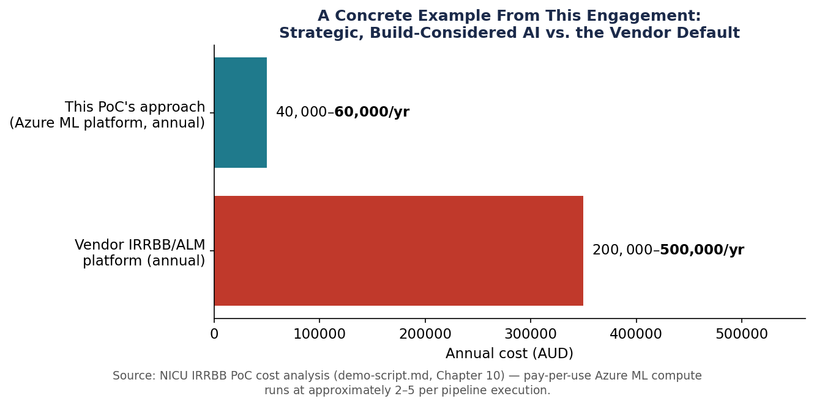
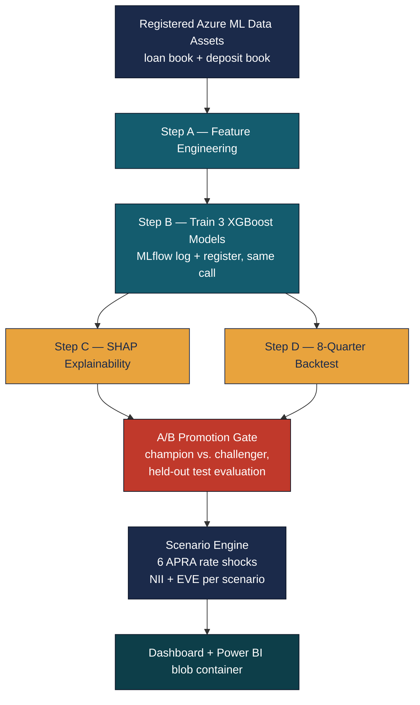
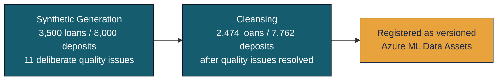

# IRRBB Proof of Concept — Three Static Assumptions Replaced by Models a Regulator Can Audit

*Three static, industry-average numbers drive a regulatory risk calculation every Australian credit union has to produce every quarter. This proof of concept replaces all three with trained models calibrated to a member base of one — and shows its own failed test result on screen rather than hiding it.*

This proof of concept was the applied centrepiece of a broader two-day AI strategy engagement for an Australian credit union — [read that story first](nicu-ai-strategy-workshop.md) for the governance and roadmap context this build sits inside. This page is a different kind of write-up: a technical and governance deep-dive into exactly how the pipeline works and why it holds up under regulatory scrutiny, not a narrative recap.

!!! info "At a Glance"
    **3 trained XGBoost models &nbsp;·&nbsp; 6 APRA-prescribed rate shock scenarios &nbsp;·&nbsp; 2,474 loans / 7,762 deposits**

    2 of 3 model gates pass comfortably &nbsp;·&nbsp; 1 fails honestly, on synthetic data, and says so on screen &nbsp;·&nbsp; $200K–$500K/year vendor alternative displaced

---

## Table of Contents

1. [The Opportunity](#1-the-opportunity)
2. [Architecture — How the Pipeline Works](#2-architecture-how-the-pipeline-works)
3. [The Three Models](#3-the-three-models)
4. [Why This Had to Be Machine Learning, Not an LLM](#4-why-this-had-to-be-machine-learning-not-an-llm)
5. [The Governance Case](#5-the-governance-case)
6. [Path to Production](#6-path-to-production)
7. [Why This Matters Beyond NICU](#7-why-this-matters-beyond-nicu)

---

## 1. The Opportunity

Every Australian ADI has been required to actively manage and report on Interest Rate Risk in the Banking Book since APRA's prudential standard APS 117 commenced on 1 October 2025. NICU is a standardised ADI, which spares it a capital charge but not the underlying obligation: a defensible risk management framework and regular IRRBB reporting against six APRA-prescribed rate shock scenarios.

Today, that obligation is met the way it is at most small credit unions — manually. Each quarter, a CFO or analyst rebuilds the model from scratch in Excel, applying industry-average assumptions about member behaviour: what fraction of home loans get refinanced early, how quickly at-call deposits run off, how much of the deposit book is genuinely "sticky" versus at risk of leaving at the first better offer. None of those assumptions are calibrated to NICU's own members — they're static numbers carried over quarter to quarter, producing one scenario at a time, with no version control and no audit trail a regulator could meaningfully inspect.

The commercial alternative is a specialist vendor IRRBB platform — running $200,000 to $500,000 a year, still built on the same kind of generic, pre-baked assumptions NICU's own Excel model uses today, just wrapped in a vendor's infrastructure instead of a spreadsheet.

The opportunity identified during discovery: NICU sits on exactly the kind of clean, structured, single-system data — loan and deposit account history, with no merger-era data fragmentation — that makes it possible to calculate these behavioural assumptions from members' own history rather than an industry table. It's also a natural second step in NICU's AI journey. Where the workshop's Copilot and agent work established generative AI as the entry point, this PoC is the first concrete demonstration that the same organisation's data can support a materially different class of AI — predictive modelling — applied to a live regulatory obligation with a clear, quantifiable cost story attached.

---

## 2. Architecture — How the Pipeline Works

The pipeline replaces three static IRRBB assumptions with three trained ML models, runs a genuine six-scenario stress test off their predictions, and gates every promotion behind an automated governance check — all on infrastructure NICU already operates.

Steps C and D deliberately run in **parallel** — both depend only on Step B's trained models, not on each other — halving wall-clock time on a two-node compute cluster. The A/B gate is a real decision point, not a formality: it re-evaluates both the current champion model and any new challenger on a held-out test split before either is allowed anywhere near production reporting.

Upstream of the pipeline, the data itself is deliberately imperfect on purpose, to mirror what a real core-banking export actually looks like:

The whole pipeline runs twice against two different registered dataset versions, to produce a genuine champion/challenger comparison rather than a single static demo:

| | Main run (champion) | Updated run (challenger) |
|---|---|---|
| **Rate environment** | Baseline — cash rate 4.35%, stable | +75bp — cash rate 5.10% |
| **Row counts** | 2,474 loans / 7,762 deposits | 2,724 loans / 8,562 deposits |
| **Models registered as** | `irrbb-*-model-v2:1` | `irrbb-*-model-v2:2` |

**All three models are gradient-boosted trees (XGBoost)** — the industry-standard choice for structured, tabular, small-to-medium financial risk data, chosen because it produces exact SHAP feature attribution natively, handles mixed numeric/categorical inputs without heavy preprocessing, and is deterministic given a fixed seed. **MLflow is the layer that makes the whole thing regulator-inspectable**: registration happens automatically inside the training job the moment a model is trained — never as a separate, skippable step — which is what lets the promotion gate and scenario engine load a model by registry name and version number rather than trusting whichever file happens to be on a laptop. The full pipeline code — feature engineering, training, the promotion gate, the scenario engine — is published at [github.com/SomeLameCode/NICU-AI-Rollout-Strategy](https://github.com/SomeLameCode/NICU-AI-Rollout-Strategy).

---

## 3. The Three Models

Each model replaces one specific, named APRA behavioural assumption — not a generic "AI does risk now" story. Each one's output is consumed at an identifiable point downstream in the scenario engine.

| | **CPR Model** | **Decay Rate Model** | **NMD Classifier** |
|---|---|---|---|
| **Replaces** | Flat 18% industry prepayment assumption | A flat deposit run-off assumption | The industry-flat "70% core" split |
| **Predicts** | Per home loan, annualised probability of early repayment | Per savings/transaction account, annualised behavioural run-off rate | Per non-maturity deposit account, core (stable) vs. volatile (at-call) |
| **Algorithm** | `XGBRegressor` | `XGBRegressor` | `XGBClassifier` |
| **Key input features** | Balance, contracted rate, remaining term, product type, rate type | Product type, interest rate, balance, customer segment | `is_savings` flag (dominant), interest rate, balance |
| **Feeds into** | Asset-side repricing gap and NII calculation | Liability-side repricing gap — short-term bucket | EVE duration treatment — which duration bucket at-call balances fall into |
| **Gate result** | RMSE 4.14pp vs. 3.0pp gate — **fails** | RMSE 0.045 vs. 0.10 gate — **passes comfortably** | F1 0.831 vs. 0.75 gate, AUC clears too — **passes comfortably** |

!!! note "An honest failure, shown on screen"
    The CPR model misses its own gate on the synthetic data used for this demonstration — a direct consequence of how the synthetic prepayment label was generated (close to unconditional random noise), not a flaw in the model or pipeline. The other two models — the ones that most directly drive the APRA-mandated NII and EVE numbers — pass their gates comfortably, and both are marked `critical: True` in the promotion configuration, meaning the promotion decision cannot proceed without them. The promotion workflow supports a documented override for exactly this situation: a one-command action, gated behind a mandatory reason string, and logged automatically. The PoC shows that mechanism as available but **not exercised** for this run, rather than pretending the gate passed when it didn't. That honesty is itself part of what makes the governance story credible — a demo built to look clean would have quietly hidden this.

SHAP values make each prediction independently checkable, not just displayed as a headline number. For the CPR model, `balance_log` carries a mean |SHAP| of 0.26 and `contracted_rate` 0.18 — an auditor can verify that a given loan's balance was the dominant driver of its predicted prepayment rate, using the same exact numbers the model produced, not a generated explanation in prose.

---

## 4. Why This Had to Be Machine Learning, Not an LLM

"AI" isn't one technology — generative AI and predictive ML are built to do different jobs on different kinds of data, and IRRBB sits squarely on one side of that line.

=== "What an LLM does"

    Trained on vast text to learn the statistical patterns of *language* — predicting the next plausible token given context. Exceptional at drafting, summarising, and reasoning over documents. Has no native concept of numerical regression: ask it to estimate a prepayment rate and it produces a plausible-*sounding* number drawn from text patterns, not one statistically fitted to a loan book. It's guessing in the shape of an answer, not calculating one.

=== "What predictive ML does"

    Trained by directly optimising a mathematical function against thousands of labelled examples, minimising prediction error across the *entire* dataset at once. Builds an internal structure of decision splits on the actual columns — balance, rate, term — that captures how they relate to the outcome. Produces the same output every time given the same input, and can be interrogated afterward for exactly which input drove which prediction.

The gap isn't about output quality — it's structural, and it applies just as much to an agent (an LLM with tools attached) as to a plain chat interface, since an agent's reasoning step is still an LLM doing language-pattern prediction underneath:

| | **LLMs / Agents** (Copilot, ChatGPT, Claude) | **Predictive ML** (this PoC — XGBoost) |
|---|---|---|
| **Trained to do** | Predict plausible language, token by token | Minimise numeric prediction error against labelled data |
| **Best input** | Unstructured — documents, conversations, free text | Structured — rows and columns of numbers/categories |
| **Reproducibility** | Non-deterministic — same input, different output possible | Deterministic — same input, same output, always |
| **Explainability** | Generated prose describing its own reasoning, not guaranteed to match the actual computation | SHAP values — exact, numeric, sum to the real prediction |
| **Scale with data volume** | Limited by context window; can't optimise across a full dataset | Trains directly against the full dataset via optimisation, however large |
| **Regulatory fit for IRRBB** | Fails reproducibility, explainability, and audit-trail requirements structurally | Built to satisfy all of them by construction |

A simple two-question test decides which tool a given task actually needs: is the input structured or unstructured, and does the output need to be a calibrated, reproducible number or judgement-based language? IRRBB fails both questions in the same direction — structured data in, a reproducible numeric percentage required out, under a standard that explicitly demands feature-level explainability. That's not a case where either tool could plausibly work and one happened to get picked. It's a case where only one of them structurally can — which is exactly why the workshop's meeting summaries, member email drafting, and exception-handling agent flow all stay squarely on the generative AI side of this same line.

---

## 5. The Governance Case

APRA's model governance expectations under APS 220 were written for models that are static, owned, and inspectable by the institution running them — not for black-box APIs whose behaviour can change without notice. Every mechanism APRA expects was a design constraint in this PoC from the outset, not something added afterward to pass a review.

| APRA requirement | PoC mechanism | Status |
|---|---|---|
| **Model registration** — versioned, named-owner artifact | Azure ML Model Registry, 3 versioned models, registered automatically inside the training job | ✅ Implemented |
| **Reproducibility** — same input → same output, always | Fixed random seeds + registry-only model loading, zero local-file dependency | ✅ Implemented |
| **Explainability** — feature-level, auditable numbers | SHAP values per model, written as exact numbers to JSON, not generated prose | ✅ Implemented (portfolio level) |
| **Independent validation** — reproducible by a separate party | Held-out test splits; the A/B gate re-evaluates both models automatically before promotion | ✅ Mechanism in place; formal external validation is a production-stage step |
| **Backtesting** — historical re-evaluation, defined pass/fail | 8-quarter walk-forward backtest against real RBA cash rate history (Q1 2024–Q4 2025) | ✅ Implemented |
| **Audit trail** — logged human decision, always | Append-only approval log; three explicit modes (review/approve/reject); every promotion or override requires a logged reason | ✅ Implemented |
| **Data sovereignty** — stays inside the institution's own environment | Entire pipeline runs inside NICU's own Azure subscription; member data never leaves tenant boundaries | ✅ Implemented (auth hardening pending) |

Three of those rows are worth reading twice, because they're where a general-purpose LLM doesn't just perform worse — it structurally cannot clear the bar at all:

!!! note "What model registration rules out"
    You cannot register "GPT-4-turbo" or "Claude Sonnet" as a regulatory model artifact. The vendor controls the version, and it can change without notice. There's nothing fixed to point to in an audit.

!!! note "What reproducibility rules out"
    LLMs are non-deterministic by design — the same prompt can produce a different answer on every call. An examiner asking "show me the model output for this account in Q2 2024" cannot be satisfied by a system with no fixed, inspectable state.

!!! note "What explainability rules out"
    An LLM can write a fluent paragraph explaining its answer — that isn't what APRA means by explainability. There's no feature importance score, no coefficient, nothing an auditor can independently recompute or verify.

The one place to be careful in a room full of risk people: don't overstate this as "APRA-approved." No regulator has reviewed or endorsed this PoC, and APRA doesn't operate a certification scheme for individual models in any case. The accurate, still-strong claim is narrower: the PoC was built to satisfy the mechanics APS 220 and APS 117 actually require, and every mechanism above is real and inspectable in the code — not asserted in a slide.

---

## 6. Path to Production

The PoC proves the modelling approach and the governance architecture. It doesn't yet run on NICU's real data, and a defined set of production-hardening work sits between here and an enterprise-ready system — already scoped as its own follow-on initiative, structured so most of it can proceed without waiting on the single slowest dependency.

**The genuine long pole is real data.** Nothing about the model architecture changes once NICU's actual core-banking loan and deposit history is connected, but the models need retraining on it — and the CPR gate that missed its threshold on synthetic data is expected to clear once trained on real behavioural data. This step, plus an independent validation pass by NICU's own model risk function or an external validator, is estimated at roughly four to five months end to end once data access is agreed.

**Everything else can be built in parallel against the existing synthetic pipeline, then simply repointed at real data** — a data swap into already-proven infrastructure, not a rebuild: replacing the current storage-account-key auth with Managed Identity; scheduled and eventually event-driven retraining with proper CI/CD and Infrastructure-as-Code; data drift and performance monitoring once a real-data baseline exists; building out the Power BI report layout against an already-populated, structured blob container; and extending SHAP from portfolio-level aggregation to member-level attribution, which the pipeline already supports structurally.

Deliberately excluded from this next phase, pending its own separate decision, is reshaping the pipeline so the same codebase could serve another Australian credit union facing the same APS 117 obligation — a realistic direction once the single-institution build is proven in production, not before.

---

## 7. Why This Matters Beyond NICU

The most consequential decision in how this PoC was built was already made: governance was a design constraint from the first line of code, not a compliance exercise applied afterward. That single choice is the difference between a demo that impresses in a workshop and one that can credibly become the basis of a production regulatory model. It's also what makes the underlying architecture — model registry, A/B governance gate, SHAP explainability, backtesting, audit trail — genuine intellectual property that generalises well beyond one credit union's IRRBB obligation, to any Australian mutual ADI facing the same APS 117 requirement with the same kind of structured, single-system member data.

*Copilot is excellent at reading and writing. This problem needed a system that's excellent at counting and calculating. Those are different skills, built by different methods — and IRRBB needed the second one.*
