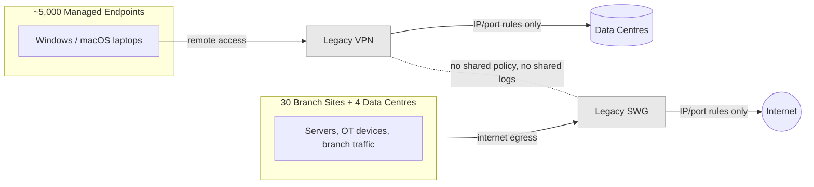
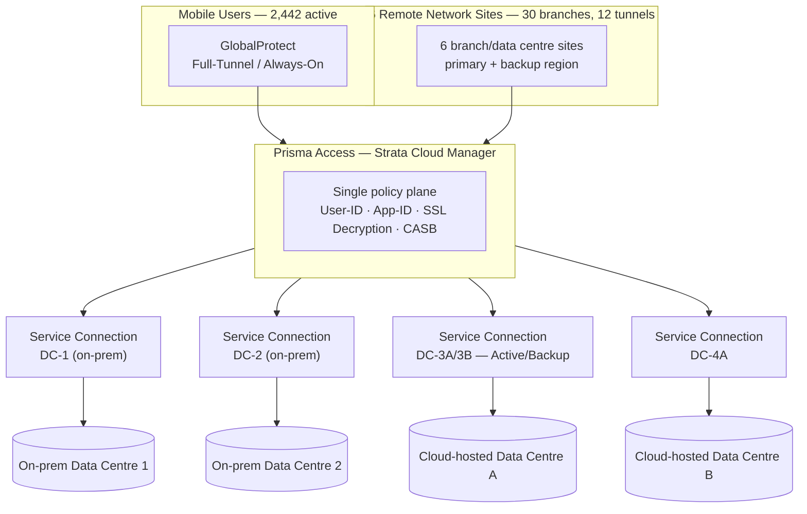
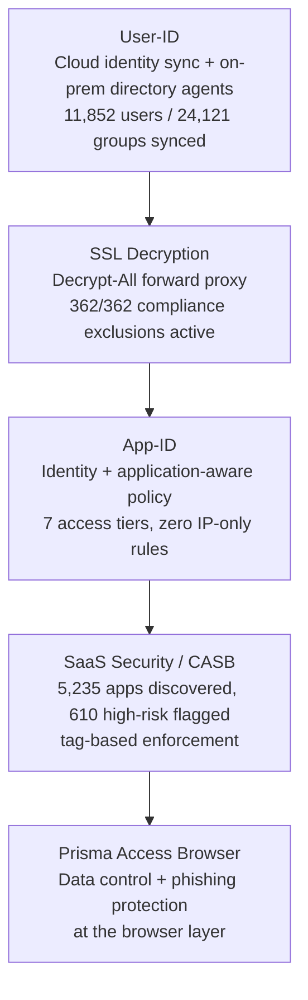
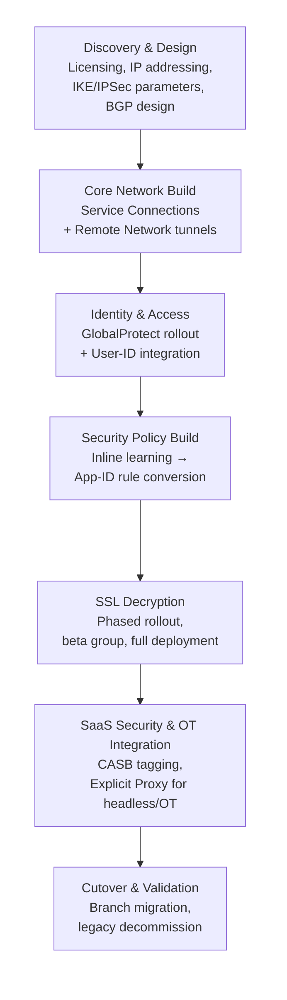
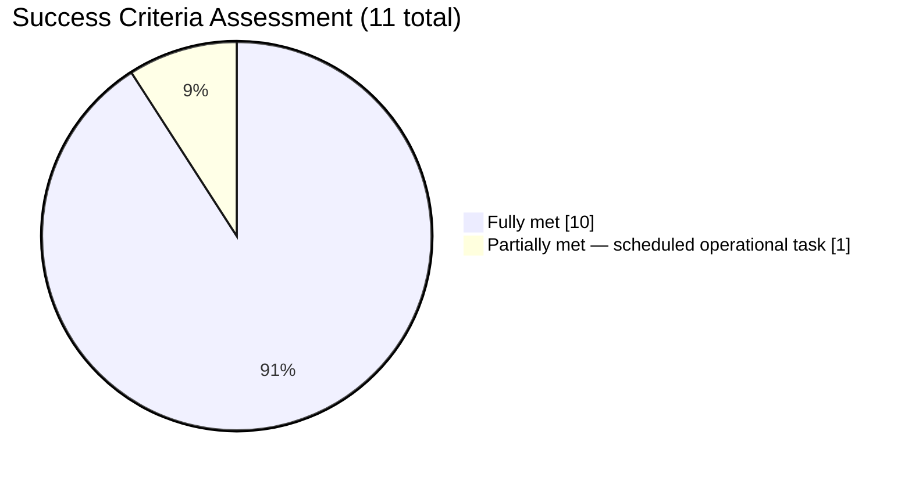

# Prisma Access SASE Implementation — Two Legacy Platforms, One Identity-Aware Policy Plane

*Two legacy platforms with no shared visibility, no identity-aware policy, and no supported migration path between them — replaced by a single Prisma Access deployment spanning 30 branch sites, four data centres, and roughly 5,000 managed endpoints.*

The client needed to retire a legacy VPN and a legacy Secure Web Gateway that had never been designed to talk to each other, while proving — not just describing — its security posture against a tightening set of regulatory compliance obligations. This is the architecture that replaced them, the technical problems that came up along the way, and what shipped.

!!! info "Engagement at a Glance"
    **2,442 active users &nbsp;·&nbsp; 30 branch sites &nbsp;·&nbsp; 4 data centres &nbsp;·&nbsp; ~5,000 endpoints**

    12 Remote Network tunnels &nbsp;·&nbsp; 100% SSL traffic decrypted &nbsp;·&nbsp; 5,235 SaaS apps catalogued &nbsp;·&nbsp; 10 of 11 success criteria met

---

## Table of Contents

1. [Executive Summary](#1-executive-summary)
2. [Business Context — Two Disconnected Platforms](#2-business-context-two-disconnected-platforms)
3. [Why Prisma Access](#3-why-prisma-access)
4. [Solution Architecture](#4-solution-architecture)
5. [Delivery Approach](#5-delivery-approach)
6. [What Changed From the Original Design](#6-what-changed-from-the-original-design)
7. [Outcomes and Results](#7-outcomes-and-results)

---

## 1. Executive Summary

The client operates a large distributed-infrastructure organization and must demonstrate alignment with a recognized security maturity framework (Maturity Level 2 equivalent). It replaced two disconnected legacy security platforms — a legacy Secure Web Gateway for branch internet egress and a legacy VPN for remote access — with a single Palo Alto Networks Prisma Access implementation spanning 30 branch sites, four data centres, and roughly 5,000 managed endpoints.

Neither legacy platform had identity-aware or application-aware policy. Rules were written against IP addresses and ports — a Technology team member and a standard business user were indistinguishable in the rulebase — and there was no way to say "block this application" rather than "block this port." Correlating an incident across both platforms meant manually cross-referencing two unrelated logging systems. A prior attempt at a proxy-based GlobalProtect rollout had already caused endpoint instability at scale, and the legacy SWG had no export format compatible with any replacement platform — whatever came next meant rebuilding security policy from scratch.

Prisma Access was implemented to solve all three problems at once: a single Strata Cloud Manager (SCM) tenant replacing both legacy platforms, a Direct-to-Full-Tunnel GlobalProtect architecture that eliminated the proxy-agent instability, and an identity- and application-aware policy model built specifically to answer the client's compliance obligations with evidence rather than intent.

The result: 10 of 11 success criteria fully met, full SSL visibility with application-aware policy across seven distinct access tiers, and a security architecture mapped directly to the client's regulatory obligations.

---

## 2. Business Context — Two Disconnected Platforms

The client's existing security architecture had grown in layers, over time, out of two platforms that had never been designed to interoperate.

Three problems compounded on top of each other:

**No common visibility plane.** Remote access logs lived in the VPN platform. Web traffic logs lived in the SWG. Correlating an incident across both meant manually cross-referencing two unrelated systems — slow, error-prone, and hard to defend in an audit.

**A prior agent rollout had already failed once.** An earlier attempt at a proxy-based GlobalProtect integration caused endpoint instability at scale, leaving the organisation wary of agent-based remote access as a category, not just that one implementation.

**No migration path off the legacy proxy.** The legacy SWG's policy had no export format compatible with any replacement platform. Whatever came next would mean rebuilding security policy from scratch — with no shortcut through existing rules.

The client's compliance obligations were tightening at the same time. The applicable regulatory risk management program requires demonstrated controls over data access, network monitoring, and incident response; the target maturity framework adds specific, checkable requirements around patch currency, MFA, application control, and centralised logging. An architecture built on IP-and-port rules with two disconnected logging systems could not produce that evidence on demand.

---

## 3. Why Prisma Access

The decision to deploy Prisma Access was driven by three specific requirements, not a general platform preference.

**Direct-to-Full-Tunnel GlobalProtect** eliminates the proxy-based agent model that had caused the prior instability. Traffic goes into the tunnel before any proxy processing — there is no local proxy agent for endpoint software to conflict with.

**A single Strata Cloud Manager tenant** manages every traffic path — managed endpoints on GlobalProtect, headless devices on Explicit Proxy, branch sites on Remote Networks, and browser users on Prisma Access Browser. One rulebase, one logging stream, one policy review process.

**Identity- and application-aware policy** directly addresses the client's compliance requirements. Rules reference user groups and App-ID application objects, not IP ranges and port numbers — security posture becomes provably tied to who is doing what, not just where traffic is coming from.

---

## 4. Solution Architecture

Prisma Access replaced both legacy platforms with a single SCM tenant governing four distinct traffic paths — managed endpoints, branch/headless traffic, browser sessions, and SaaS activity — under one rulebase and one logging stream.

### Network fabric

Five IPSec Service Connections link Prisma Access to the client's four data centres — two on-premises, two cloud-hosted. All connections are confirmed **Up, In Sync, with BGP established**. The two cloud-hosted sites run active/backup BGP roles with AS-path prepending; the on-premises and standalone cloud connections run without a redundancy pairing. All tunnels use **IKEv2 with AES-GCM-256 and DH Group 20**, at or above NSA CNSSP 15 cryptographic minimums.

Twelve Remote Network tunnels extend the same policy plane across six sites to headless devices and server farms that can't run a VPN agent — each with a primary connection to a Primary compute region and a backup to a Backup region. Policy-Based Forwarding on each site's perimeter firewall steers internet-bound server traffic through the primary region and fails over automatically on a path-monitoring alert, with no session interruption. Combined throughput across all 12 tunnels measured **850.78 Mbps at 44% utilisation**.

### Managed endpoints

Roughly 2,440 Windows and macOS laptops run GlobalProtect in Full-Tunnel / Always-On mode. The tunnel establishes at boot using a machine certificate, before any user logs in. On login, SAML 2.0 authentication redirects through the client's identity provider (Microsoft Entra ID), where MFA and Conditional Access are enforced natively — no duplicate policy configuration inside Prisma Access. iOS and Android managed devices use Per-App VPN, scoping the tunnel to corporate applications only, deployed and kept current via a mobile device management platform.

### Headless and OT devices

Servers and automated systems that cannot run an agent are configured with a PAC file pointing to Prisma Access's Explicit Proxy. The first unauthenticated request triggers a SAML redirect; subsequent requests authenticate via a browser-injected cookie. For systems that cannot complete interactive authentication at all — automation accounts, legacy services, and OT monitoring and control systems — a curated list of 20 trusted source addresses admits them via IP bypass while keeping every session fully subject to Prisma Access inspection.

### Browser layer

Prisma Access Browser is deployed as a managed extension on Chrome and Edge, adding data control (clipboard, download, and screenshot restriction) and phishing protection directly at the browser layer for managed endpoints — a control surface neither legacy platform could offer at all.

### Security policy — identity first

The security model was built around a strict dependency chain: each layer needs the one below it operational before it can do meaningful work.

User-ID must resolve an IP to a user before any identity-based rule can match. SSL Decryption must be running before App-ID can classify HTTPS traffic beyond "TLS on port 443." CASB's inline, activity-level enforcement needs decrypted traffic to distinguish, say, a read from an export. Deploying these layers out of order means the layers above fail silently rather than loudly — exactly the kind of gap an audit finds and a live dashboard doesn't.

Every source IP is mapped to a username and group in real time. On-premises directory agents feed the Remote Network Security Processing Node directly — a platform feature flag had to be configured to disable the default redistribution path — while cloud identity group membership syncs through the Cloud Identity Engine (11,852 users, 24,121 groups). Every session in Prisma Access carries a real identity, and security policy enforces **seven distinct access tiers** — Standard, Technology, Executive, Basic Server, Guest Wi-Fi, Basic Citrix, and Birthright — instead of one blanket ruleset for everyone.

A Decrypt-All forward proxy rule inspects every HTTPS session across GlobalProtect and Explicit Proxy traffic. 362 of 362 predefined exclusions are enabled — covering financial, health, and pinned-certificate categories that fall under the client's compliance protections — alongside explicit exclusions for productivity-suite and vulnerability-scanning traffic. URL categories specifically in scope for the client's compliance obligations, including social networking, P2P, and personal cloud storage, are decrypted and inspected rather than carved out.

SaaS Security Inline (CASB) adds application-layer governance on top: 5,235 applications discovered in a 90-day window, 610 flagged high-risk, tagged Sanctioned / Unsanctioned / Tolerated rather than blanket allow/block. GenAI posture is deliberately conservative — a small set of sanctioned productivity AI tools is permitted by default; every other AI tool is unsanctioned and blocked, a direct response to the data-exfiltration risk unmanaged AI access poses under the client's compliance obligations.

| Control | Regulatory anchor | Implementation |
|---|---|---|
| MFA enforcement | Maturity framework | Identity provider Conditional Access, natively integrated via SAML |
| Application control | Maturity framework | App-ID policy across all 7 access tiers |
| SSL/TLS inspection scope | Compliance obligations | Decrypt-All + 362/362 compliance-relevant exclusions |
| Centralised logging | Compliance obligations | Single logging stream, all traffic paths |
| GenAI / data exfiltration risk | Compliance obligations | CASB tag-based blocking, sanctioned-app allowlist |
| Patch/AV currency | Maturity framework | HIP deny rules (see [§7](#7-outcomes-and-results) for the one open item here) |

---

## 5. Delivery Approach

Replacing two production security platforms serving 5,000 endpoints and 30 branch sites was not a big-bang cutover. The implementation followed a structured, phased methodology, each phase gated on the one before it.

The network fabric had to be confirmed stable before identity integration began; identity had to be operational before security policy could reference user and group objects; SSL Decryption had to be live before application-layer CASB enforcement could see anything beyond raw TLS handshakes.

**Redundancy matched to real failure domains, not a template.** The two cloud-hosted Service Connections had a natural redundancy relationship and got an explicit active/backup BGP role with AS-path prepending; the on-premises and standalone cloud connections had no natural pairing and were built as independent connections instead.

**Security policy without a portable legacy ruleset.** The legacy SWG had no export format that could seed the new App-ID rulebase — every existing rule was written against IP addresses and ports, with no application or identity context to translate. Rather than attempt a lossy, incomplete import, policy was built using **inline learning**: Prisma Access placed inline with a permissive, fully-logged baseline rule, running for two to four weeks to capture real traffic patterns before converting that traffic into specific, least-privilege App-ID rules.

**OT and headless systems needed their own design pass.** OT monitoring and control systems with no interactive login and no standard VPN agent path route through a chain of intermediate proxies specific to that environment, so standard SAML-based Explicit Proxy authentication couldn't apply. The solution was a curated set of trusted-source IP bypasses paired with identity-header propagation (XAU), so OT traffic still carries an attributable identity and remains fully subject to Prisma Access inspection — SSL Decryption, App-ID, and logging all still apply.

**A deliberately conservative GenAI posture.** SaaS Security policy needed an explicit answer to what happens when an employee tries an unsanctioned AI tool. Given the client's data-exfiltration risk profile, the implementation defaulted to blocking unsanctioned GenAI tools outright, with a small, deliberately curated allowlist of sanctioned productivity AI applications — a stricter default than many organisations choose, chosen specifically because the regulatory risk profile called for it.

**Validated component by component, not batch-verified.** Service Connections were confirmed Up and BGP-established one by one. Every Remote Network tunnel was checked for both primary and backup path health. GlobalProtect authentication was end-to-end tested through a pilot user group before wider rollout.

---

## 6. What Changed From the Original Design

The implementation was documented retrospectively against the live SCM tenant, so a formal design-delta comparison against the original HLD was produced alongside the as-built reference documents. The deviations worth knowing about, grouped by why they happened:

**Corrected during build:**

- The Asia-Pacific fallback gateway region shipped as the as-deployed region rather than the one originally planned — the originally-planned region was referenced in the runbook but never provisioned.
- The two cloud-hosted backup sites use reversed primary/backup tunnel numbering internally, but dual-region coverage is confirmed equivalent either way.
- The internal AD domain used in HIP checks, User-ID group DNs, and GP DNS suffixes differs from the external/public domain — corrected throughout the documentation set.

**Accepted trade-offs, made explicitly:**

- The Forward Trust CA uses the platform's auto-generated certificate rather than a dedicated sub-CA from the client's internal PKI. Functionally equivalent for internal SSL inspection; avoided PKI-team process overhead in exchange for a standing renewal-management obligation (all four certificates expire the same date — flagged as a single point of failure if renewal is missed).
- SSL Decryption shipped as a full Decrypt-All deployment rather than the originally planned beta-group pilot — exceeding the original design intent, not falling short of it.
- Zone and security-profile-group naming conventions in the live tenant diverge from the HLD's proposed naming scheme. Over 100 existing rules already referenced the live names; renaming would have meant a mass rule update for no operational benefit.

**Open items, disclosed rather than hidden:**

- The HIP antivirus-currency threshold is set to 14 days against the target framework's 24-hour guidance — operationally appropriate given the endpoint management tooling in place, but a gap the client's security team should formally confirm.
- No patch-age HIP check is currently configured; patch currency is managed through the MDM platform instead.
- "Allow User to Sign Out" remains enabled on GlobalProtect profiles (intended for helpdesk troubleshooting) rather than disabled for full Always-On hardening.
- Log forwarding to the client's cloud SIEM was de-scoped for this engagement — credentials were never provided on the client side. Centralised logging within Prisma Access's own logging service is unaffected.

Every one of these was tracked to an explicit disposition — corrected, accepted with rationale, or handed to the client with a named owner — rather than left ambiguous at go-live.

---

## 7. Outcomes and Results

| # | Criterion | Status |
|---|---|---|
| 1 | Full-Tunnel GlobalProtect deployed to all managed endpoints | ✓ Met |
| 2 | All 4 data centres connected via Service Connections | ✓ Met |
| 3 | Remote Networks providing internet egress for headless devices | ✓ Met |
| 4 | User-ID active | ✓ Met |
| 5 | App-ID active | ✓ Met |
| 6 | SSL Decryption with approved exclusions | ✓ Met |
| 7 | AV, anti-spyware, URL filtering, WildFire active | ✓ Met |
| 8 | Centralised logging in place | ✓ Met |
| 9 | Policy built on user/group + application objects | ✓ Met |
| 10 | Strata Cloud Manager as single pane of glass | ✓ Met |
| 11 | Legacy SWG + VPN decommissioned | Partial — SWG ✓ decommissioned; legacy VPN decommission scheduled as a client operations task |

The one open item — legacy VPN decommission — was deliberately not forced to closure. Cutting remote access before every user cohort had validated GlobalProtect stability would have traded project velocity for production risk. It's now an owned, scheduled task on the client's operations roadmap, with no dependency on the implementation itself.

### What's operational today

| Component | Status | Scale |
|---|---|---|
| Service Connections | ✓ Operational | 5 connections, 4 data centres, all Up / BGP established |
| Remote Networks | ✓ Operational | 6 sites, 12 tunnels, 850.78 Mbps combined @ 44% utilisation |
| GlobalProtect (Mobile Users) | ✓ Operational | 2,442 active users, Full-Tunnel / Always-On |
| Explicit Proxy | ✓ Operational | Headless + OT devices, SAML + Kerberos + trusted-source paths |
| Prisma Access Browser | ✓ Operational | Chrome + Edge, centrally managed |
| SSL Decryption | ✓ Operational | Decrypt-All, 362/362 compliance exclusions |
| User-ID | ✓ Operational | 11,852 users / 24,121 groups synced via identity engine + directory agents |
| SaaS Security (CASB) | ✓ Operational | 5,235 apps discovered, 610 high-risk flagged, tag-based enforcement |

### Risk disposition

Every technical risk identified during the implementation received an explicit disposition rather than being left ambiguous at go-live:

| Item | Disposition |
|---|---|
| Legacy SWG migration risk (no supported export path) | Mitigated — SWG decommissioned, inline learning policy operational |
| Prior proxy-agent instability risk | Mitigated — 2,442 users active on Full-Tunnel architecture, no reported issues |
| Cloud-hosted Service Connection approval risk | Mitigated — all cloud Service Connections operational |
| PKI/certificate dependency risk | Mitigated — CAs confirmed valid; renewal scheduled ahead of expiry |
| Additional interconnect licensing risk | Accepted — no use case identified requiring it |
| BGP migration change-window risk | Mitigated — all 30 branches migrated, zero incidents recorded |
| Shared BGP ASN on two cloud Service Connections | Accepted — confirmed intentional single-cluster topology |
| Orphaned Service Connection object | Accepted — confirmed benign, cleanup scheduled |
| HIP antivirus-currency threshold below framework guidance | Accepted — operationally appropriate; gap acknowledged, not hidden |

### Key Takeaways

**Identity before decryption, decryption before CASB.** Each layer in the security stack depends on the one below it. Skipping ahead doesn't fail loudly; it fails silently, and the gap only shows up when someone goes looking for evidence during an audit.

**Inline learning is the realistic path off a legacy proxy with no portable ruleset.** Any organisation migrating off a legacy web proxy will recognize this situation: existing policy simply isn't portable. Running the new platform in permissive, fully-logged inline learning mode for two to four weeks before writing blocking rules produces a policy grounded in what users actually do, not what old documentation claims they do.

**Regulatory obligations are design inputs, not a post-deployment checklist.** The GenAI block posture, the AV currency threshold, the SSL decryption category scope, and the MFA enforcement model all trace directly back to a specific compliance requirement in this implementation — the difference between "we believe we're compliant" and "here's the control, here's the obligation it satisfies, here's the evidence it's active."

**OT and headless systems need their own design pass.** They will not fit a generic access pattern. Generic SASE architecture patterns are built around users and standard servers; devices with no interactive login and no standard agent path need to be scoped explicitly, early — or they surface as a gap late, exactly when it's most expensive to fix.

**A go-live is only as strong as its risk dispositions, not its checkmarks.** Every technical risk still open at go-live got an explicit disposition — accepted, mitigated, or handed to operations with a named owner — rather than being marked "resolved" by omission. An implementation that's "done" but leaves ambiguous open items behind isn't actually finished; it's just stopped.
